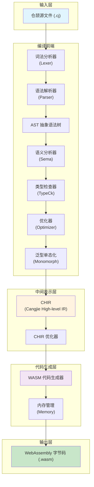

CJWasm 是一款将仓颉语言（Cangjie）源代码直接编译为 WebAssembly 字节码的编译器前端，完全使用 Rust 语言编写。该项目旨在为仓颉开发者提供一种将代码编译为高效、跨平台的 WebAssembly 二进制格式的能力，使生成的 `.wasm` 文件能够在 wasmtime、浏览器或任何兼容的 WASM 运行时中执行。

本页面为初次接触 CJWasm 的开发者提供项目架构概览、核心模块介绍以及项目组织结构的说明，帮助您快速理解这个编译器的设计理念和技术实现。

Sources: [README.md](README.md#L1-L15), [Cargo.toml](Cargo.toml#L1-L20)

---

## 系统架构

CJWasm 采用经典的编译器前端架构，核心编译流程包含四个主要阶段：**词法分析** → **语法解析** → **语义分析** → **代码生成**。编译器将仓颉源代码经过这些阶段处理后，最终输出符合 WebAssembly 标准规范的二进制字节码文件。



### 编译流水线详解

**词法分析阶段**负责将源代码字符串转换为 Token 流。CJWasm 使用 `logos` 库实现高效的词法分析器，能够识别仓颉语言中的关键字、标识符、字面量、运算符等语法元素。词法分析器还处理字符串插值、多行字符串、类型化整数等特殊语法构造。

**语法解析阶段**将 Token 流转换为抽象语法树（AST）。解析器采用递归下降解析算法，能够正确处理仓颉语言的复杂语法结构，包括函数定义、类型声明、控制流语句、模式匹配等。解析器会验证语法结构的正确性，并在发现语法错误时提供精确的错误位置和友好的错误信息。

**语义分析阶段**进行符号解析、类型检查和作用域分析。该阶段确保所有引用的变量和函数都已声明，类型匹配关系正确，并执行必要的类型推断。CJWasm 的语义分析器支持局部类型推断、泛型约束检查、访问控制检查等功能。

**代码生成阶段**是编译器的核心输出环节。CJWasm 支持两种代码生成路径：传统的直接代码生成路径（AST → WASM）以及基于 CHIR 中间表示的新路径（AST → CHIR → WASM）。CHIR 路径提供了更完整的类型信息和符号解析，便于后续的优化处理。

Sources: [src/lib.rs](src/lib.rs#L1-L16), [src/lexer/mod.rs](src/lexer/mod.rs#L1-L50), [src/parser/mod.rs](src/parser/mod.rs#L1-L100)

---

## 核心模块

### 词法分析器（Lexer）

词法分析器模块位于 `src/lexer/mod.rs`，负责将源代码字符串转换为 Token 序列。该模块使用 Rust 的 `logos` 库实现零拷贝的高效词法分析，支持仓颉语言的所有词法元素，包括关键字、标识符、各种字面量（整数、浮点数、字符、字符串）、运算符和分隔符。词法分析器还实现了字符串插值的识别，能够正确解析 `"Hello, ${name}!"` 这类包含表达式的字符串字面量。

### 语法解析器（Parser）

语法解析器模块位于 `src/parser/`，包含多个子模块分别处理表达式、语句、声明、模式、类型和宏的解析。解析器采用手写的递归下降解析器实现，具有良好的错误恢复能力和精确的错误定位功能。解析器维护一个 Token 缓冲机制，用于处理仓颉语言中 `>>` 在泛型上下文中的歧义解析问题。

### 抽象语法树（AST）

抽象语法树模块位于 `src/ast/`，定义了仓颉语言所有语法结构的树形表示。AST 节点涵盖表达式（Expr）、语句（Stmt）、模式（Pattern）和类型（Type）四大类别，总计 91 个节点类型。其中表达式节点 47 个，语句节点 15 个，模式节点 10 个，类型节点 19 个。这种细粒度的 AST 设计使得编译器能够精确地表示和分析仓颉语言的各类语法结构。

```mermaid
classDiagram
    class Expr {
        <<enumeration>>
        Integer(i64)
        Float(f64)
        String(String)
        Binary{BinOp, left, right}
        Call{name, args}
        MethodCall{object, method, args}
        If{cond, then, else}
        Match{expr, arms}
        Lambda{params, body}
        ...
    }
    
    class Stmt {
        <<enumeration>>
        Let{name, type, value}
        Var{name, type, value}
        Func{name, params, body}
        While{cond, body}
        For{var, iter, body}
        Return{value}
        Expr{expr}
        ...
    }
    
    class Type {
        <<enumeration>>
        Int8, Int16, Int32, Int64
        UInt8, UInt16, UInt32, UInt64
        Float32, Float64
        Bool, Rune, String
        Array{elem}
        Tuple{elems}
        Option{inner}
        Result{Ok, Err}
        Struct{name, fields}
        Enum{name, variants}
        Class{name, methods}
        ...
    }
```

### CHIR 中间表示

CHIR（Cangjie High-level IR）模块位于 `src/chir/`，是 CJWasm 引入的高层中间表示层。CHIR 提供了完整的类型信息和符号解析，所有表达式都携带类型标注，所有符号引用都已解析为具体的索引或偏移量。这种设计使得代码生成更加可靠，同时也为后续的优化 passes 提供了便利。CHIR 模块包含构建器（builder）、AST 下降（lower）、表达式下降（lower_expr）、语句下降（lower_stmt）、类型推断（type_inference）和优化（optimize）等子模块。

### 代码生成器（CodeGen）

代码生成器模块位于 `src/codegen/`，负责将 AST 或 CHIR 转换为 WebAssembly 字节码。代码生成器使用 `wasm-encoder` 库构建符合 WASM 规范的二进制模块。该模块处理函数签名编码、全局变量、内存布局、表（Tables）、元素段（Element Sections）和数据段（Data Sections）等 WASM 模块的各个组成部分。代码生成器还实现了字符串常量池管理、vtable 布局计算、lambda 函数处理等高级功能。

### 内存管理（Memory）

内存管理模块位于 `src/memory.rs`，为编译输出的 WASM 模块提供运行时内存管理支持。该模块生成三种内存管理策略的辅助函数：Free List 分配器（支持 malloc/free 内存回收）、引用计数系统（通过对象头的 refcount 字段实现自动计数）以及 Mark-Sweep 垃圾回收器（遍历堆回收引用计数为零的对象）。内存布局采用 8 字节对齐，每个堆对象前有 8 字节头部存储块大小和引用计数。

Sources: [src/chir/mod.rs](src/chir/mod.rs#L1-L25), [src/codegen/mod.rs](src/codegen/mod.rs#L1-L100), [src/memory.rs](src/memory.rs#L1-L100)

---

## 项目结构

CJWasm 的源代码组织遵循 Rust 项目的标准惯例，同时反映了编译器的模块化架构。以下是主要目录和文件的说明：

| 路径 | 说明 |
|------|------|
| `src/lib.rs` | 库入口，导出所有公开模块 |
| `src/main.rs` | 命令行工具入口，实现 `cjwasm` CLI |
| `src/lexer/mod.rs` | 词法分析器实现 |
| `src/parser/` | 语法解析器及其子模块 |
| `src/ast/` | 抽象语法树定义 |
| `src/chir/` | CHIR 中间表示及其处理模块 |
| `src/codegen/` | WebAssembly 代码生成器 |
| `src/memory.rs` | 内存管理运行时辅助函数 |
| `src/pipeline.rs` | 编译流水线工具函数 |
| `src/optimizer.rs` | AST 优化器 |
| `src/monomorph/` | 泛型单态化处理 |
| `src/cjpm.rs` | 项目管理（兼容 cjpm.toml） |
| `tests/` | 测试用例和集成测试 |

```
src/
├── lexer/           # 词法分析：源代码 → Token 流
│   └── mod.rs
├── parser/          # 语法解析：Token 流 → AST
│   ├── decl.rs      # 声明解析（函数、结构体、类等）
│   ├── expr.rs      # 表达式解析
│   ├── stmt.rs      # 语句解析
│   ├── pattern.rs   # 模式解析
│   └── type_.rs     # 类型解析
├── ast/             # AST 节点定义
│   └── type_.rs     # 类型系统定义
├── sema/            # 语义分析
├── typeck/          # 类型检查
├── optimizer/       # AST 级别优化
├── monomorph/       # 泛型单态化
├── chir/            # CHIR 中间表示
│   ├── lower.rs     # AST → CHIR 下降
│   ├── optimize.rs  # CHIR 优化
│   └── type_inference.rs
├── codegen/         # WASM 代码生成
│   ├── decl.rs      # 声明代码生成
│   ├── expr.rs      # 表达式代码生成
│   └── type_.rs     # 类型代码生成
├── memory.rs        # 内存管理运行时
├── pipeline.rs      # 编译流水线
└── cjpm.rs          # 项目管理
```

Sources: [src/lib.rs](src/lib.rs#L1-L16), [Cargo.toml](Cargo.toml#L1-L20)

---

## 功能特性

CJWasm 实现了仓颉语言的核心特性，能够将各种语言构造编译为高效的 WebAssembly 代码。以下是主要功能特性的概览：

### 类型系统

CJWasm 支持仓颉语言的完整类型系统，包括整数类型（Int8 至 Int64、UInt8 至 UInt64）、浮点类型（Float16、Float32、Float64）、布尔类型（Bool）、字符类型（Rune）、字符串类型（String）以及复合类型（Array、Tuple、Option、Result）。编译器能够进行类型推断，自动推导局部变量、全局变量和方法返回值的类型。

### 面向对象编程

编译器支持仓颉语言的面向对象特性，包括结构体（struct）、类（class，含继承机制、abstract/sealed 修饰符）、接口（interface，含默认实现）、属性（prop）和扩展方法（extend）。类继承通过 vtable 实现动态分派，接口通过方法签名表支持多态。

### 泛型与单态化

CJWasm 实现了完整的泛型系统，支持泛型函数、泛型结构体、泛型类和泛型枚举。编译器通过单态化（monomorphization）技术将泛型代码实例化为具体类型的版本，避免了运行时的类型检查开销。多重约束和 where 子句也得到了完整支持。

### 模式匹配

编译器实现了强大的模式匹配功能，支持 match 表达式、枚举解构、结构体解构、元组解构、if-let 和 while-let 语句以及 guard 条件表达式。模式匹配是仓颉语言处理条件逻辑的核心机制。

### 错误处理

CJWasm 支持多种错误处理机制：try-catch-finally 结构用于捕获异常，throws 声明用于声明函数可能抛出异常，Result<T, E> 和 Option<T> 类型提供了函数式的错误处理方式，空值合并运算符 `??` 和 try 运算符 `?` 简化了可选值的处理。

Sources: [README.md](README.md#L20-L80), [src/ast/type_.rs](src/ast/type_.rs#L1-L100)

---

## 快速开始

### 环境要求

使用 CJWasm 之前，您需要确保系统已安装以下工具：

- **Rust 工具链**：CJWasm 使用 Rust 开发，需要安装 rustup 和 cargo（推荐使用最新稳定版）
- **wasmtime**：用于运行编译生成的 WebAssembly 二进制文件（可选，但推荐安装）

### 构建项目

克隆仓库并使用 Cargo 构建：

```bash
git clone https://gitcode.com/SeanXDO/CJWasm
cd CJWasm
cargo build --release
```

构建完成后，可执行文件位于 `target/release/cjwasm`（或 Windows 上的 `target/release/cjwasm.exe`）。

### 基本使用方法

CJWasm 提供两种使用方式：**项目模式**（推荐）和**直接编译模式**。

**项目模式**使用 cjpm.toml 配置文件管理项目：

```bash
# 初始化新项目
cjwasm init myproject
cd myproject

# 编译项目
cjwasm build

# 指定输出文件
cjwasm build -o app.wasm

# 运行编译结果
wasmtime run --invoke main target/wasm/myproject.wasm
```

**直接编译模式**用于编译单个或多个源文件：

```bash
# 编译单文件
cjwasm hello.cj

# 指定输出文件
cjwasm hello.cj -o hello.wasm

# 多文件编译
cjwasm main.cj lib.cj -o app.wasm
```

Sources: [README.md](README.md#L90-L150), [src/main.rs](src/main.rs#L1-L100)

---

## 典型示例

以下是一个展示 CJWasm 支持的多种语言特性的完整示例：

```cangjie
// 泛型结构体
struct Pair<T, U> {
    var first: T
    var second: U
    init(first: T, second: U) {
        this.first = first
        this.second = second
    }
}

// 类与继承
open class Animal {
    var name: Int64
    init(name: Int64) { this.name = name }
    func speak(): Int64 { return 0 }
}

class Dog <: Animal {
    init(name: Int64) { super(name) }
    override func speak(): Int64 { return 1 }
}

// 枚举与模式匹配
enum Shape {
    | Circle(Int64)
    | Rectangle(Int64, Int64)
}

func area(s: Shape): Int64 {
    match (s) {
        case Shape.Circle(r) => r * r * 3,
        case Shape.Rectangle(w, h) => w * h
    }
}

// 错误处理
func safeDivide(a: Int64, b: Int64): Result<Int64, String> {
    if (b == 0) { return Err("division by zero") }
    return Ok(a / b)
}

main(): Int64 {
    let pair = Pair(10, 20)
    let result = safeDivide(10, 2) ?? 0
    @Assert(result, 5)
    return result
}
```

Sources: [tests/examples/hello.cj](tests/examples/hello.cj#L1-L29), [tests/examples/generic.cj](tests/examples/generic.cj#L1-L23)

---

## 测试与质量保证

CJWasm 建立了完善的测试体系，确保编译器的正确性和稳定性：

| 测试类别 | 数量 | 说明 |
|----------|------|------|
| 单元测试 | 672 | 各模块的独立功能测试 |
| 集成测试 | 631 | 端到端编译流程测试 |
| 标准库测试 | 14 | 标准库功能验证测试 |
| 示例测试 | 37 | 语言特性示例验证 |
| **总计** | **1,354** | **全部通过** |

代码覆盖率指标：行覆盖率 80.15%，分支覆盖率 89.93%。测试可以通过交互式脚本运行：

```bash
./scripts/run_test.sh        # 交互式测试菜单
./scripts/run_test.sh 1      # 仅单元测试
./scripts/run_test.sh 2      # 仅系统测试
./scripts/run_test.sh 5      # 全部测试
```

Sources: [README.md](README.md#L160-L200), [tests/compile_test.rs](tests/compile_test.rs#L1-L100)

---

## 后续学习路径

完成本概述页面后，建议按以下顺序深入学习 CJWasm：

1. **[快速开始](2-kuai-su-kai-shi)** — 学习如何安装配置和编译第一个程序
2. **[命令行工具](3-ming-ling-xing-gong-ju)** — 深入了解 cjwasm 命令行各选项
3. **[词法分析器](5-ci-fa-fen-xi-qi)** — 理解 Token 生成的内部机制
4. **[语法解析器](6-yu-fa-jie-xi-qi)** — 学习 AST 构建过程
5. **[抽象语法树](7-chou-xiang-yu-fa-shu)** — 深入理解 AST 节点设计
6. **[编译流水线](8-bian-yi-liu-shui-xian)** — 串联各模块的整体流程

如果您对编译器内部实现感兴趣，可以直接阅读 `src/` 目录下的源代码，从 `src/lexer/mod.rs` 和 `src/parser/mod.rs` 开始，这两个模块是理解整个编译器的基础。