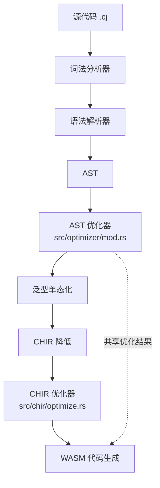
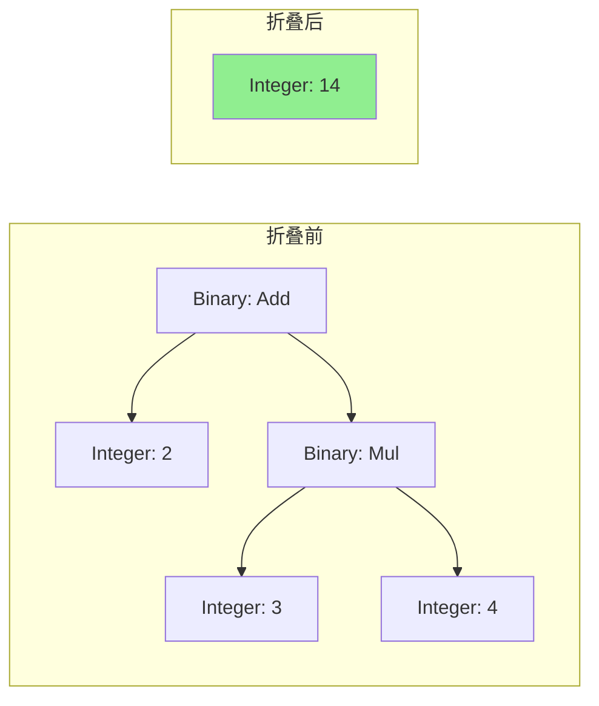

CJWasm 编译器的优化系统采用**两层架构**，分别在抽象语法树（AST）和高级中间表示（CHIR）层面执行不同的优化策略。AST 优化器位于 `src/optimizer/mod.rs`，专注于源码级别的常量折叠、死代码消除和尾递归优化，在类型检查和语义分析之前完成对程序结构的精简。

## 架构概览

CJWasm 的优化流水线遵循 **AST → CHIR → WASM** 的三阶段架构，AST 优化器作用于第一阶段的输出，对源码结构进行与目标无关的通用优化。这一设计使优化结果能够同时惠及两条代码生成路径——传统的直接生成路径和基于 CHIR 的新路径。



优化器的调用入口在编译流水线中明确标识。在 `src/pipeline.rs` 的 `compile_source_to_wasm` 函数中，AST 优化器于泛型单态化之前执行，随后 CHIR 优化器在中间表示降低完成后运行，两个阶段的优化相互配合，共同提升最终生成的 WebAssembly 代码质量。

Sources: [src/pipeline.rs#L350-L368](src/pipeline.rs#L350-L368)

## AST 优化器核心算法

### 常量折叠

常量折叠是最基础的优化技术，通过在编译时计算常量表达式来消除运行时的冗余计算。AST 优化器的 `fold_expr` 函数采用递归下降模式，对表达式树进行深度优先遍历，将可求值的子表达式替换为对应的常量值。



整数运算的折叠逻辑定义在 `fold_binary_int` 函数中，支持加法、减法、乘法、除法、取模、比较运算以及按位运算。对于除法和取模操作，优化器显式检查除数是否为零，避免在折叠过程中引入除零异常。

Sources: [src/optimizer/mod.rs#L412-L445](src/optimizer/mod.rs#L412-L445)

浮点数折叠由 `fold_binary_float` 函数处理，涵盖加减乘除和所有比较运算。值得注意的是，浮点数的取模和按位运算不被折叠，因为 IEEE 754 浮点数的语义在运行时和编译时可能存在精度差异。

Sources: [src/optimizer/mod.rs#L447-L465](src/optimizer/mod.rs#L447-L465)

一元表达式的折叠涵盖负号（`Neg`）和逻辑非（`Not`）两种运算。对于整数负号，优化器使用 `saturating_neg()` 方法防止溢出；对于布尔非，直接取反操作数。

Sources: [src/optimizer/mod.rs#L204-L213](src/optimizer/mod.rs#L204-L213)

### 死代码消除

死代码消除器识别并移除在 `return`、`break` 或 `continue` 语句之后不可达的代码。这种优化不仅减少了生成的 WASM 指令数量，还降低了代码体积，对嵌入式场景尤为重要。

```rust
fn eliminate_dead_code(stmts: &mut Vec<Stmt>) {
    // 找到第一个终止语句的位置
    let mut terminator_pos = None;
    for (i, stmt) in stmts.iter().enumerate() {
        match stmt {
            Stmt::Return(_) | Stmt::Break | Stmt::Continue => {
                terminator_pos = Some(i);
                break;
            }
            _ => {}
        }
    }
    // 截断终止语句之后的所有语句
    if let Some(pos) = terminator_pos {
        stmts.truncate(pos + 1);
    }
    // 递归处理嵌套块
    for stmt in stmts.iter_mut() {
        // ... 处理 while/for/loop 等嵌套结构
    }
}
```

死代码消除器通过 `Vec::truncate` 方法将语句列表裁剪到终止语句之后，确保不会生成不可达的代码块。优化器递归处理 `while`、`for`、`loop` 和 `while-let` 等循环结构中的嵌套块。

Sources: [src/optimizer/mod.rs#L44-L73](src/optimizer/mod.rs#L44-L73)

### 尾递归优化

尾递归优化将符合条件的递归函数转换为等价的循环结构，从而避免函数调用栈的线性增长。这对于在 WebAssembly 这样的栈受限环境中编译深度递归算法具有重要意义。

尾递归优化的核心模式是检测函数最后一条语句是否为对自身的调用：

```rust
// 检测模式: func f(params) { ... return f(new_args) }
let is_tail_call = match func.body.last() {
    Some(Stmt::Return(Some(Expr::Call { name, args, .. }))) => {
        name == &func_name && args.len() == param_names.len()
    }
    Some(Stmt::Expr(Expr::Call { name, args, .. })) => {
        name == &func_name && args.len() == param_names.len()
    }
    _ => false,
};
```

转换算法采用临时变量来解决参数赋值的顺序覆盖问题：

```rust
// 转换前:
func factorial(n: Int64, acc: Int64): Int64 {
    if n <= 1 { return acc }
    return factorial(n - 1, acc * n)  // 尾递归
}

// 转换后:
func factorial(n: Int64, acc: Int64): Int64 {
    loop {
        if n <= 1 { break }
        // 临时变量避免 a=b; b=a%b 的顺序覆盖问题
        let __tco_tmp0 = n - 1
        let __tco_tmp1 = acc * n
        n = __tco_tmp0
        acc = __tco_tmp1
        continue
    }
    return acc
}
```

Sources: [src/optimizer/mod.rs#L75-L144](src/optimizer/mod.rs#L75-L144)

## 表达式折叠覆盖范围

AST 优化器的 `fold_expr` 函数覆盖了仓颉语言的所有表达式类型，确保在各个语法构造中都能执行常量折叠优化。以下是各类表达式的折叠处理：

| 表达式类型 | 折叠行为 | 示例 |
|-----------|---------|------|
| 二元运算 | 整数/浮点数常量折叠 | `2 + 3` → `5` |
| 一元运算 | 整数负号、布尔非折叠 | `!true` → `false` |
| if/if-let | 条件为常量时简化 | `if true { a } else { b }` → `a` |
| 块表达式 | 递归折叠语句和尾部表达式 | `{ x + 1; 2 * 3 }` → `6` |
| 函数调用 | 递归折叠实参 | `add(1+2, 3*4)` → `add(3, 12)` |
| 数组/元组 | 递归折叠元素 | `[1+1, 2*2]` → `[2, 4]` |
| 字段访问 | 递归折叠对象表达式 | `p.x + 1` → `p.x + 1` |
| 匹配表达式 | 递归折叠主题和分支体 | `match 1+1 { ... }` → `match 2 { ... }` |
| try 块 | 递归折叠 body、catch、finally | - |

优化器通过模式匹配实现对每种表达式类型的专门处理，对于无法折叠的复杂表达式（如变量引用、函数调用），直接返回原表达式以保持语义不变。

Sources: [src/optimizer/mod.rs#L180-L410](src/optimizer/mod.rs#L180-L410)

## 优化策略对比

### AST 层优化 vs CHIR 层优化

CJWasm 采用双层优化架构，AST 优化器和 CHIR 优化器各司其职，分别在不同的抽象层级上执行优化。

| 特性 | AST 优化器 | CHIR 优化器 |
|------|-----------|-----------|
| **文件位置** | `src/optimizer/mod.rs` | `src/chir/optimize.rs` |
| **优化层级** | 源代码结构 | 类型化中间表示 |
| **执行时机** | 解析后、单态化前 | 降低到 CHIR 后 |
| **核心优化** | 常量折叠、死代码消除、尾递归 | 小函数内联、冗余 local 消除 |
| **信息可用性** | 无类型信息 | 完整类型 + WASM 类型 |
| **优化保守性** | 必须保持类型中立 | 可利用类型信息精确优化 |

### CHIR 层优化策略

CHIR 优化器在 AST 优化器之后运行，利用降低阶段提供的完整类型信息和符号解析结果，执行更为精确的优化。

**小函数内联**：CHIR 优化器识别可内联的小型函数，将函数调用替换为函数体副本。内联条件包括函数体仅包含返回值表达式、表达式节点数不超过 8 个、且不包含副作用。

Sources: [src/chir/optimize.rs#L108-L136](src/chir/optimize.rs#L108-L136)

**冗余 local 消除**：对于只被写入一次且只被读取一次的纯表达式对应的局部变量，优化器将其直接内联到使用位置，避免创建不必要的 WASM 局部变量。

Sources: [src/chir/optimize.rs#L1637-L1648](src/chir/optimize.rs#L1637-L1648)

## 测试覆盖

AST 优化器模块包含详尽的单元测试，覆盖所有支持的折叠场景：

- **整数运算**：加法、减法、乘法、除法、取模、比较运算、按位运算
- **浮点运算**：加法、减法、乘法、除法、比较运算
- **一元运算**：负号、逻辑非
- **复合表达式**：嵌套折叠、递归折叠

测试使用 Rust 的 `matches!` 宏进行模式匹配验证，确保折叠结果的正确性。特别地，测试覆盖了边界情况如除零操作（保持原表达式不折叠）和浮点数不支持的运算（按位运算等）。

Sources: [src/optimizer/mod.rs#L467-L936](src/optimizer/mod.rs#L467-L936)

## 编译流水线集成

AST 优化器通过 `optimize_program` 函数暴露公共接口，该函数遍历程序中的所有函数和方法，对每个可执行单元应用三阶段优化流程：

```rust
pub fn optimize_program(program: &mut crate::ast::Program) {
    for func in &mut program.functions {
        optimize_function(func);
    }
    for class in &mut program.classes {
        for m in &mut class.methods {
            optimize_function(&mut m.func);
        }
        // 处理 init/deinit 方法
    }
}

fn optimize_function(func: &mut crate::ast::Function) {
    // Pass 1: 常量折叠
    for stmt in &mut func.body {
        fold_stmt(stmt);
    }
    // Pass 2: 死代码消除
    eliminate_dead_code(&mut func.body);
    // Pass 3: 尾递归优化
    optimize_tail_recursion(func);
}
```

Sources: [src/optimizer/mod.rs#L6-L42](src/optimizer/mod.rs#L6-L42)

优化器在编译流水线中的位置确保其结果可被泛型单态化和 CHIR 降低复用，实现"一次优化，多路径受益"的效率提升。

## 后续阅读

- **[CHIR 中间表示](9-chir-zhong-jian-biao-shi)** — 了解 AST 降低到的类型化中间表示结构
- **[WebAssembly 代码生成器](12-webassembly-dai-ma-sheng-cheng-qi)** — 了解优化后的代码如何生成 WASM 字节码
- **[泛型单态化](11-fan-xing-dan-tai-hua)** — 了解在 AST 优化之后执行的泛型实例化