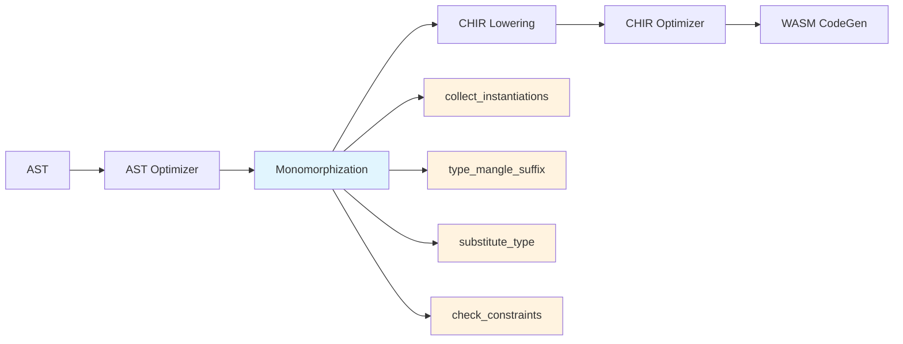

泛型单态化是仓颉编译器将泛型代码转换为具体类型代码的核心机制。在编译过程中，编译器通过收集泛型调用点（call site）的类型实参，生成对应的特化版本，从而消除运行时的类型调度开销。本模块实现了完整的泛型特化流程，包括类型名字修饰、类型替换、实例收集与约束检查。

## 编译器流水线定位

在 CJWasm2 的编译架构中，泛型单态化（monomorphization）位于 AST 优化之后、代码生成之前的关键位置。该 Pass 与 [AST 优化器](10-ast-you-hua-qi) 和 [CHIR 中间表示](9-chir-zhong-jian-biao-shi) 共同构成编译流水线的核心环节。



泛型单态化模块通过 `pub fn monomorphize_program(program: &mut Program)` 入口函数被调用，该函数位于编译流水线的第 353 行，在 CHIR lowering 之前执行特化处理。

Sources: [pipeline.rs#L349-L369](src/pipeline.rs#L349-L369)

## 名字修饰机制

### 类型后缀映射

名字修饰（name mangling）是将泛型类型信息编码到符号名称中的关键步骤。`type_mangle_suffix` 函数为每种类型生成唯一的字符串后缀，确保不同类型实参组合产生不同的符号名称。

| 类型类别 | 映射规则 | 示例 |
|---------|---------|------|
| 基础类型 | 直接映射 | `Int64` → "Int64" |
| 数组类型 | 递归包装 | `Array<Int64>` → "Array_Int64" |
| 元组类型 | 下划线连接 | `Tuple<Int64,Float64>` → "Tuple_Int64_Float64" |
| 结构体 | 含实参时连接 | `Pair<Int64,String>` → "Pair_Int64_String" |
| 函数类型 | 参数与返回值连接 | `Fn_Int64_Bool` |
| Option/Result | 递归包装 | `Option<Int64>` → "Option_Int64" |

对于空类型实参的结构体，返回原始名称；对于带类型实参的结构体，则将类型后缀用下划线连接后附在名称后面。

Sources: [monomorph/mod.rs#L11-L82](src/monomorph/mod.rs#L11-L82)

### 函数名生成

`mangle_name` 函数通过拼接原始函数名与类型后缀生成单态化后的函数名。格式为 `name$T1$T2$...`，其中 `$` 符号作为分隔符，空类型实参时使用 `$_` 作为占位符。

```rust
pub fn mangle_name(name: &str, type_args: &[Type]) -> String {
    if type_args.is_empty() {
        format!("{}$_", name)
    } else {
        format!(
            "{}${}",
            name,
            type_args
                .iter()
                .map(type_mangle_suffix)
                .collect::<Vec<_>>()
                .join("$")
        )
    }
}
```

例如：`identity<Int64>` 修饰为 `identity$Int64`，`Pair<Int64, String>` 修饰为 `Pair$Int64$String`。

Sources: [monomorph/mod.rs#L84-L99](src/monomorph/mod.rs#L84-L99)

## 类型替换系统

### 替换映射构建

类型替换通过 `HashMap<String, Type>` 将类型形参映射到具体类型。构建替换映射时，将泛型定义的 `type_params` 与调用点的 `type_args` 按位置配对：

```rust
let subst: HashMap<_, _> = def
    .type_params
    .iter()
    .cloned()
    .zip(type_args.iter().cloned())
    .collect();
```

对于泛型函数 `func foo<T, U>(a: T, b: U)`，若调用 `foo<Int64, String>`，则替换映射为 `{ "T" → Int64, "U" → String }`。

Sources: [monomorph/mod.rs#L102-L132](src/monomorph/mod.rs#L102-L132)

### 表达式级替换

`substitute_expr` 函数递归遍历表达式树，对所有涉及泛型类型的节点进行替换处理。该函数处理的核心表达式类型包括：

- **函数调用**：替换函数名中的泛型符号引用
- **结构体构造**：更新构造器名称与类型参数
- **方法调用**：替换方法接收者类型
- **模式匹配**：更新 match arm 中的类型引用
- **控制流表达式**：If、While、For 等结构中的类型替换

替换过程同时维护 `RewriteMap`，用于记录泛型符号到单态化符号的映射关系，确保所有引用点使用一致的特化名称。

Sources: [monomorph/mod.rs#L134-L627](src/monomorph/mod.rs#L134-L627)

## 实例收集策略

### 调用点扫描

`collect_instantiations` 函数通过深度遍历 AST 收集所有泛型实例化信息。该函数维护四个 HashSet 分别记录函数、结构体、枚举和类的实例化：

```rust
fn collect_instantiations(program: &Program) -> (
    HashSet<(String, Vec<Type>)>,  // func_insts
    HashSet<(String, Vec<Type>)>,  // struct_insts
    HashSet<(String, Vec<Type>)>,  // enum_insts
    HashSet<(String, Vec<Type>)>,  // class_insts
)
```

扫描逻辑首先识别程序中的泛型定义（非 extern import 的带 type_params 声明），然后遍历所有表达式节点，匹配泛型调用点。关键规则是：类型实参数量必须与泛型定义的形式参数数量一致。

Sources: [monomorph/mod.rs#L637-L744](src/monomorph/mod.rs#L637-L744)

### 类型注解推导

除了显式调用点外，编译器还从类型注解中推导泛型实例化需求。对于形如 `var arr: Array<Pair<Int64, String>>` 的声明，需要递归展开嵌套的泛型类型并收集其中的泛型结构体实例化。

该递归处理涵盖 Array、Option、Slice、Map、Result、Tuple 和 Function 等所有泛型容器类型，确保嵌套泛型结构也能被正确收集和特化。

Sources: [monomorph/mod.rs#L746-L1100](src/monomorph/mod.rs#L746-L1100)

## AST 遍历基础设施

### AstWalk trait

模块实现了 `AstWalk` trait 提供通用的 AST 遍历能力，支持表达式级和语句级的深度遍历。该 trait 通过模式匹配将遍历逻辑委托给子节点：

```rust
trait AstWalk {
    fn walk<F: FnMut(&Expr)>(&self, f: &mut F);
}
```

实现涵盖仓颉语言的所有表达式变体，包括 Binary、Call、MethodCall、If、Match、Lambda 等复杂结构。遍历采用深度优先策略，确保先处理子表达式再处理父表达式。

Sources: [monomorph/mod.rs#L1102-L1269](src/monomorph/mod.rs#L1102-L1269)

### 表达式提取器

`StmtWalkExprs` trait 专门用于从语句中提取所有子表达式，为实例收集提供遍历支持。该 trait 在处理 let/var 声明、赋值、返回语句、控制流结构时提取其中的表达式节点。

Sources: [monomorph/mod.rs#L1271-L1399](src/monomorph/mod.rs#L1271-L1399)

## 约束检查机制

### 内置实现收集

`collect_type_implementations` 函数通过扫描程序中的 impl 块收集类型实现信息。该函数识别类型对接口的具体实现，将结果存储在 `HashMap<String, HashSet<String>>` 中，键为类型名，值为该类型实现的接口集合。

内置类型（Int64、Float64、String、Bool 等）的接口实现被硬编码在 `builtin_impls` 映射中，确保约束检查对标准库类型的正确性。

Sources: [monomorph/mod.rs#L1350-L1437](src/monomorph/mod.rs#L1350-L1437)

### 约束验证

`check_constraints` 函数对每个泛型实例化点执行约束验证。约束检查遍历泛型定义中的 `where` 子句，验证类型实参是否满足声明的约束条件。对于不满足约束的实例化，编译器输出警告信息但不中断编译流程。

```rust
func maximum<T>(a: T, b: T): T where T <: Comparable<T> { ... }
```

调用 `maximum<Int64>` 时，检查 Int64 是否实现了 `Comparable<Int64>` 接口。

Sources: [monomorph/mod.rs#L1308-L1437](src/monomorph/mod.rs#L1308-L1437)

## 单态化执行流程

### 主入口函数

`monomorphize_program` 函数按以下顺序执行单态化：

1. **实例收集**：调用 `collect_instantiations` 收集所有泛型实例化点
2. **约束检查**：对每个实例化点验证泛型约束
3. **结构体特化**：为泛型结构体生成特化版本
4. **枚举特化**：为泛型枚举生成特化版本
5. **类特化**：为泛型类生成特化版本（含方法重命名）
6. **函数特化**：为泛型函数生成特化版本（含特化冲突检测）

Sources: [monomorph/mod.rs#L1440-L1841](src/monomorph/mod.rs#L1440-L1841)

### 特化冲突处理

函数特化时，编译器检查程序中是否已存在对应的非泛型函数（通过精确的名字匹配）。若已存在预定义的特化实现，则跳过自动生成，优先使用用户提供的特化版本。这一机制允许开发者通过手工特化优化关键路径性能。

```rust
// 泛型版本
func add<T>(a: T, b: T): T { ... }

// 手写特化：通过 extern import 或预定义实现
func add$Int64$Int64(a: Int64, b: Int64): Int64 { ... }
```

Sources: [monomorph/mod.rs#L1753-L1819](src/monomorph/mod.rs#L1753-L1819)

### 方法名重命名

泛型类单态化时，编译器需要重命名方法名中的类名引用。例如 `Box<T>.getContent()` 单态化为 `Box$Int64.getContent()`。实现通过字符串替换完成：

```rust
let method_name = if m.func.name.starts_with(&format!("{}.", name)) {
    m.func.name.replacen(name, &mangled_name, 1)
} else {
    m.func.name.clone()
};
```

Sources: [monomorph/mod.rs#L1645-L1655](src/monomorph/mod.rs#L1645-L1655)

## 代码生成集成

### 调用点名字解析

代码生成器在处理泛型调用时，需要将泛型函数名解析为单态化后的名字。`codegen/expr.rs` 中的多处代码直接调用 `mangle_name` 函数：

```rust
let mangled = crate::monomorph::mangle_name(s, type_args);
```

这些调用点覆盖了函数调用、结构体初始化、方法调用等多种场景，确保生成的 WASM 指令引用正确的特化函数符号。

Sources: [codegen/expr.rs#L1224](src/codegen/expr.rs#L1224)
Sources: [codegen/expr.rs#L3976](src/codegen/expr.rs#L3976)
Sources: [codegen/expr.rs#L6294](src/codegen/expr.rs#L6294)

## 测试覆盖

模块包含完整的单元测试覆盖关键功能：

| 测试函数 | 验证内容 |
|---------|---------|
| `test_type_mangle_suffix_basic` | 基础类型的名字修饰 |
| `test_type_mangle_suffix_compound` | 复合类型的递归修饰 |
| `test_mangle_name` | 函数名生成格式 |
| `test_monomorphize_empty_program` | 空程序处理 |
| `test_monomorphize_no_generics` | 无泛型程序直通 |
| `test_monomorphize_generic_function_multi_type_params` | 多类型参数函数特化 |
| `test_monomorphize_struct_with_generic_params` | 泛型结构体特化 |
| `test_monomorphize_nested_generics` | 嵌套泛型推导 |
| `test_monomorphize_generic_func_multi_call_sites` | 多调用点去重 |
| `test_monomorphize_generic_class_with_methods` | 泛型类方法重命名 |

Sources: [monomorph/mod.rs#L1843-L2413](src/monomorph/mod.rs#L1843-L2413)

## 泛型示例验证

CJWasm2 通过 `tests/examples/generic.cj` 和 `tests/examples/generic_advanced.cj` 提供泛型功能验证：

```cangjie
// 泛型结构体
struct Pair<T, U> {
    var first: T;
    var second: U;
    init(first: T, second: U) {
        this.first = first
        this.second = second
    }
}

// 泛型函数
func identity<T>(value: T): T {
    return value
}

main(): Int64 {
    let p = Pair<Int64, Int64>(1, 2)
    let x = identity<Int64>(42)
    return p.first + x  // 预期输出: 43
}
```

单态化后，编译器生成 `Pair$Int64$Int64` 结构体和 `identity$Int64` 函数，供代码生成器使用。

Sources: [tests/examples/generic.cj](tests/examples/generic.cj)
Sources: [tests/examples/generic_advanced.cj](tests/examples/generic_advanced.cj)

## 性能特性

泛型单态化的时间复杂度为 O(n × d)，其中 n 为 AST 节点数量，d 为最大泛型嵌套深度。空间复杂度主要由实例化集合和替换映射决定，平均为 O(i × t)，i 为实例化点数量，t 为类型参数数量。

约束检查采用增量式验证，仅在发现新实例化点时执行检查，已验证的类型实参组合会被缓存以避免重复检查。