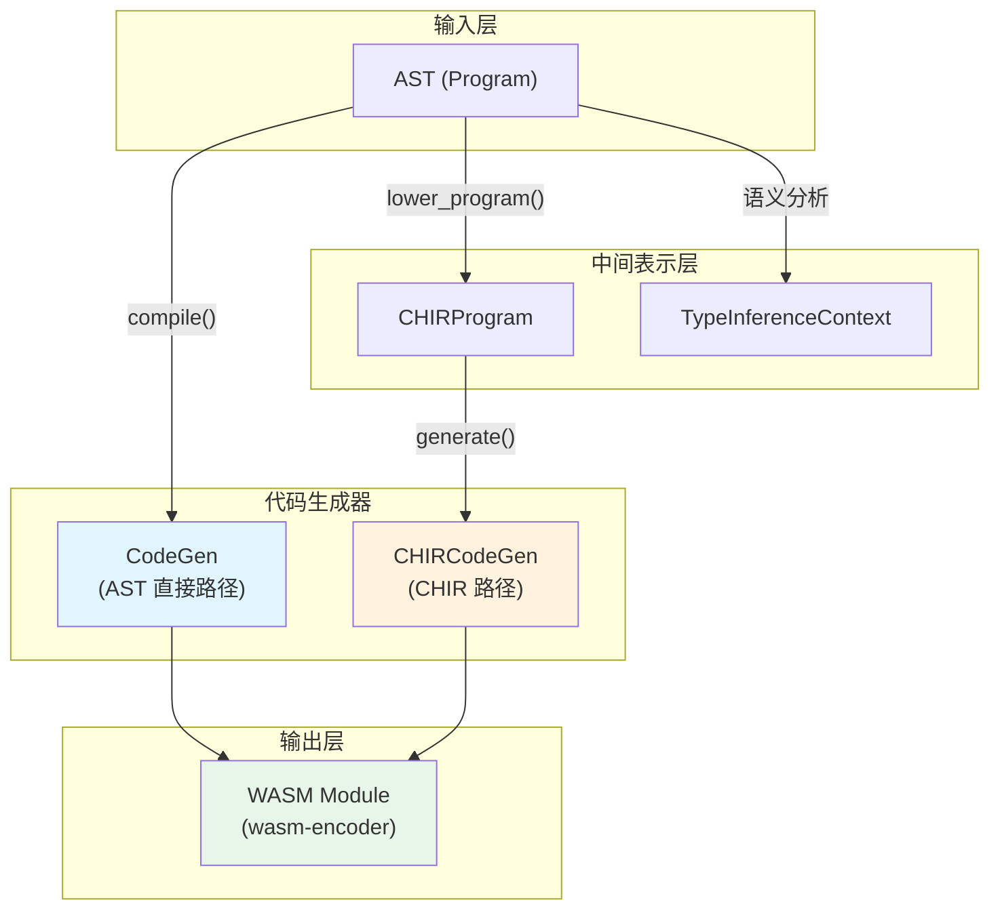
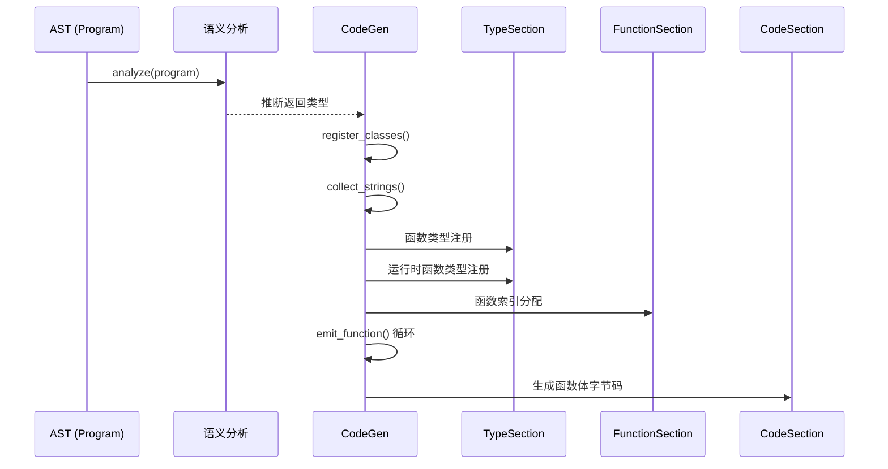
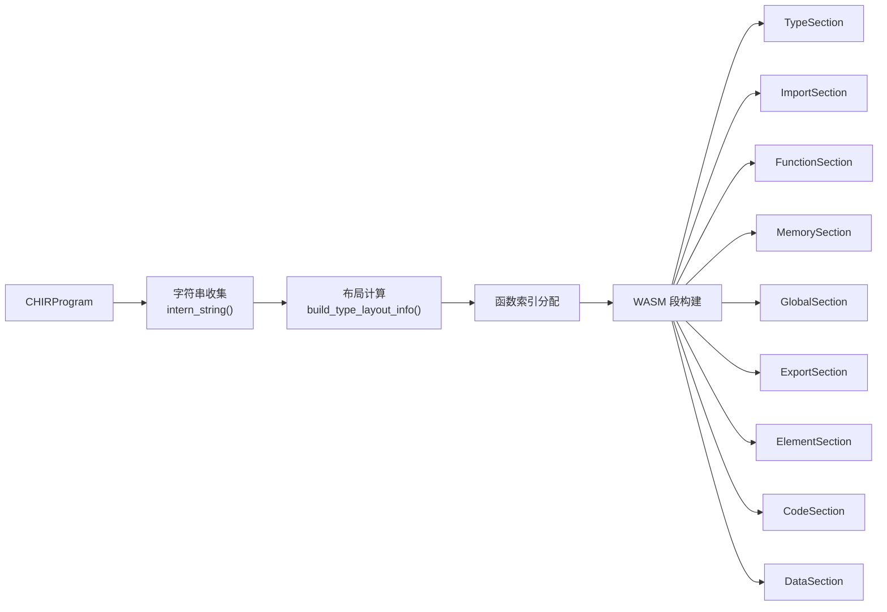
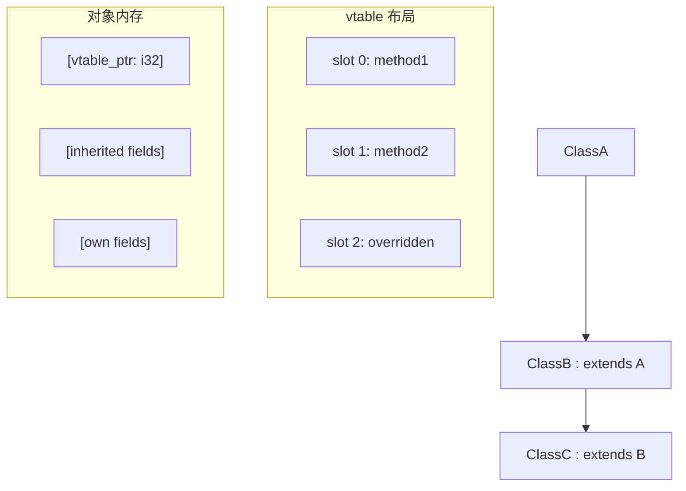
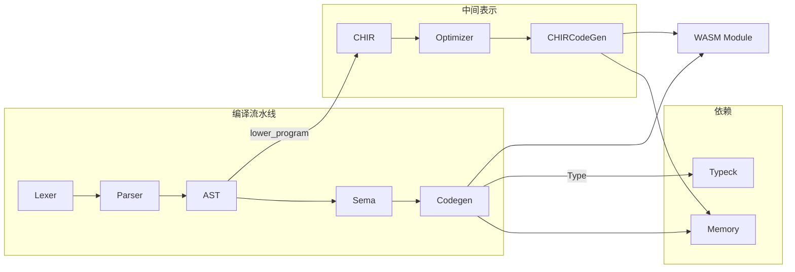

CJWasm 的 WebAssembly 代码生成器是将仓颉语言源程序编译为 WebAssembly (WASM) 二进制格式的核心引擎。该模块接收经过语义分析后的抽象语法树（AST），通过两条并行的代码生成路径——直接 AST 路径和 CHIR（仓颉高级中间表示）路径——输出符合 WASM 规范的字节码。整个代码生成器共包含约 **25,145 行 Rust 代码**，分布在五个核心子模块中。

## 架构概览

代码生成器采用分层架构设计，上层支持两条生成路径，底层共享类型系统和内存管理基础设施：



两条路径最终都输出 `wasm_encoder` 库定义的 `Module` 对象，该对象序列化后即为标准的 `.wasm` 文件。

Sources: [src/codegen/mod.rs](src/codegen/mod.rs#L1-L50)
Sources: [src/codegen/chir_codegen.rs](src/codegen/chir_codegen.rs#L1-L80)

## 核心数据结构

### CodeGen（主代码生成器）

`CodeGen` 是直接 AST 路径的核心入口，负责管理所有符号映射和代码生成上下文：

```text
CodeGen {
    // 索引映射
    func_types: HashMap<String, u32>      // 函数名 → WASM 类型索引
    func_indices: HashMap<String, u32>    // 函数名 → WASM 函数索引
    
    // 类型定义存储
    structs: HashMap<String, StructDef>    // 结构体定义
    enums: HashMap<String, EnumDef>        // 枚举定义  
    classes: HashMap<String, ClassInfo>    // 类信息（含继承布局和 vtable）
    
    // 字符串常量池
    string_pool: Vec<(String, u32)>        // 字符串内容 → 内存偏移
    
    // 高级特性支持
    lambda_functions: Vec<FuncDef>         // Lambda 函数列表
    type_aliases: HashMap<String, Type>    // 类型别名映射
    lambda_table_indices: HashMap           // Lambda Table 索引映射
    
    // 类型系统
    global_var_types: HashMap<String, Type>
    func_return_wasm_types: HashMap<String, Option<ValType>>
}
```

Sources: [src/codegen/mod.rs](src/codegen/mod.rs#L27-L70)

### ClassInfo（类元信息）

`ClassInfo` 封装了类的运行时布局信息，是继承层次和虚表（vtable）管理的核心：

```rust
pub(crate) struct ClassInfo {
    pub name: String,
    pub class_id: u32,                          // 用于 `is` 类型检查
    pub parent: Option<String>,                  // 父类名
    pub all_fields: Vec<FieldDef>,              // 完整字段列表（继承+自身）
    pub vtable_methods: Vec<String>,            // vtable 方法名列表
    pub vtable_slot: HashMap<String, usize>,   // 方法名 → vtable 槽位
    pub has_vtable: bool,                       // 是否需要 vtable_ptr
}
```

Sources: [src/codegen/decl.rs](src/codegen/decl.rs#L10-L30)

### CHIRCodeGen（CHIR 代码生成器）

CHIR 路径专用代码生成器，管理 CHIR 表达式到 WASM 指令的转换：

```rust
pub struct CHIRCodeGen {
    func_indices: HashMap<String, u32>,        // 用户函数名 → WASM 索引
    func_void_map: HashMap<u32, bool>,         // 函数是否无返回值
    loop_break_depth: Cell<u32>,               // break 跳转深度
    
    // 内存布局
    string_data: Vec<(String, u32)>,           // 字符串常量池
    struct_field_offsets: HashMap,             // 结构体字段偏移
    class_field_offsets: HashMap,              // 类字段偏移
    class_object_sizes: HashMap,               // 类对象大小
}
```

Sources: [src/codegen/chir_codegen.rs](src/codegen/chir_codegen.rs#L125-L145)

## 子模块职责

| 模块 | 行数 | 核心职责 |
|------|------|----------|
| `mod.rs` | 8,722 | 主入口、符号注册、WASM 段构建、导出管理 |
| `expr.rs` | 8,462 | 表达式编译、语句编译、局部变量收集 |
| `chir_codegen.rs` | 7,024 | CHIR → WASM 转换、运行时函数生成 |
| `decl.rs` | 534 | 类/结构体/枚举/接口声明处理 |
| `type_.rs` | 131 | 类型修饰、别名解析、函数类型索引 |
| `macro.rs` | 272 | 编译期宏处理（@Assert, @Deprecated 等） |

Sources: [src/codegen/](src/codegen/)

## 内存布局策略

WebAssembly 代码生成器采用统一的内存布局约定，确保与运行时环境的互操作性：

```text
地址空间布局：
┌─────────────────────────────────────────────────────────────┐
│ 0 - 127        │ I/O 缓冲区（println/fd_write 使用）         │
├────────────────┼────────────────────────────────────────────┤
│ 128 - N        │ 数据段（字符串常量，格式：[len:i32][bytes]）  │
├────────────────┼────────────────────────────────────────────┤
│ N+            │ 堆起始地址（Global 0: heap_ptr）              │
│               │  + 空闲链表头（Global 1: free_list_head）   │
└────────────────┴────────────────────────────────────────────┘
```

每个堆对象的内存布局包含 8 字节头部：

```text
┌────────────┬────────────┬─────────────────────────────────┐
│ block_size │ refcount   │ user_data...                     │
│   (i32)   │   (i32)   │                                 │
└────────────┴────────────┴─────────────────────────────────┘
         ↑ __alloc() 返回 user_ptr（跳过头部）
```

Sources: [src/memory.rs](src/memory.rs#L1-L100)
Sources: [src/codegen/mod.rs](src/codegen/mod.rs#L16-L30)

## WASM 模块构建流程

### 直接 AST 路径（`CodeGen::compile`）



编译流程的关键步骤：

1. **语义预分析**：推断无标注函数的返回类型，提前注册到 `func_return_types`
2. **类型定义注册**：结构体、类、枚举、接口、内建类型（Option/Result/Error）
3. **函数索引分配**：处理函数重载，使用 `name$arity` 修饰名精确匹配
4. **WASM 段顺序构建**：必须严格遵循 WASM 规范顺序

Sources: [src/codegen/mod.rs](src/codegen/mod.rs#L265-L400)

### CHIR 路径（`CHIRCodeGen::generate`）

CHIR 路径遵循更结构化的转换流程：



CHIR 路径首先遍历程序收集所有字符串字面量并分配内存地址，然后预计算结构体和类的字段偏移信息，最后按规范顺序构建各个 WASM 段。

Sources: [src/codegen/chir_codegen.rs](src/codegen/chir_codegen.rs#L520-L750)

## 运行时函数体系

代码生成器内置了完整的运行时函数库，通过 WASI 接口提供标准库级别的支持：

### 字符串处理

| 函数名 | 签名 | 功能 |
|--------|------|------|
| `__str_concat` | `(i32, i32) → i32` | 字符串拼接 |
| `__str_contains` | `(i32, i32) → i32` | 子串查找 |
| `__str_to_array` | `(i32) → i32` | 字符串转数组 |
| `__str_replace` | `(i32, i32, i32) → i32` | 字符串替换 |

### I/O 操作

| 函数名 | 签名 | 功能 |
|--------|------|------|
| `__println_i64` | `(i64) → ()` | 输出 i64 加换行 |
| `__println_str` | `(i32) → ()` | 输出字符串加换行 |
| `__eprintln_*` | 同上 | 输出到 stderr |

### 数学运算

| 函数名 | 签名 | 功能 |
|--------|------|------|
| `sin/cos/tan/exp/log` | `(f64) → f64` | 一元数学函数 |
| `pow` | `(f64, f64) → f64` | 幂运算 |

### 内存管理

| 函数名 | 签名 | 功能 |
|--------|------|------|
| `__alloc` | `(i32) → i32` | 分配内存块 |
| `__free` | `(i32) → ()` | 释放内存块 |
| `__rc_inc` | `(i32) → ()` | 引用计数递增 |
| `__rc_dec` | `(i32) → ()` | 引用计数递减 |

Sources: [src/codegen/chir_codegen.rs](src/codegen/chir_codegen.rs#L40-L130)
Sources: [src/codegen/chir_codegen.rs](src/codegen/chir_codegen.rs#L600-L800)

## 类继承与虚表机制

代码生成器通过拓扑排序实现类继承链的正确处理：



注册流程：
1. 拓扑排序确保父类先注册
2. 收集所有继承字段（父类字段在前）
3. 构建 vtable 方法槽位
4. 处理 override 方法替换槽位

Sources: [src/codegen/decl.rs](src/codegen/decl.rs#L55-L150)

## 类型系统与名字修饰

类型修饰机制支持泛型单态化和函数重载解析：

```rust
pub(crate) fn type_mangle_suffix(ty: &Type) -> String {
    match ty {
        Type::Int64 => "Int64".to_string(),
        Type::Array(inner) => format!("Array_{}", Self::type_mangle_suffix(inner)),
        Type::Struct(s, args) => format!("{}_{}", s, args.iter()
            .map(Self::type_mangle_suffix)
            .collect::<Vec<_>>()
            .join("_")),
        Type::Function { params, ret } => format!("Fn_{}_{}", ...),
        // ...
    }
}
```

函数名修饰格式：`name$Type1$Type2$...`，例如 `add$Int64$Int64`。

Sources: [src/codegen/type_.rs](src/codegen/type_.rs#L10-L80)

## 表达式编译

`expr.rs` 模块实现了仓颉表达式到 WASM 指令的完整映射。关键编译模式：

### 模式匹配编译

```rust
fn compile_pattern_binding(&self, pattern: &Pattern, value_type: &Type, 
                          locals: &LocalsBuilder, func: &mut WasmFunc) {
    match pattern {
        Pattern::Binding(name) => {
            // 直接存储到局部变量
            func.instruction(&Instruction::LocalSet(idx));
        }
        Pattern::Tuple(patterns) => {
            // 元组解构：值是指针，需加载每个元素
            for (i, pat) in patterns.iter().enumerate() {
                self.emit_load_by_type(func, elem_ty);
                self.compile_pattern_binding(pat, elem_ty, locals, func);
            }
        }
        Pattern::Variant { enum_name, variant_name, payload } => {
            // 枚举变体：读取 tag 并分发
        }
    }
}
```

Sources: [src/codegen/expr.rs](src/codegen/expr.rs#L170-L230)

## 与其他模块的集成



代码生成器作为流水线的最终阶段，依赖于类型检查模块提供的类型信息和内存管理模块提供的运行时支持。

Sources: [src/lib.rs](src/lib.rs#L1-L16)
Sources: [src/main.rs](src/main.rs#L1-L100)

## 进阶阅读

- [CHIR 中间表示](9-chir-zhong-jian-biao-shi)：深入了解 AST 到 CHIR 的转换过程
- [AST 优化器](10-ast-you-hua-qi)：代码生成前的优化 pass
- [内存管理与垃圾回收](15-nei-cun-guan-li-yu-la-ji-hui-shou)：Free List 分配器详细实现
- [表达式代码生成](14-biao-da-shi-dai-ma-sheng-cheng)：表达式编译的详细语义