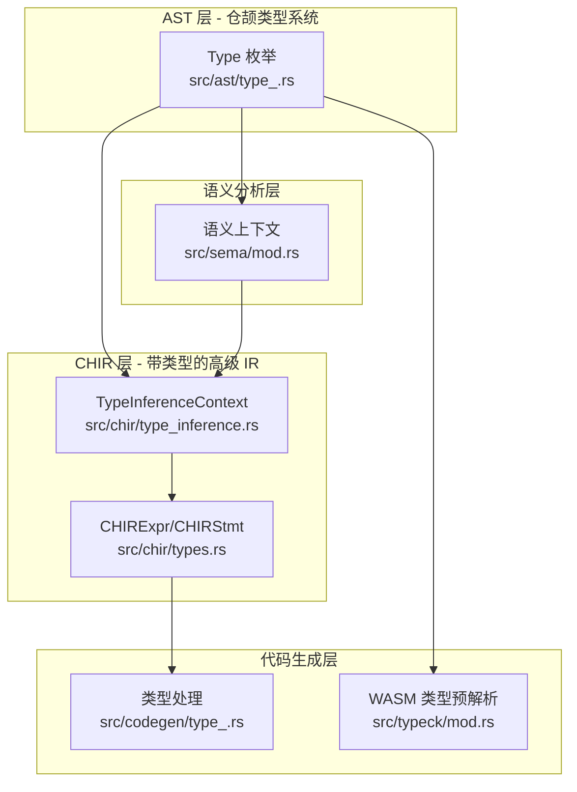

CJWasm2 采用**双层类型架构**：AST 层面保持仓颉语言的完整类型语义，CHIR（仓颉高级中间表示）层面附加 WebAssembly 类型信息，最终通过代码生成层转换为 WASM 指令。这种分层设计使类型检查既保留语言层面的类型抽象，又能在编译后期获取精确的 WASM 目标类型。

## 架构概览



### 类型系统核心模块对照表

| 模块 | 文件 | 职责 | 关键数据结构 |
|------|------|------|-------------|
| AST 类型定义 | [type_.rs](src/ast/type_.rs#L7-L57) | 仓颉语言完整类型系统 | `Type` 枚举（19种类型） |
| CHIR 类型 | [types.rs](src/chir/types.rs#L1-L200) | 带 WASM 类型的表达式 | `CHIRExpr`, `CHIRExprKind` |
| 类型推断 | [type_inference.rs](src/chir/type_inference.rs#L1-L200) | 表达式类型推断、模式绑定 | `TypeInferenceContext` |
| WASM 类型检查 | [typeck/mod.rs](src/typeck/mod.rs#L1-L100) | 函数级局部变量类型预解析 | `FunctionTypeContext` |
| 代码生成类型 | [codegen/type_.rs](src/codegen/type_.rs#L1-L132) | 类型名字修饰、别名解析 | `type_mangle_suffix` |
| 语义分析 | [sema/mod.rs](src/sema/mod.rs#L1-L100) | 返回类型推断、符号表构建 | `SemanticContext` |

## AST 类型系统

仓颉语言类型定义于 `src/ast/type_.rs`，采用枚举表示 19 种基础和复合类型。这些类型在编译前期保留语言语义，待 CHIR lowering 时转换为目标 WASM 类型。

### Type 枚举定义

```rust
// src/ast/type_.rs#L6-L57
pub enum Type {
    // 数值类型
    Int8, Int16, Int32, Int64, IntNative,
    UInt8, UInt16, UInt32, UInt64, UIntNative,
    Float16, Float32, Float64, Rune, Bool,
    
    // 特殊类型
    Nothing,  // 底类型（无返回值表达式）
    Unit,     // 单元类型（无值返回）
    String,   // 字符串（指针表示）
    
    // 复合类型
    Array(Box<Type>),           // 数组
    Struct(String, Vec<Type>),  // 结构体/类（可选类型实参）
    Tuple(Vec<Type>),           // 元组
    Range,                       // 范围（start..end）
    Function { params, ret },   // 函数类型（Lambda）
    Option(Box<Type>),          // Option<T>
    Result(Box<Type>, Box<Type>), // Result<T, E>
    Slice(Box<Type>),           // 切片 [ptr, len]
    Map(Box<Type>, Box<Type>),  // Map<K, V>
    
    // 泛型与高级特性
    TypeParam(String),  // 泛型类型参数（T）
    This,               // 当前类类型（P2）
    Qualified(Vec<String>),  // 限定类型 pkg.Module.Type（P1）
}
```

Sources: [type_.rs](src/ast/type_.rs#L6-L57)

### WASM 类型映射

每种仓颉类型映射到 WASM 值类型，转换规则如下：

```rust
// src/ast/type_.rs#L60-L98
pub fn to_wasm(&self) -> ValType {
    match self {
        // 32位值类型
        Type::Int8 | Type::Int16 | Type::Int32 | Type::UInt8 | Type::UInt16 | Type::UInt32
        | Type::Rune | Type::Bool | Type::String | Type::Array(_) | Type::Struct(..)
        | Type::Tuple(_) | Type::Range | Type::Function { .. }
        | Type::Option(_) | Type::Result(..) | Type::Slice(_) | Type::Map(..)
        | Type::TypeParam(_) | Type::This | Type::Qualified(_)
        | Type::Nothing | Type::Unit => ValType::I32,
        
        // 64位值类型
        Type::Int64 | Type::UInt64 | Type::IntNative | Type::UIntNative => ValType::I64,
        
        // 浮点类型
        Type::Float32 => ValType::F32,
        Type::Float64 => ValType::F64,
    }
}
```

Sources: [type_.rs](src/ast/type_.rs#L60-L98)

### 类型内存布局

```rust
// src/ast/type_.rs#L101-L127
pub fn size(&self) -> u32 {
    match self {
        // 定长数值类型
        Type::Int8 | Type::UInt8 => 1,
        Type::Int16 | Type::UInt16 => 2,
        Type::Int32 | Type::UInt32 | Type::Bool | Type::Rune => 4,
        Type::Int64 | Type::UInt64 | Type::IntNative | Type::UIntNative => 8,
        Type::Float16 => 2,
        Type::Float32 => 4,
        Type::Float64 => 8,
        
        // 引用类型（指针大小）
        Type::String | Type::Array(_) | Type::Tuple(_) | Type::Struct(..)
        | Type::Range | Type::Function { .. } | Type::Option(_) 
        | Type::Result(..) | Type::Slice(_) | Type::Map(..)
        | Type::TypeParam(_) | Type::This | Type::Qualified(_) => 4,
        
        // 特殊类型
        Type::Nothing => 0,
        Type::Unit => 0,
    }
}
```

Sources: [type_.rs](src/ast/type_.rs#L101-L127)

## CHIR 类型系统

CHIR（仓颉高级中间表示）层在 AST 基础上附加 WASM 类型信息，每个表达式都携带完整的类型注解，便于后续代码生成。

### CHIR 表达式结构

```rust
// src/chir/types.rs#L13-L20
pub struct CHIRExpr {
    pub kind: CHIRExprKind,     // 表达式种类
    pub ty: Type,               // 完整的 AST 类型（单态化后）
    pub wasm_ty: ValType,       // WASM 类型
    pub span: Option<Span>,     // 源码位置
}
```

Sources: [types.rs](src/chir/types.rs#L13-L20)

### CHIR 表达式种类

```rust
// src/chir/types.rs#L22-L179
pub enum CHIRExprKind {
    // 字面量
    Integer(i64), Float(f64), Float32(f32), Bool(bool), String(String), Rune(char),
    
    // 变量和引用
    Local(u32),     // 局部变量索引
    Global(String), // 全局变量名
    
    // 运算
    Binary { op: BinOp, left, right },
    Unary { op: UnaryOp, expr },
    
    // 函数调用
    Call { func_idx: u32, args },
    MethodCall { vtable_offset, func_idx, receiver, args },
    
    // 内存访问
    Load { ptr, offset, align },
    Store { ptr, value, offset, align },
    
    // 控制流
    If { cond, then_block, else_block },
    Match { subject, arms },
    Block(CHIRBlock),
    
    // 类型转换
    Cast { expr, from_ty, to_ty },
    
    // 数组/元组
    ArrayNew { len, init },
    ArrayLiteral { elements },
    ArrayGet { array, index },
    ArraySet { array, index, value },
    TupleNew { elements },
    TupleGet { tuple, index },
    
    // 结构体/类
    StructNew { struct_name, fields },
    FieldGet { object, field_offset, field_ty },
    FieldSet { object, field_offset, value },
    
    // I/O 和数学内置
    Print { arg, newline, fd },
    MathUnary { op, arg },
    MathBinary { op, left, right },
    
    // Lambda 支持
    CallIndirect { type_idx, args, callee },
}
```

Sources: [types.rs](src/chir/types.rs#L22-L179)

## 类型推断上下文

`TypeInferenceContext` 是 CHIR 层类型推断的核心数据结构，维护完整的符号表和类型关系信息。

### 上下文结构定义

```rust
// src/chir/type_inference.rs#L113-L149
pub struct TypeInferenceContext {
    // 局部变量
    pub locals: HashMap<String, Type>,           // 局部变量类型表
    pub local_mutability: HashMap<String, bool>,  // 局部变量可变性
    
    // 类型层级关系
    pub nominal_supertypes: HashMap<String, Vec<String>>,  // 名义类型继承关系
    
    // 函数和类型定义
    pub functions: HashMap<String, FunctionSignature>,     // 函数签名表
    pub struct_fields: HashMap<String, HashMap<String, Type>>,    // 结构体字段
    pub class_fields: HashMap<String, HashMap<String, Type>>,      // 类字段
    pub class_static_fields: HashMap<String, HashSet<String>>,     // 类静态字段
    pub class_method_returns: HashMap<String, HashMap<String, Type>>, // 方法返回类型
    pub enum_variant_types: HashMap<String, Type>,          // 枚举变体类型
    
    // 上下文状态
    pub current_return_ty: Option<Type>,   // 当前函数返回类型
    pub globals: HashMap<String, Type>,    // 全局变量类型
}
```

Sources: [type_inference.rs](src/chir/type_inference.rs#L113-L149)

### 从 Program 构建上下文

```rust
// src/chir/type_inference.rs#L286-L618
pub fn from_program(program: &Program) -> Self {
    // 1. 收集函数签名（含重载支持）
    // 2. 收集结构体字段
    // 3. 注册标准库接口实现
    // 4. 收集类字段和方法签名
    // 5. 二次精化无显式返回类型的函数
    // 6. 注册枚举变体类型
    // 7. 构建名义子类型关系（继承链传播）
    // 8. 继承合并（父类字段/方法传播到子类）
}
```

Sources: [type_inference.rs](src/chir/type_inference.rs#L286-L618)

## 表达式类型推断

### 字面量类型推断

```rust
// src/chir/type_inference.rs#L799-L811
pub fn infer_expr(&self, expr: &Expr) -> Result<Type, String> {
    match expr {
        // 字面量类型
        Expr::Integer(_) => Ok(Type::Int64),
        Expr::Float(_) => Ok(Type::Float64),
        Expr::Float32(_) => Ok(Type::Float32),
        Expr::Bool(_) => Ok(Type::Bool),
        Expr::Rune(_) => Ok(Type::Rune),
        Expr::String(_) => Ok(Type::String),
        Expr::Interpolate(_) => Ok(Type::String),
        
        // Option/Result 构造
        Expr::Some(inner) => Ok(Type::Option(Box::new(self.infer_expr(inner)?))),
        Expr::None => Ok(Type::Option(Box::new(Type::Nothing))),
        Expr::Ok(inner) => Ok(Type::Result(Box::new(self.infer_expr(inner)?), Box::new(Type::Nothing))),
        Expr::Err(inner) => Ok(Type::Result(Box::new(Type::Nothing), Box::new(self.infer_expr(inner)?))),
    }
}
```

Sources: [type_inference.rs](src/chir/type_inference.rs#L799-L821)

### 二元运算类型推断

```rust
// src/chir/type_inference.rs#L1226-L1315
fn infer_binary_result(&self, op: &BinOp, left: &Type, right: &Type) -> Result<Type, String> {
    match op {
        // 比较运算 → Bool
        BinOp::Eq | BinOp::NotEq
        | BinOp::Lt | BinOp::LtEq | BinOp::Gt | BinOp::GtEq
        | BinOp::LogicalAnd | BinOp::LogicalOr
        | BinOp::NotIn => Ok(Type::Bool),
        
        // 算术运算 → 操作数类型（支持字符串连接）
        BinOp::Add => {
            if matches!(left, Type::String) || matches!(right, Type::String) {
                Ok(Type::String)  // 字符串连接
            } else {
                Ok(self.promote_integral_binary_type(left, right))
            }
        }
        BinOp::Sub | BinOp::Mul | BinOp::Div | BinOp::Pow => {
            Ok(self.promote_integral_binary_type(left, right))
        }
        BinOp::Mod | BinOp::BitAnd | BinOp::BitOr | BinOp::BitXor => {
            Ok(self.promote_integral_binary_type(left, right))
        }
        
        // 移位运算 → 左操作数类型
        BinOp::Shl | BinOp::Shr => Ok(left.clone()),
        
        // 管道表达式 → 右值类型
        BinOp::Pipeline => Ok(right.clone()),
    }
}
```

Sources: [type_inference.rs](src/chir/type_inference.rs#L1226-L1315)

### 整数提升规则

```rust
// src/chir/type_inference.rs#L1400-L1415
fn promote_integral_binary_type(left: &Type, right: &Type) -> Type {
    if left == right {
        return left.clone();
    }
    // 任一操作数为 64 位 → Int64
    if matches!(left, Type::Int64 | Type::UInt64 | Type::IntNative | Type::UIntNative)
        || matches!(right, Type::Int64 | Type::UInt64 | Type::IntNative | Type::UIntNative)
    {
        Type::Int64
    } else {
        Type::Int32
    }
}
```

Sources: [type_inference.rs](src/chir/type_inference.rs#L1400-L1415)

## 子类型与赋值兼容性

### 赋值兼容性检查

```rust
// src/chir/type_inference.rs#L632-L737
pub fn is_assignable_type(&self, target: &Type, value: &Type) -> bool {
    self.is_subtype(value, target)
}

fn is_subtype(&self, sub: &Type, sup: &Type) -> bool {
    // 精确匹配
    if sub == sup { return true; }
    
    // 数值上下文允许整型宽度互通
    if Self::is_integral(sub) && Self::is_integral(sup) { return true; }
    
    // 浮点上下文允许宽度互通
    if Self::is_floating(sub) && Self::is_floating(sup) { return true; }
    
    // 未单态化类型参数保守放行
    if matches!(sup, Type::TypeParam(_) | Type::This | Type::Qualified(_)) { return true; }
    
    // Nothing 是底类型，可赋值给任何类型
    if matches!(sub, Type::Nothing) { return true; }
    
    // 引用类型赋值给 Object
    if let Type::Struct(sup_name, _) = sup {
        if sup_name == "Object" && Self::is_reference_like(sub) { return true; }
    }
    
    // 复合类型匹配...
    match (sub, sup) {
        // Option 类型兼容性
        (Type::Option(sub_t), Type::Option(sup_t)) => self.is_subtype(sub_t, sup_t),
        
        // 解包 Option 兼容性
        (value, Type::Option(inner)) if !matches!(value, Type::Option(_)) => 
            self.is_subtype(value, inner),
        
        // Result 类型兼容性
        (Type::Result(so, se), Type::Result(do, de)) => 
            self.is_subtype(so, do) && self.is_subtype(se, de),
        
        // 名义子类型（继承链检查）
        (Type::Struct(sub_name, _), Type::Struct(sup_name, _)) => 
            self.nominal_is_subtype(sub_name, sup_name),
        
        // 函数类型（参数逆变，返回值协变）
        (Type::Function { .. }, Type::Function { .. }) => { /* ... */ }
        
        _ => false,
    }
}
```

Sources: [type_inference.rs](src/chir/type_inference.rs#L632-L737)

### 名义子类型检查

```rust
// src/chir/type_inference.rs#L771-L791
fn nominal_is_subtype(&self, sub_name: &str, sup_name: &str) -> bool {
    if sub_name == sup_name { return true; }
    
    // BFS 遍历继承链
    let mut stack = vec![sub_name.to_string()];
    let mut visited = HashSet::new();
    
    while let Some(cur) = stack.pop() {
        if !visited.insert(cur.clone()) { continue; }
        if let Some(parents) = self.nominal_supertypes.get(&cur) {
            for parent in parents {
                if parent == sup_name { return true; }
                stack.push(parent.clone());
            }
        }
    }
    false
}
```

Sources: [type_inference.rs](src/chir/type_inference.rs#L771-L791)

## 模式类型绑定

类型推断上下文支持将模式与具体类型绑定，推断各绑定变量的类型。

### 模式绑定规则

```rust
// src/chir/type_inference.rs#L1799-L1860
fn bind_pattern_types(&mut self, pattern: &Pattern, ty: &Type, mutable: bool) {
    match pattern {
        // 简单绑定
        Pattern::Binding(name) => {
            self.add_local_with_mutability(name.clone(), ty.clone(), mutable);
        }
        
        // 元组解构
        Pattern::Tuple(pats) => {
            if let Type::Tuple(items) = ty {
                for (idx, p) in pats.iter().enumerate() {
                    let elem_ty = items.get(idx).unwrap_or(ty);
                    self.bind_pattern_types(p, elem_ty, mutable);
                }
            }
        }
        
        // 枚举变体解构
        Pattern::Variant { enum_name, variant_name, payload } => {
            if let Some(payload_ty) = self.variant_payload_type(ty, enum_name, variant_name) {
                self.bind_pattern_types(payload, &payload_ty, mutable);
            }
        }
        
        // 结构体字段解构
        Pattern::Struct { fields, .. } => {
            if let Type::Struct(name, type_args) = ty {
                for (field_name, field_pat) in fields {
                    let field_ty = self.lookup_field_type(ty, field_name)
                        .unwrap_or(Type::Int32);
                    self.bind_pattern_types(field_pat, &field_ty, mutable);
                }
            }
        }
        
        // Or 模式
        Pattern::Or(pats) => {
            for p in pats {
                self.bind_pattern_types(p, ty, mutable);
            }
        }
        
        // 类型测试模式
        Pattern::TypeTest { binding, ty } => {
            self.add_local_with_mutability(binding.clone(), ty.clone(), mutable);
        }
    }
}
```

Sources: [type_inference.rs](src/chir/type_inference.rs#L1799-L1860)

## 函数级 WASM 类型检查

`src/typeck/mod.rs` 实现函数级类型预解析，在代码生成前确定所有局部变量的精确 WASM 类型。

### 函数类型上下文

```rust
// src/typeck/mod.rs#L19-L36
pub(crate) struct FunctionTypeGlobal<'a> {
    pub func_return_wasm_types: &'a HashMap<String, Option<ValType>>,
    pub structs: &'a HashMap<String, StructDef>,
    pub classes: &'a HashMap<String, ClassInfo>,
    pub global_var_types: &'a HashMap<String, Type>,
}

#[derive(Debug, Default)]
pub(crate) struct FunctionTypeContext {
    pub local_types: HashMap<String, ValType>,
}
```

Sources: [typeck/mod.rs](src/typeck/mod.rs#L19-L36)

### 表达式 WASM 类型推断

```rust
// src/typeck/mod.rs#L396-L543
pub(crate) fn resolve_expr_type(
    expr: &Expr,
    ctx: &FunctionTypeContext,
    global: &FunctionTypeGlobal<'_>,
) -> ValType {
    match expr {
        // 整数字面量 → I64（唯一确定用 I64 的情况）
        Expr::Integer(_) => ValType::I64,
        
        // 浮点字面量
        Expr::Float(_) => ValType::F64,
        Expr::Float32(_) => ValType::F32,
        
        // 其他字面量 → I32（对象引用）
        Expr::Bool(_) | Expr::Rune(_) | Expr::String(_) | Expr::Interpolate(_)
        | Expr::Array(_) | Expr::Tuple(_) | Expr::SliceExpr { .. } | Expr::Range { .. }
        | Expr::StructInit { .. } | Expr::Some(_) | Expr::None
        | Expr::Ok(_) | Expr::Err(_) | Expr::VariantConst(_) => ValType::I32,
        
        // 构造函数：原始类型与 Type::T.to_wasm() 一致
        Expr::ConstructorCall { name, .. } => match name.as_str() {
            "Int8" | "Int16" | "Int32" | "UInt8" | "UInt16" | "UInt32" => ValType::I32,
            "Int64" | "UInt64" | "IntNative" | "UIntNative" => ValType::I64,
            "Float16" | "Float32" => ValType::F32,
            "Float64" => ValType::F64,
            _ => ValType::I32,  // 用户定义类型
        },
        
        // 变量：查已解析的 local_types，再查全局变量
        Expr::Var(name) => {
            ctx.local_types.get(name.as_str())
                .copied()
                .or_else(|| global.global_var_types.get(name.as_str()).map(|t| t.to_wasm()))
                .unwrap_or(ValType::I32)
        }
        
        // 二元运算：比较 → I32，算术 → 取最大类型
        Expr::Binary { op, left, right } => match op {
            BinOp::Eq | BinOp::NotEq | BinOp::Lt | BinOp::LtEq 
            | BinOp::Gt | BinOp::GtEq | BinOp::LogicalAnd | BinOp::LogicalOr | BinOp::NotIn
                => ValType::I32,
            _ => {
                let lt = resolve_expr_type(left, ctx, global);
                let rt = resolve_expr_type(right, ctx, global);
                if lt == ValType::I64 || rt == ValType::I64 { ValType::I64 } else { lt }
            }
        },
        
        // If 表达式 → then 分支类型
        Expr::If { then_branch, .. } => resolve_expr_type(then_branch, ctx, global),
        
        // Block → trailing 表达式类型
        Expr::Block(stmts, trailing) => { /* ... */ }
        
        _ => ValType::I32,  // 保守回退
    }
}
```

Sources: [typeck/mod.rs](src/typeck/mod.rs#L396-L543)

## 内置类型方法推断

类型推断上下文内置标准库方法返回类型知识，用于方法调用链的类型推断。

### 内置方法返回类型表

```rust
// src/chir/type_inference.rs#L1526-L1595
fn infer_method_return(&self, obj_ty: &Type, method: &str, args: &[Expr]) -> Result<Type, String> {
    // Option 方法
    if let Type::Option(inner) = obj_ty {
        match method {
            "getOrThrow" | "unwrap" | "getOrDefault" => return Ok(inner.as_ref().clone()),
            "isNone" | "isSome" => return Ok(Type::Bool),
        }
    }
    
    // Result 方法
    if let Type::Result(ok, err) = obj_ty {
        match method {
            "getOrThrow" | "unwrap" => return Ok(ok.as_ref().clone()),
            "isOk" | "isErr" => return Ok(Type::Bool),
            "errOrThrow" => return Ok(err.as_ref().clone()),
        }
    }
    
    // ArrayList 方法
    if let Type::Struct(name, type_args) = obj_ty {
        match (name.as_str(), method) {
            ("ArrayList", "append" | "set" | "clear") => return Ok(Type::Unit),
            ("ArrayList", "get" | "remove") => {
                return Ok(type_args.first().cloned().unwrap_or(Type::Int64));
            }
            ("ArrayList", "size") => return Ok(Type::Int64),
            ("ArrayList", "isEmpty") => return Ok(Type::Bool),
            
            // HashMap 方法
            ("HashMap", "put" | "clear") => return Ok(Type::Unit),
            ("HashMap", "get" | "remove") => {
                return Ok(type_args.get(1).cloned().unwrap_or(Type::Int64));
            }
            ("HashMap", "size") => return Ok(Type::Int64),
            ("HashMap", "contains" | "containsKey") => return Ok(Type::Bool),
            
            // String 方法
            ("String", "toLower" | "toUpper" | "toTitle") => return Ok(Type::String),
            ("String", "runes" | "toRuneArray") => {
                return Ok(Type::Array(Box::new(Type::Rune)));
            }
            
            // ...
        }
    }
    
    // 通用方法
    match method {
        "toString" => Ok(Type::String),
        // ...
        _ => Ok(Type::Int32),  // 保守推断
    }
}
```

Sources: [type_inference.rs](src/chir/type_inference.rs#L1526-L1595)

## 类型名字修饰

代码生成层使用类型名字修饰解决重载和泛型问题。

```rust
// src/codegen/type_.rs#L9-L83
impl CodeGen {
    pub(crate) fn type_mangle_suffix(ty: &Type) -> String {
        match ty {
            Type::Int8 => "Int8".to_string(),
            Type::Int64 => "Int64".to_string(),
            Type::Array(inner) => format!("Array_{}", Self::type_mangle_suffix(inner)),
            Type::Struct(s, args) => {
                if args.is_empty() {
                    s.clone()
                } else {
                    format!("{}_{}", s, args.iter()
                        .map(Self::type_mangle_suffix)
                        .collect::<Vec<_>>()
                        .join("_"))
                }
            }
            Type::Function { params, ret } => {
                let params_str = params.iter().map(Self::type_mangle_suffix).collect::<Vec<_>>().join("_");
                let ret_str = ret.as_ref().as_ref()
                    .map(Self::type_mangle_suffix)
                    .unwrap_or_else(|| "Unit".to_string());
                format!("Fn_{}_{}", params_str, ret_str)
            }
            // ...
        }
    }
    
    pub(crate) fn mangle_key(name: &str, param_tys: &[Type]) -> String {
        format!("{}${}", name, param_tys.iter()
            .map(Self::type_mangle_suffix)
            .collect::<Vec<_>>()
            .join("$"))
    }
}
```

Sources: [codegen/type_.rs](src/codegen/type_.rs#L9-L83)

## 语义分析层

`src/sema/mod.rs` 实现轻量级语义预分析，主要用于无显式返回类型标注的函数推断。

```rust
// src/sema/mod.rs#L21-L103
pub fn analyze(program: &Program) -> SemanticContext {
    let mut ctx = SemanticContext::default();
    let mut known: HashMap<String, Type> = HashMap::new();
    
    // 第一轮：收集已有返回类型的符号
    for func in &program.functions {
        if let Some(ref ret) = func.return_type {
            if *ret != Type::Unit && *ret != Type::Nothing {
                known.insert(func.name.clone(), ret.clone());
            }
        }
    }
    
    // 第二轮（多轮迭代）：推断无标注函数的返回类型
    for _pass in 0..3 {
        let mut changed = false;
        for func in &program.functions {
            if func.return_type.is_some() || func.extern_import.is_some() 
                || !func.type_params.is_empty() || func.body.is_empty()
                || known.contains_key(&func.name) { continue; }
            
            if let Some(inferred) = infer_return_from_body(&func.body, &known) {
                known.insert(func.name.clone(), inferred.clone());
                ctx.inferred_return_types.insert(func.name.clone(), inferred);
                changed = true;
            }
        }
        if !changed { break; }
    }
    
    ctx
}
```

Sources: [sema/mod.rs](src/sema/mod.rs#L21-L103)

## 继承关系与接口实现

类型推断上下文维护标准库内置的类型层级关系：

```rust
// src/chir/type_inference.rs#L152-L180
fn builtin_nominal_supertypes() -> &'static [(&'static str, &'static [&'static str])] {
    &[
        // I/O 流层级
        ("File", &["InputStream", "OutputStream"]),
        ("FileReader", &["InputStream"]),
        ("BufferedReader", &["InputStream"]),
        ("ConsoleStdOut", &["OutputStream"]),
        ("ByteBuffer", &["InputStream", "OutputStream"]),
        
        // 异常层级
        ("IOException", &["Exception", "Error", "Object"]),
        ("Exception", &["Error", "Object"]),
        
        // ...
    ]
}
```

Sources: [type_inference.rs](src/chir/type_inference.rs#L152-L180)

## 设计原则

1. **零 panic 保守推断**：遇到不确定类型时统一回退到 `I32`（对象引用），避免编译流程中断
2. **整数字面量特殊处理**：唯一确定用 `I64` 的情况，避免 `collect_locals` 中 `I64` 错误回退
3. **纯只读扫描**：类型检查模块不修改 AST，与代码生成解耦
4. **多轮迭代传播**：继承关系和返回类型通过多轮迭代传播，确保复杂继承链正确解析
5. **名义子类型检查**：BFS 遍历继承链，支持 class extends 和 interface implements

## 相关文档

- [CHIR 中间表示](9-chir-zhong-jian-biao-shi) - 了解 CHIR 层如何利用类型信息
- [WebAssembly 代码生成器](12-webassembly-dai-ma-sheng-cheng-qi) - 了解类型如何转换为 WASM 指令
- [表达式代码生成](14-biao-da-shi-dai-ma-sheng-cheng) - 了解表达式求值中的类型处理
- [AST 优化器](10-ast-you-hua-qi) - 了解基于类型的优化 Pass