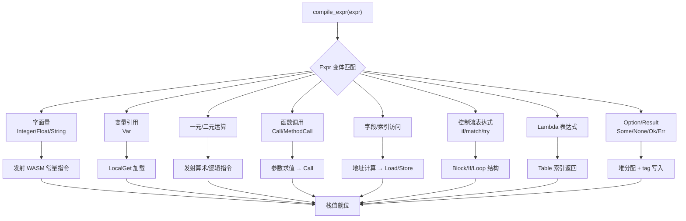

表达式代码生成模块负责将 Cangjie 语言的表达式 AST 节点编译为 WebAssembly 字节码指令。该模块是编译器后端的核心组件，驻留在 `src/codegen/expr.rs` 中，与 AST 定义 (`src/ast/mod.rs`)、类型系统 (`src/ast/type_.rs`) 以及 CHIR 中间表示 (`src/chir/`) 紧密协作。

Sources: [expr.rs](src/codegen/expr.rs#L1-L100)
Sources: [mod.rs](src/codegen/mod.rs#L1-L100)

## 架构概览

表达式编译采用**递归下降**模式，以 `compile_expr` 为核心入口点。该方法接收 AST 表达式、局部变量构建器、WASM 函数构建器以及循环上下文，返回编译后的指令序列。整个编译过程遵循"先类型推断、后指令发射"的两阶段策略。



表达式编译的关键设计决策包括：**局部变量作用域管理**通过 `LocalsBuilder` 实现，支持 WASM 值类型和 AST 类型的双轨存储；**类型推断**采用三级降级策略（AST 推断 → 局部变量上下文 → WASM 默认类型）；**内建方法分发**在方法调用前拦截常见模式（如 `Int64.abs()`），避免生成冗余调用序列。

Sources: [expr.rs](src/codegen/expr.rs#L4807-L4865)
Sources: [mod.rs](src/codegen/mod.rs#L6897-L6961)

## 局部变量管理

`LocalsBuilder` 是表达式编译时的作用域上下文维护器，负责追踪所有可见的局部变量及其类型信息。该结构维护三个并行数据结构：变量名到索引的映射、索引到 WASM 值类型的映射、以及变量名到 AST 类型的映射。

Sources: [mod.rs](src/codegen/mod.rs#L6897-L6961)

### 类型升级与修正

`add` 方法实现了智能类型升级逻辑：当同一变量名被多次声明时，若后续声明需要更宽的类型（如 `I32` → `I64` 或 `F32` → `F64`），自动升级类型信息。这确保了代码如 `var x = 1; x = 2.0` 能正确编译为 `i64` 类型。

```rust
fn add(&mut self, name: &str, ty: ValType, ast_type: Option<Type>) {
    if let Some(&idx) = self.names.get(name) {
        let existing = self.types[idx as usize];
        let should_upgrade = matches!(
            (existing, ty),
            (ValType::I32, ValType::I64) | (ValType::F32, ValType::F64)
        );
        if should_upgrade {
            self.types[idx as usize] = ty;
            // ...
        }
    } else {
        // 新变量注册
    }
}
```

`apply_type_corrections` 方法则在类型检查完成后，将 `FunctionTypeContext` 中的精确类型应用到局部变量，仅执行 I64 → I32 的降级修正，避免引入新的类型错误。

Sources: [mod.rs](src/codegen/mod.rs#L6913-L6975)

## 字面量编译

字面量是最基础的表达式形式，编译策略是将字面量值直接嵌入 WASM 指令流中。

| 字面量类型 | AST 节点 | WASM 指令 | 说明 |
|-----------|----------|----------|------|
| 整数 | `Expr::Integer(i64)` | `I64Const` | 64位有符号整数常量 |
| Float64 | `Expr::Float(f64)` | `F64Const` | 双精度浮点常量 |
| Float32 | `Expr::Float32(f32)` | `F32Const` | 单精度浮点常量（后缀 f） |
| 布尔 | `Expr::Bool(bool)` | `I32Const(0\|1)` | 用 I32 表示布尔值 |
| Rune | `Expr::Rune(char)` | `I32Const(c as i32)` | Unicode 码点 |
| 字符串 | `Expr::String(String)` | `I32Const(pool_offset)` | 返回字符串池偏移 |

字符串字面量的处理略有特殊：编译器在编译初期构建**字符串常量池** (`string_pool`)，将所有字符串字面量收集到数据段中，编译时通过池偏移量引用。

Sources: [expr.rs](src/codegen/expr.rs#L4815-L4838)

### 字符串插值

`Interpolate` 表达式实现了 `"Hello, ${name}!"` 形式的字符串插值。编译策略是逐部分求值并使用 `__str_concat` 运行时函数串联。对于非字符串类型的插值表达式，自动调用对应的 `__to_string_TYPE` 转换函数。

Sources: [expr.rs](src/codegen/expr.rs#L4840-L4965)

## 变量与作用域

变量引用通过 `Expr::Var` 节点表示。编译时首先在 `LocalsBuilder` 中查找变量索引，若命中则发射 `LocalGet` 指令；否则检查是否为隐式 `this` 字段访问（用于方法内部的方法调用简写）；最后回退到全局变量或发出警告占位符。

```rust
Expr::Var(name) => {
    if let Some(idx) = locals.get(name) {
        func.instruction(&Instruction::LocalGet(idx));
    } else if let Some(this_idx) = locals.get("this") {
        // 隐式 this 字段访问：field → this.field
        let this_field = Expr::Field { ... };
        self.compile_expr(&this_field, locals, func, loop_ctx);
    } else {
        // 全局变量或警告
        func.instruction(&Instruction::I32Const(0));
    }
}
```

Sources: [expr.rs](src/codegen/expr.rs#L4967-L5004)

### 数学常数

模块还处理内建的数学常数（`PI`、`E`、`INF`、`NAN` 等），当这些名称未在局部作用域中声明时，直接发射对应的 `F64Const` 指令。

Sources: [expr.rs](src/codegen/expr.rs#L4968-L4987)

## 运算符表达式

### 一元运算符

一元运算符包括逻辑取反 (`!`)、按位取反 (`~`) 和负号 (`-`)。每种运算符根据操作数类型选择对应的 WASM 指令序列。

| 运算符 | 操作数类型 | 编译策略 |
|-------|-----------|---------|
| `!` | 任意 | 先 `I32Eqz`（I64 需先 wrap） |
| `~` | I32/I64 | 与 -1 异或 |
| `-` | I32/I64/F32/F64 | `0 - operand` |

Sources: [expr.rs](src/codegen/expr.rs#L5006-L5061)

### 二元运算符

二元运算符编译根据类型分为三大类：**算术运算**（`+`、`-`、`*`、`/`、`%`）直接映射到 WASM 整数/浮点指令；**比较运算**（`==`、`!=`、`<`、`>`、`<=`、`>=`）发射比较指令后产生 I32 结果；**逻辑运算**（`&&`、`||`）实现短路求值。

#### 短路逻辑运算

逻辑与 (`&&`) 和逻辑或 (`||`) 采用块结构实现短路求值：

```rust
// LogicalAnd: left && right
self.compile_expr(left, ...);
func.instruction(&Instruction::If(BlockType::Result(I32)));
func.instruction(&Instruction::I32Const(0));  // left 为 false
func.instruction(&Instruction::Else);
self.compile_expr(right, ...);               // left 为 true，求值 right
func.instruction(&Instruction::I32Const(1));
func.instruction(&Instruction::I32Sub);        // 取反得最终结果
func.instruction(&Instruction::End);
```

Sources: [expr.rs](src/codegen/expr.rs#L5063-L5117)

#### 管道运算符

P6 引入的管道运算符 (`|>`) 实现为 `left |> right` → `right(left)` 的语义转换，支持变量引用和函数调用作为右操作数。

Sources: [expr.rs](src/codegen/expr.rs#L5140-L5179)

### 运算符重载

Phase 3.1 支持运算符重载，编译器在处理二元运算前检查左操作数类型是否定义了对应的 `op_add`、`op_sub` 等方法。若存在，则将二元运算转换为方法调用。

Sources: [expr.rs](src/codegen/expr.rs#L5181-L5239)

## 函数调用

函数调用是表达式编译中最复杂的部分，涉及参数求值、类型适配和函数解析。

### 函数解析策略

编译器采用多级回退策略解析函数引用：首先按精确参数类型匹配（修饰名如 `foo$I64$F64`），若失败则尝试按参数数量匹配（包级函数），最后按参数数量匹配（带参数化的包级函数）。

```rust
// 精确类型匹配
let key = Self::mangle_key(name, &arg_tys);
if let Some(&idx) = self.func_indices.get(&key) {
    func.instruction(&Instruction::Call(idx));
} else {
    // 回退到参数数量匹配
    let candidates: Vec<String> = self.func_params.keys()
        .filter(|k| self.func_params[k].len() == args.len())
        .collect();
    // ...
}
```

Sources: [expr.rs](src/codegen/expr.rs#L5970-L6060)

### 参数处理

参数求值采用从左到右的顺序，依次调用 `compile_expr` 压栈。对于**可变参数**（`...args`），将剩余实参打包为数组表达式；对于**缺失实参**，使用函数声明中的默认值填充。参数类型适配 (`emit_type_coercion`) 在实参类型与形参类型不匹配时自动插入转换指令。

Sources: [expr.rs](src/codegen/expr.rs#L6069-L6108)

### 隐式 this 参数

当检测到隐式方法调用时（如在类方法内直接调用 `method()` 而非 `this.method()`），编译器自动将 `this` 指针作为第一个参数注入。

Sources: [expr.rs](src/codegen/expr.rs#L6063-L6067)

## 方法调用与字段访问

### 方法调用

`MethodCall` 表达式首先尝试内建方法分发（`compile_builtin_method`），若命中则直接编译；否则走正常的对象方法调用流程。

内建方法分发覆盖了 `Int64`、`Float64`、`String`、`Array`、`HashMap` 等常见类型的核心方法。例如 `Int64.abs()` 直接调用运行时函数 `__abs_i64`，避免了虚拟方法调用的开销。

Sources: [expr.rs](src/codegen/expr.rs#L2574-L2800)

### 字段访问

字段访问 (`Expr::Field`) 编译为对象地址计算加类型感知的加载指令序列：

```rust
self.compile_expr(object, ...);      // 对象指针压栈
func.instruction(&I32Const(offset));
func.instruction(&I32Add);           // 计算字段地址
self.emit_load_by_type(func, &field_ty);  // 根据字段类型选择加载指令
```

属性（getter 方法）通过检测 `ClassName.__get_propName` 格式的方法名识别，编译为方法调用而非直接内存访问。

Sources: [expr.rs](src/codegen/expr.rs#L7162-L7280)

## 控制流表达式

### 条件表达式

`If` 表达式编译为 WASM `if-else` 结构，条件表达式必须为 I32 类型（必要时自动 wrap I64）。若 `then` 或 `else` 分支不产生值，使用 `Empty` 块类型。

Sources: [expr.rs](src/codegen/expr.rs#L6385-L6450)

### Match 表达式

Match 编译为嵌套的 `if` 链或 `br` 指令序列。编译器首先推断结果类型，然后为每个分支生成条件检查和值发射代码。

```rust
func.instruction(&Instruction::Block(result_type));  // 外层块
self.compile_expr(expr, ...);                        // subject 求值

for arm in arms {
    match arm.pattern {
        Pattern::Literal(lit) => {
            // 发射比较指令
            func.instruction(&Instruction::I64Eq);
            func.instruction(&Instruction::If(BlockType::Empty));
            self.compile_expr(&arm.body, ...);
            func.instruction(&Instruction::Br(1));    // break 到外层块外
            func.instruction(&Instruction::End);
        }
        Pattern::Binding(name) => { /* 绑定并继续 */ }
        Pattern::Wildcard => { /* 默认分支 */ }
    }
}
func.instruction(&Instruction::End);
```

无主体的 match 表达式（如 `match { case x > 0 => println("positive") }`）作为布尔条件链处理，无需对 subject 求值。

Sources: [expr.rs](src/codegen/expr.rs#L7399-L7700)

### Try-Catch-Finally

`TryBlock` 表达式实现异常处理机制，在编译期预分配 `__err_flag`、`__err_val` 和 `__try_result` 三个临时局部变量。try 块正常编译，catch 块在 `__err_flag` 为真时执行，finally 块无论是否异常都执行。

Sources: [expr.rs](src/codegen/expr.rs#L729-L781)
Sources: [expr.rs](src/codegen/expr.rs#L8135-L8181)

## Option 与 Result

Option/Result 类型采用**堆分配带 tag 的结构**表示：前 4 字节存储判别式（0 或 1），后续字节存储实际值。

| 类型 | 判别式 | 内存布局 |
|------|--------|---------|
| `Some(v)` / `Ok(v)` | 0 | `[0: i32][value]` |
| `None` | 0 | `[0]`（无 payload） |
| `Err(e)` | 1 | `[1: i32][e_ptr: i32]` |

`?` 运算符 (`Try`) 编译为 tag 检查：若为 `None`/`Err` 则从函数提前返回，否则解包并继续。

Sources: [expr.rs](src/codegen/expr.rs#L8017-L8166)

## Lambda 表达式

Lambda 编译返回其在函数表 (`table`) 中的索引，而非内联内嵌代码。这是 Phase 2.3 引入的设计，支持**一等函数**（First-class functions）。

```rust
Expr::Lambda { params, return_type, body } => {
    let lambda_idx = self.lambda_counter.get();
    self.lambda_counter.set(lambda_idx + 1);
    let lambda_name = format!("__lambda_{}", lambda_idx);
    // 返回 table 索引
    func.instruction(&Instruction::I32Const(table_indices[&lambda_name]));
}
```

Lambda 的实际函数体在编译初期通过**预扫描**收集，生成独立的 WASM 函数，通过 `call_indirect` 调用。

Sources: [expr.rs](src/codegen/expr.rs#L7996-L8016)
Sources: [mod.rs](src/codegen/mod.rs#L557-L561)

## 类型推断系统

类型推断是表达式编译正确性的基石，采用三级降级策略：

1. **AST 类型推断** (`infer_ast_type_with_locals`)：基于 AST 结构本身推断最精确的类型
2. **局部变量上下文**：检查变量在当前作用域中的声明类型
3. **WASM 默认类型**：作为最后的回退，使用保守的 I64

```rust
fn infer_type_with_locals(&self, expr: &Expr, locals: &LocalsBuilder) -> ValType {
    // 优先使用 AST 类型推断
    if let Some(ast_ty) = self.infer_ast_type_with_locals(expr, locals) {
        return ast_ty.to_wasm();
    }
    // 回退到局部变量类型
    if let Expr::Var(name) = expr {
        if let Some(vt) = locals.get_valtype(name) {
            return vt;
        }
    }
    // 最终回退
    self.infer_type(expr)
}
```

Sources: [expr.rs](src/codegen/expr.rs#L2434-L2471)

## 类型转换与强制

显式类型转换 (`expr as Type`) 和隐式类型强制 (`emit_type_coercion`) 处理 WASM 类型间的转换。编译器根据源类型和目标类型选择正确的转换指令：

| 源 → 目标 | 指令 |
|----------|------|
| I64 → I32 | `I32WrapI64` |
| I32 → I64 | `I64ExtendI32S/U` |
| I64 → F64 | `F64ConvertI64S` |
| F64 → I64 | `I64TruncF64S` |
| F32 ↔ F64 | `F64PromoteF32` / `F32DemoteF64` |

Sources: [expr.rs](src/codegen/expr.rs#L5554-L5600)

## 模式匹配与解构

模式匹配在 match 表达式和 `let` 声明中均有应用。`collect_pattern_bindings` 方法递归收集模式中的所有绑定变量，`compile_pattern_binding` 方法编译值到绑定的存储操作。

支持的模式类型包括：
- **简单绑定** (`Pattern::Binding`)：直接 `LocalSet`
- **元组解构**：加载指针后逐元素递归
- **结构体解构**：字段偏移计算后加载
- **枚举变体**：判别式比较后条件分支

Sources: [expr.rs](src/codegen/expr.rs#L102-L219)
Sources: [expr.rs](src/codegen/expr.rs#L221-L812)

## 特殊表达式处理

### Break 与 Continue

循环控制语句需要**循环上下文**信息 `(break_depth, continue_depth)`，用于计算 `br` 指令的目标深度。这些信息在编译循环语句时传入，并在编译 break/continue 时使用。

Sources: [expr.rs](src/codegen/expr.rs#L8190-L8205)

### Return 表达式

`return` 在表达式上下文（如 match arm body）中编译为：先求值返回值表达式，然后发射 `Return` 指令。

Sources: [expr.rs](src/codegen/expr.rs#L8183-L8188)

### Throw 表达式

`throw` 编译为：先求值异常表达式，若在 try 上下文则设置错误标志并跳转到 catch；否则直接 `Return`。

Sources: [expr.rs](src/codegen/expr.rs#L8167-L8181)

## 运行时函数集成

表达式编译依赖大量运行时函数实现语言特性：

| 类别 | 函数示例 | 用途 |
|------|---------|------|
| 字符串 | `__i64_to_str`, `__str_concat` | 数值到字符串转换、字符串拼接 |
| 数学 | `__math_sin`, `__abs_i64`, `__pow_f64` | 数学运算 |
| 内存 | `__alloc` | 堆内存分配 |
| I/O | `__println`, `__readln` | 标准输入输出 |
| 集合 | `__hashmap_get`, `__array_size` | 集合操作 |

这些函数在编译器的 `emit_*` 方法中生成内联实现，或从标准库链接。

Sources: [mod.rs](src/codegen/mod.rs#L2841-L2943)
Sources: [expr.rs](src/codegen/expr.rs#L1380-L1514)

## 下一步

表达式代码生成与 [类型检查与类型推断](13-lei-xing-jian-cha-yu-lei-xing-tui-duan) 紧密相关，后者提供了类型推断所需的基础设施。如需了解语句层面的编译逻辑，可参考 [WebAssembly 代码生成器](12-webassembly-dai-ma-sheng-cheng-qi) 中的语句编译部分。若对编译过程的中间表示感兴趣，可阅读 [CHIR 中间表示](9-chir-zhong-jian-biao-shi) 了解从 AST 到 CHIR 的降级转换。