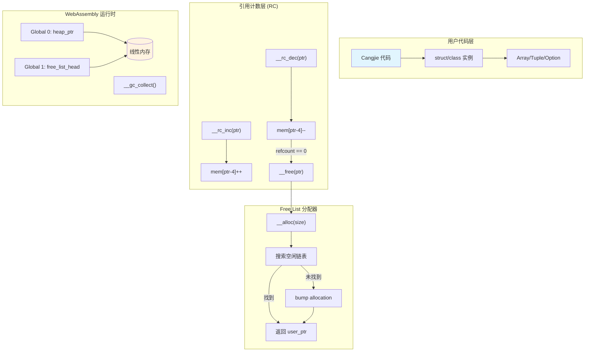
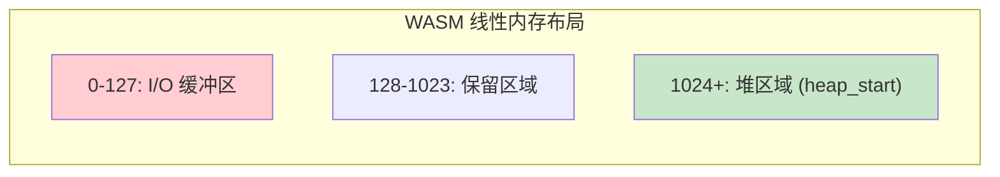
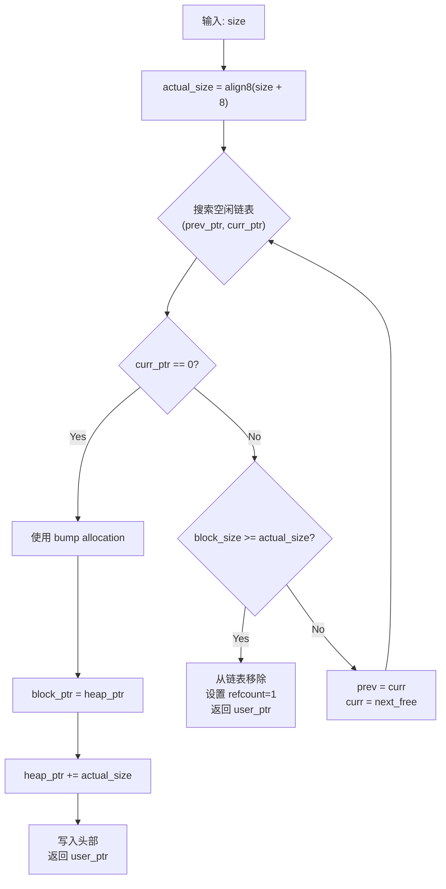
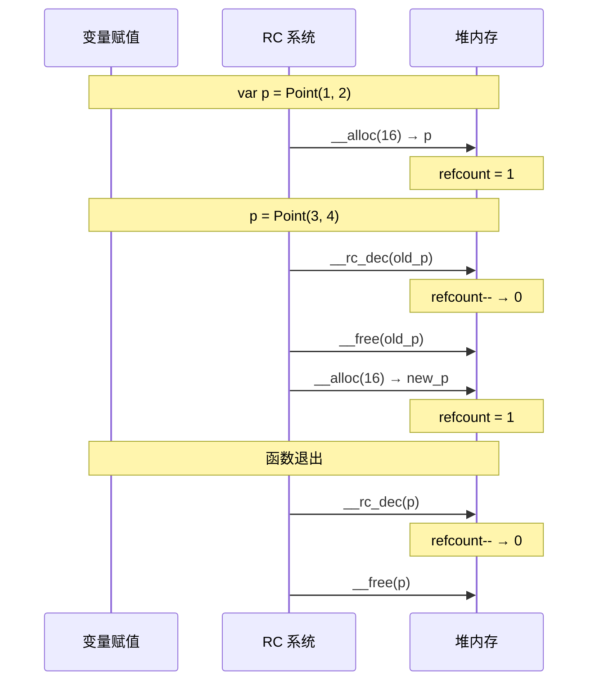
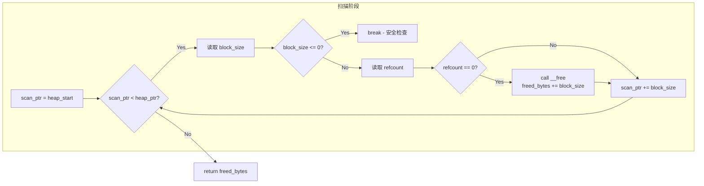

本页面介绍 CJwasm2 编译器为 WebAssembly 目标平台实现的内存管理子系统。该系统采用分层策略：底层基于 WebAssembly 线性内存模型，中层实现 Free List 分配器，上层提供引用计数与可选的标记-清除垃圾回收机制。

## 架构概览



### 设计决策

| 层次 | 组件 | 目的 | 触发条件 |
|------|------|------|----------|
| 底层 | WebAssembly 线性内存 | 原始内存空间 | 编译时固定 |
| 中层 | Free List Allocator | 替代 bump allocator，支持内存回收 | `__alloc`/`__free` |
| 上层 | 引用计数 | 即时释放无引用对象 | 变量赋值/作用域退出 |
| 上层 | Mark-Sweep GC | 回收循环引用对象 | `__gc_collect()` |

Sources: [memory.rs](src/memory.rs#L1-L26)

## 内存布局

### 堆对象头部结构

每个通过 `__alloc` 分配的堆对象在用户数据前包含 8 字节固定头部：

```text
内存地址布局:
┌────────────────────┬─────────────────────┬────────────────────────────┐
│   block_size: i32   │    refcount: i32     │       user_data...         │
│   (4 bytes)         │    (4 bytes)         │                            │
└────────────────────┴─────────────────────┴────────────────────────────┘
        ↑                                    ↑
        |__alloc 返回 user_ptr ───────────────┘

Global 变量:
  Global 0: heap_ptr       (i32, mutable) — bump allocator 指针
  Global 1: free_list_head (i32, mutable) — 空闲链表头指针，0 表示空
```

### 空闲块结构

已释放的块复用头部空间存储空闲链表指针：

```text
┌────────────────────┬─────────────────────┐
│   block_size: i32  │   next_free_ptr     │
│   (保持不变)        │   (复用 refcount 字段)│
└────────────────────┴─────────────────────┘
```

Sources: [memory.rs](src/memory.rs#L8-L25)

### 内存区域划分



内存初始化时预留 128 字节 I/O 缓冲区，堆从地址 1024 开始：

Sources: [codegen/mod.rs](src/codegen/mod.rs#L24-L34)

## Free List 分配器实现

### `__alloc` 函数生成算法

`__alloc(size: i32) -> i32` 函数的 WebAssembly 指令生成遵循以下算法：



关键实现细节：

```rust
// 对齐到 8 字节: (n + 7) & ~7
actual_size = ((size + 8) + 7) & !7

// 搜索空闲链表
while curr_ptr != 0 {
    if block_size >= actual_size {
        // 从链表移除
        mem[prev_ptr + 4] = next_free
        // 设置 refcount = 1
        mem[curr_ptr + 4] = 1
        return curr_ptr + 8  // user_ptr
    }
    prev = curr
    curr = mem[curr + 4]  // next_free
}

// 未找到，使用 bump allocation
heap_ptr += actual_size
mem[block_ptr] = actual_size
mem[block_ptr + 4] = 1
return block_ptr + 8
```

Sources: [memory.rs](src/memory.rs#L44-L176)

### `__free` 函数实现

```rust
// 空指针安全检查
if ptr == 0 { return }

// block_ptr = ptr - 8 (回退到块起始)
block_ptr = ptr - 8

// 将块加入空闲链表头部
mem[block_ptr + 4] = free_list_head  // next = old head
free_list_head = block_ptr           // head = this block
```

Sources: [memory.rs](src/memory.rs#L178-L213)

## 引用计数系统

### 引用计数函数

引用计数机制在对象头部维护 32 位引用计数器，编译器在关键位置自动插入计数操作：



### `__rc_inc` 实现

```rust
pub fn emit_rc_inc_func(heap_start: i32) -> WasmFunc {
    // if ptr == 0 → return
    // if ptr < heap_start → return (非堆指针，如数据段字符串)
    
    // mem[ptr - 4] += 1
    let new_count = mem.load(ptr - 4) + 1
    mem.store(ptr - 4, new_count)
}
```

Sources: [memory.rs](src/memory.rs#L219-L259)

### `__rc_dec` 实现

```rust
pub fn emit_rc_dec_func(heap_start: i32, free_func_idx: u32) -> WasmFunc {
    // if ptr == 0 || ptr < heap_start → return
    
    // new_count = mem[ptr - 4] - 1
    let new_count = mem.load(ptr - 4) - 1
    mem.store(ptr - 4, new_count)
    
    // if new_count == 0 → call __free(ptr)
    if new_count == 0 {
        call(free_func_idx)
    }
}
```

Sources: [memory.rs](src/memory.rs#L261-L315)

### 编译器自动插入点

编译器在以下位置自动插入引用计数操作：

```rust
// 1. 变量赋值时 - 对旧值执行 rc_dec
if memory::is_heap_type(ast_ty) || memory::may_hold_heap_ptr(ast_ty) {
    // 赋值前调用 __rc_dec
    call(__rc_dec)
}

// 2. 函数退出时 - 对所有堆类型局部变量执行 rc_dec
for (name, idx) in locals.names {
    if memory::is_heap_type(ty) {
        // 函数末尾调用 __rc_dec
        call(__rc_dec)
    }
}
```

Sources: [codegen/expr.rs](src/codegen/expr.rs#L3874-L3882)
Sources: [codegen/mod.rs](src/codegen/mod.rs#L1999-L2026)

### 堆类型判定

```rust
/// 判断类型是否为堆分配的引用类型
pub fn is_heap_type(ty: &Type) -> bool {
    matches!(
        ty,
        Type::Struct(_, _) | Type::Array(_) | Type::Tuple(_) 
        | Type::Option(_) | Type::Result(_, _)
    )
}

/// 判断类型是否可能持有堆指针
pub fn may_hold_heap_ptr(ty: &Type) -> bool {
    is_heap_type(ty) || matches!(ty, Type::String)
}
```

Sources: [memory.rs](src/memory.rs#L420-L431)

## 标记-清除垃圾回收

### `__gc_collect` 算法

虽然引用计数可以处理大多数内存释放场景，但无法处理循环引用。`__gc_collect()` 提供补充的标记-清除回收：



Sources: [memory.rs](src/memory.rs#L321-L412)

### GC 触发时机

```rust
// __gc_collect() 函数签名
pub fn emit_gc_collect_func(heap_start: i32, free_func_idx: u32) -> WasmFunc
// 返回: 回收的总字节数
```

当前实现为半自动模式：
- **即时释放**：通过引用计数自动触发
- **批量回收**：显式调用 `__gc_collect()`

## 运行时函数导出

内存管理函数作为 WebAssembly 模块导出，供 JavaScript 环境或其他工具调用：

```rust
// 导出内存管理函数
exports.export("__alloc", ExportKind::Func, func_indices["__alloc"]);
exports.export("__free", ExportKind::Func, func_indices["__free"]);
exports.export("__rc_inc", ExportKind::Func, func_indices["__rc_inc"]);
exports.export("__rc_dec", ExportKind::Func, func_indices["__rc_dec"]);
exports.export("__gc_collect", ExportKind::Func, func_indices["__gc_collect"]);
```

Sources: [codegen/mod.rs](src/codegen/mod.rs#L1498-L1507)

## 导出 API 一览

| 函数 | 参数 | 返回值 | 说明 |
|------|------|--------|------|
| `__alloc` | `size: i32` | `i32` | 分配 size 字节，返回用户指针 |
| `__free` | `ptr: i32` | - | 释放对象，加入空闲链表 |
| `__rc_inc` | `ptr: i32` | - | 递增引用计数 |
| `__rc_dec` | `ptr: i32` | - | 递减引用计数，归零时自动释放 |
| `__gc_collect` | - | `i32` | 执行 GC，返回回收字节数 |

## 单元测试

`memory.rs` 模块包含完整的单元测试覆盖：

```rust
#[test]
fn test_is_heap_type() {
    assert!(is_heap_type(&Type::Struct("Foo".to_string(), vec![])));
    assert!(is_heap_type(&Type::Array(Box::new(Type::Int64))));
    assert!(is_heap_type(&Type::Tuple(vec![Type::Int64])));
    assert!(is_heap_type(&Type::Option(Box::new(Type::Int64))));
    assert!(!is_heap_type(&Type::Int64));
    assert!(!is_heap_type(&Type::String)); // 字符串常量在数据段
}

#[test]
fn test_may_hold_heap_ptr() {
    assert!(may_hold_heap_ptr(&Type::String));
    assert!(may_hold_heap_ptr(&Type::Struct("Foo".to_string(), vec![])));
    assert!(!may_hold_heap_ptr(&Type::Int64));
}
```

Sources: [memory.rs](src/memory.rs#L433-L490)

## 与原生运行时对比

| 特性 | CJwasm2 (WASM) | cangjie_runtime (Native) |
|------|----------------|--------------------------|
| 内存模型 | 线性内存 | 分页堆 (Region-based) |
| 分配策略 | Free List + Bump | 多级分配器 (ThreadCache/CentralCache) |
| GC 算法 | 简化 Mark-Sweep | 并行 Tracing GC |
| 内存安全 | 依赖 WASM 边界检查 | 依赖 OS 虚拟内存 |
| 并发支持 | 单线程 | 多线程 Mutator + GC Thread Pool |

cangjie_runtime 的完整 GC 实现采用分代收集与写屏障优化，支持多线程并发回收，但 CJwasm2 针对 WebAssembly 单线程环境进行了大幅简化。

Sources: [third_party/cangjie_runtime/runtime/src/Heap/Heap.h](third_party/cangjie_runtime/runtime/src/Heap/Heap.h#L28-L50)

## 后续学习路径

- 了解 [WebAssembly 代码生成器](12-webassembly-dai-ma-sheng-cheng-qi) 如何集成内存管理函数
- 探索 [表达式代码生成](14-biao-da-shi-dai-ma-sheng-cheng) 中的内存分配指令
- 查看 [标准库支持](16-biao-zhun-ku-zhi-chi) 中字符串和集合类型的内存管理