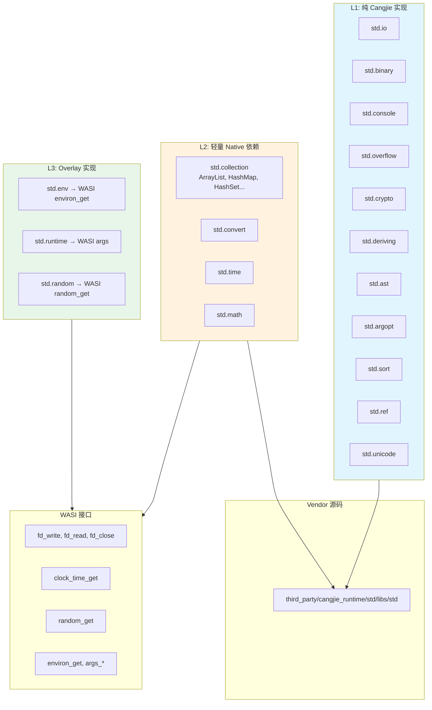
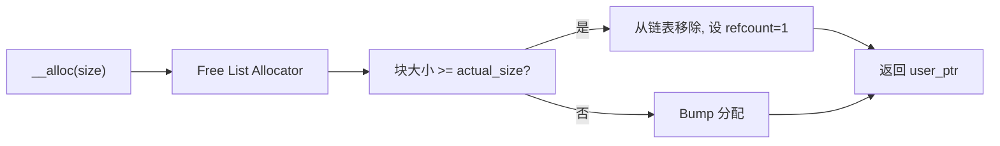

CJWasm2 通过创新的三层模块解析策略，成功复用仓颉官方标准库中约 **485 个 .cj 文件（约 13.5 万行代码）**，实现对 WebAssembly/WASI 环境的完整运行时支持。本页面详细阐述标准库架构、模块分类、Foreign 函数映射机制以及当前限制。

## 架构概述

CJWasm2 的标准库支持采用分层复用策略，根据模块对原生系统调用的依赖程度划分为三个层级：



### 三层策略详解

| 层级 | 策略 | 估计复用率 | 已完成模块 |
|------|------|-----------|------------|
| **L1** | Vendor 优先，纯 Cangjie 代码 | ~60% | std.io, std.binary, std.console, std.overflow, std.crypto, std.deriving, std.ast, std.argopt, std.sort, std.ref, std.unicode |
| **L2** | Vendor + WASI Overlay | ~30% | std.collection ✅, std.convert ✅, std.time ✅, std.math 📋 |
| **L3** | Overlay 实现 | ~10% | std.env ✅, std.runtime ✅, std.random ✅ |

**总计**：约 **70-80%** 的标准库代码可以直接或间接复用。

Sources: [std_implement_stragety.md](docs/plan/std_implement_stragety.md#L1-L20)

## 模块解析机制

### L1 解析流程

L1 模块（纯 Cangjie 实现）通过 `resolve_import_to_files` 函数从 vendor 目录解析。由于仓颉标准库将包拆分为多个 `.cj` 文件，L1 解析需处理目录级别的批量解析：

```rust
// src/pipeline.rs#L274-L302
pub fn resolve_import_to_files(
    module_path: &[String],
    base_dirs: &[&Path],
    vendor_std_dir: Option<&Path>,
) -> Vec<PathBuf> {
    // L1 Vendor 优先：std.io / std.crypto.digest 等
    if let Some(vendor) = vendor_std_dir {
        if is_l1_std_module(module_path) && module_path.len() >= 2 {
            let rel: PathBuf = module_path[1..]
                .iter()
                .cloned()
                .collect::<Vec<_>>()
                .join("/")
                .into();
            let dir = vendor.join(rel);
            if dir.exists() && dir.is_dir() {
                let mut files: Vec<PathBuf> = match std::fs::read_dir(&dir) {
                    Ok(rd) => rd
                        .filter_map(|e| e.ok())
                        .map(|e| e.path())
                        .filter(|p| p.extension().map_or(false, |e| e == "cj"))
                        .collect(),
                    Err(_) => vec![],
                };
                files.sort();
                if !files.is_empty() {
                    return files;
                }
            }
        }
    }
    // 回退：在 base_dirs 中按单文件解析
    // ...
}
```

Sources: [src/pipeline.rs#L274-L302](src/pipeline.rs#L274-L302)

### Vendor 路径解析

系统按以下顺序查找 vendor 标准库目录：

1. 项目目录向上遍历（最多 8 层）查找 `third_party/cangjie_runtime/std/libs/std`
2. 环境变量 `CJWASM_STD_PATH`

```rust
// src/pipeline.rs#L227-L242
pub fn get_vendor_std_dir(project_dir: &Path) -> Option<PathBuf> {
    let mut dir = project_dir.to_path_buf();
    for _ in 0..8 {
        let vendor = dir.join("third_party/cangjie_runtime/std/libs/std");
        if vendor.exists() && vendor.is_dir() {
            return Some(vendor);
        }
        if let Some(parent) = dir.parent() {
            dir = parent.to_path_buf();
        } else {
            break;
        }
    }
    std::env::var_os("CJWASM_STD_PATH").map(PathBuf::from)
}
```

Sources: [src/pipeline.rs#L227-L242](src/pipeline.rs#L227-L242)

## WASI Foreign 函数映射

### 13 个 WASI 系统调用导入

CJWasm2 通过 WASI (WebAssembly System Interface) 提供标准库所需的系统能力，在代码生成阶段注册以下导入函数：

```rust
// src/codegen/mod.rs#L645
let num_builtin_imports = 13u32; // WASI: fd_write, fd_read, fd_close, args_sizes_get, args_get, clock_time_get, random_get, environ_sizes_get, environ_get, proc_exit, fd_prestat_get, path_open, fd_seek
```

| WASI 函数 | 用途 | 标准库模块 |
|-----------|------|------------|
| `__wasi_fd_write` | 控制台输出 | std.io, std.console |
| `__wasi_fd_read` | 标准输入 | std.io |
| `__wasi_clock_time_get` | 时间戳 | std.time |
| `__wasi_random_get` | 随机数 | std.random |
| `__wasi_args_get/args_sizes_get` | 命令行参数 | std.runtime |
| `__wasi_environ_get/environ_sizes_get` | 环境变量 | std.env |
| `__wasi_proc_exit` | 进程退出 | std.runtime |

Sources: [src/codegen/mod.rs#L645](src/codegen/mod.rs#L645)

### 时间函数映射

`std.time` 模块的 `now()` 函数通过 WASI `clock_time_get` 实现：

```wasm
;; now() → i64 (纳秒时间戳)
;; 调用 clock_time_get(clock_id=0(realtime), precision=1, buf=WASI_SCRATCH)
block $done
    i32.const 0          ;; clock_id = CLOCK_REALTIME (0)
    i64.const 1           ;; precision = 1 (纳秒)
    i32.const 80          ;; scratch buffer offset
    call $__wasi_clock_time_get
    br_if $done           ;; 失败则返回
    i64.load offset=80    ;; 从 scratch 加载 i64 时间戳
end
```

Sources: [src/codegen/mod.rs#L3274-L3290](src/codegen/mod.rs#L3274-L3290)

### 随机数函数映射

`std.random` 模块通过 WASI `random_get` 实现：

```cangjie
// std.random 内部调用
let (sec, ns) = monoNow()  // → __random_i64 → WASI random_get
```

```rust
// src/codegen/mod.rs#L3297-L3318
/// __random_i64() -> i64: 调用 random_get(buf, 8) 返回随机 i64
fn emit_random_i64(&self) -> WasmFunc {
    let mut f = WasmFunc::new(vec![]);
    // random_get(scratch, 8)
    f.instruction(&Instruction::I32Const(WASI_SCRATCH));
    f.instruction(&Instruction::I32Const(8));
    f.instruction(&Instruction::Call(self.func_indices["__wasi_random_get"]));
    // 返回 scratch 中的 i64
    f.instruction(&Instruction::I32Const(WASI_SCRATCH));
    f.instruction(&Instruction::I64Load(wasm_encoder::MemArg { offset: 0, align: 3, memory_index: 0 }));
    f.instruction(&Instruction::End);
    f
}
```

Sources: [src/codegen/mod.rs#L3297-L3318](src/codegen/mod.rs#L3297-L3318)

## @When 条件编译

仓颉标准库大量使用条件编译指令来区分不同后端。CJWasm2 支持解析 `@When[backend != "cjnative"]` 指令，自动跳过原生后端专用代码：

```cangjie
// std.core.String 中的 SIMD 检测
@When[backend == "cjnative"]
const IS_SIMD_SUPPORTED: Bool = unsafe { CJ_CORE_CanUseSIMD() }
```

**当前行为**：
- 保留 `@When[backend != "cjnative"]` 的代码（用于 WASM）
- 跳过 `@When[backend == "cjnative"]` 的代码

Sources: [docs/plan/std_implement_stragety.md#L26-L30](docs/plan/std_implement_stragety.md#L26-L30)

## 运行时函数体系

### 内存管理

CJWasm2 实现三种内存管理策略，支持从简单分配到完整 GC：



Sources: [src/memory.rs#L1-L150](src/memory.rs#L1-L150)

### 内置运行时函数

| 函数名 | 类型签名 | 用途 |
|--------|----------|------|
| `__alloc` | `(i32) → i32` | 堆内存分配 |
| `__free` | `(i32) → ()` | 内存释放 |
| `__rc_inc` | `(i32) → ()` | 引用计数 +1 |
| `__rc_dec` | `(i32) → ()` | 引用计数 -1 |
| `__gc_collect` | `() → i32` | 触发 GC |
| `__str_concat` | `(i32, i32) → i32` | 字符串拼接 |
| `__pow_i64` | `(i64, i64) → i64` | 整数幂运算 |
| `__pow_f64` | `(f64, f64) → f64` | 浮点幂运算 |

Sources: [src/codegen/mod.rs#L773-L806](src/codegen/mod.rs#L773-L806)

## 测试验证

### L1 模块单元测试

`tests/l1_std_test.rs` 验证所有 11 个 L1 模块的解析能力：

```rust
#[test]
fn test_l1_std_io_resolve() {
    assert_l1_module_resolves("io");
}

#[test]
fn test_l1_std_binary_resolve() {
    assert_l1_module_resolves("binary");
}
// ... 覆盖 io, binary, console, overflow, crypto, deriving, ast, argopt, sort, ref, unicode
```

Sources: [tests/l1_std_test.rs#L1-L100](tests/l1_std_test.rs#L1-L100)

### 系统测试覆盖

37 个系统测试全部通过，涵盖：
- 多文件编译 (`tests/examples/multifile/`)
- cjpm 项目测试 (`tests/examples/project/`)
- 集合类型 (`std.collection`)
- 标准库特性 (`std.time`, `std.math`)

Sources: [docs/plan/std_implement_stragety.md#L130-L145](docs/plan/std_implement_stragety.md#L130-L145)

## 当前限制

### 不支持的模块

由于 WASM/WASI 环境限制，以下模块暂不支持：

| 模块 | 原因 |
|------|------|
| `std.net` | 网络套接字 API 不可用 |
| `std.posix` | POSIX 系统调用不可用 |
| `std.process` | 进程管理不可用 |
| `std.database` | 数据库驱动依赖原生库 |
| `std.sync` | 线程同步原语不可用 |
| `std.unittest` | 需要完整宏系统和异常框架 |

Sources: [docs/plan/std.unittest.md#L1-L50](docs/plan/std.unittest.md#L1-L50)

### Parser 语法支持

仍有部分 vendor 代码使用 CJWasm2 尚未支持的语法：

- **枚举变体多参数**（边界情况）：`([0x1FB7], [0x0391, 0x0342, 0x0345], ...)`
- **Class-level where 子句**：部分 `extend<T>` 语法
- **@Intrinsic 函数**：需要编译器特殊处理

Sources: [tests/examples/std/README.md#L50-L65](tests/examples/std/README.md#L50-L65)

## 成功案例

### std.collection.ArrayList

**100% vendor 代码复用**：

```cangjie
let list = ArrayList<Int64>()
list.append(1)
list.append(2)
println("Size: ${list.size}")  // 输出: Size: 2
```

验证了 L2 层 vendor 复用策略的可行性。

Sources: [docs/plan/std_implement_stragety.md#L155-L175](docs/plan/std_implement_stragety.md#L155-L175)

## 快速开始

### 编译标准库示例

```bash
# 在仓库根目录
cjwasm build -p tests/examples/std

# 或设置 vendor 路径
cd tests/examples/std
CJWASM_STD_PATH=../../third_party/cangjie_runtime/std/libs/std cjwasm build
```

### 使用标准库模块

```cangjie
package myapp

import std.io
import std.collection

main(): Int64 {
    let list = ArrayList<Int64>()
    list.append(42)
    println(list.get(0))  // 输出: 42
    return 0
}
```

## 下一步

- 深入了解 [内存管理与垃圾回收](15-nei-cun-guan-li-yu-la-ji-hui-shou) 机制
- 查看 [WebAssembly 代码生成器](12-webassembly-dai-ma-sheng-cheng-qi) 实现细节
- 参考 [测试框架](17-ce-shi-kuang-jia) 进行标准库测试