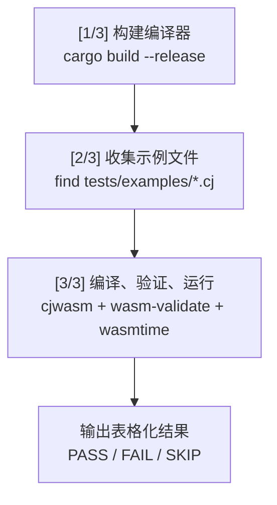
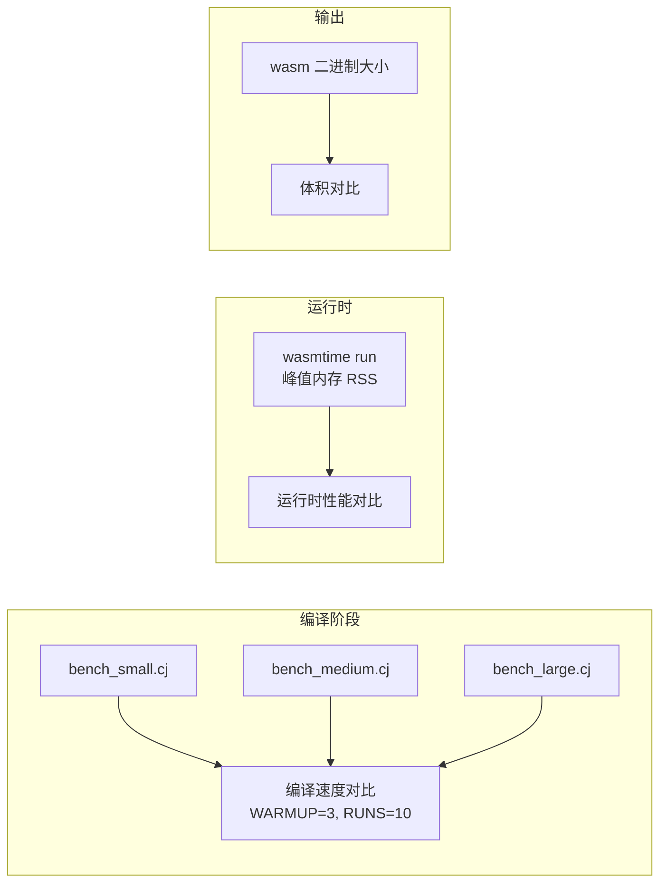

CJWasm 项目采用多层次、渐进式的测试策略，覆盖从单元测试到系统级集成的完整编译流水线验证。测试框架以 Rust 原生测试生态为主体，结合 shell 脚本实现端到端系统测试和性能基准测试，构成完整的质量保障体系。

## 测试层次架构

CJWasm 的测试体系按验证粒度和执行环境分为四个层级，形成从内部编译阶段到外部运行时的完整覆盖链条。

### Rust 单元与集成测试层

Rust 标准库测试通过 `#[test]` 宏直接在代码库内部验证编译流水线的各个阶段，是响应最快、反馈最直接的测试层。测试文件位于 `tests/` 目录，主要包括：

- **`tests/compile_test.rs`** — 核心集成测试文件，包含 631 个测试用例，覆盖词法分析、语法解析、AST 优化、泛型单态化到 WebAssembly 代码生成的全链路验证
- **`tests/l1_std_test.rs`** — 标准库 L1 模块解析测试，验证 std.io、std.binary、std.console 等模块能从 vendor 目录正确解析

### Shell 脚本系统测试层

Shell 脚本层在编译产物级别进行端到端验证，需要完整构建编译器后执行：

- **`scripts/run_test.sh`** — 交互式测试运行器，提供菜单式接口选择测试组合
- **`scripts/system_test.sh`** — 系统级集成测试，编译运行 `tests/examples/` 下所有示例文件并验证输出
- **`scripts/std_test.sh`** — 标准库兼容性测试，基于官方 cangjie_test 测试集验证 L1/L2 模块编译能力
- **`scripts/benchmark.sh`** — 性能基准测试，对比 CJWasm 与 cjc 的编译速度、运行时性能和输出大小

### 示例与 Fixture 测试层

示例文件既是语言特性的演示，也是可执行的冒烟测试：

- **`tests/examples/`** — 40+ 个 .cj 示例文件，包含 `// 预期输出: <value>` 注释用于自动化验证
- **`tests/fixtures/`** — 20 个小型测试 fixture，专注于特定语法结构的编译验证

Sources: [tests/compile_test.rs](tests/compile_test.rs#L1-L50), [tests/l1_std_test.rs](tests/l1_std_test.rs#L1-L80)

## Rust 测试模块详解

### compile_test.rs 核心测试

`compile_test.rs` 是项目最核心的测试文件，通过 `compile_source()` 函数串联完整编译流水线：

```rust
fn compile_source(source: &str) -> Vec<u8> {
    let lexer = Lexer::new(source);
    let tokens: Vec<_> = lexer.collect::<Result<Vec<_>, _>>()
        .expect("词法分析应成功");
    let mut parser = Parser::new(tokens);
    let mut program = parser.parse_program().expect("语法分析应成功");
    cjwasm::optimizer::optimize_program(&mut program);
    cjwasm::monomorph::monomorphize_program(&mut program);
    let mut codegen = CodeGen::new();
    codegen.compile(&program)
}
```

测试用例验证 WASM 二进制格式的有效性：

```rust
fn assert_valid_wasm(wasm: &[u8], name: &str) {
    assert!(wasm.len() >= 8, "{}: WASM 输出过短", name);
    assert_eq!(&wasm[0..4], b"\0asm", "{}: 魔数应为 \\0asm", name);
    assert_eq!(&wasm[4..8], [1, 0, 0, 0], "{}: 版本应为 1", name);
}
```

### 测试覆盖的语言特性

`compile_test.rs` 包含对以下语言特性的编译验证：

| 特性类别 | 测试用例示例 | 数量 |
|---------|-------------|------|
| 基础运算 | 算术运算、位运算、浮点运算 | ~10 |
| 控制流 | if/else、while、for-in、match | ~15 |
| 类型系统 | 结构体、枚举、元组、类型转换 | ~20 |
| 模式匹配 | 解构、guard、if-let、while-let | ~15 |
| 函数 | 默认参数、方法、构造函数 | ~10 |
| 泛型 | 泛型函数、泛型结构体、单态化 | ~10 |
| 语言兼容 | CJC 风格结构体、原始字符串、尾随闭包 | ~10 |

Sources: [tests/compile_test.rs](tests/compile_test.rs#L1-L107)

### l1_std_test.rs 标准库解析测试

`l1_std_test.rs` 验证 CJWasm 能正确解析 cangjie_runtime vendor 标准库中的 L1 模块：

```rust
fn repo_vendor_dir() -> Option<std::path::PathBuf> {
    let repo = std::env::var("CARGO_MANIFEST_DIR")
        .ok()
        .map(std::path::PathBuf::from)
        .unwrap_or_else(|| std::path::PathBuf::from("."));
    cjwasm::pipeline::get_vendor_std_dir(&repo)
}
```

测试覆盖的 L1 模块包括：io、binary、console、overflow、crypto、deriving、ast、argopt、sort、ref、unicode。

Sources: [tests/l1_std_test.rs](tests/l1_std_test.rs#L1-L50)

## Shell 脚本测试系统

### system_test.sh 工作流程

`system_test.sh` 是系统级集成测试的核心脚本，采用三阶段流水线：



测试从源文件提取预期输出：

```bash
extract_expected() {
  local filepath="$1"
  local expected=""
  if grep -q '预期输出' "$filepath"; then
    expected=$(grep '预期输出' "$filepath" | tail -1 | grep -oE '[-]?[0-9]+' | tail -1 || true)
  fi
  echo "$expected"
}
```

运行结果通过 `wasmtime` 执行并与预期值比对：

```bash
run_wasmtime() {
  local wasm_file="$1"
  run_output=$(wasmtime run -W timeout=10s --invoke main "$wasm_file" 2>"$stderr_file") || exit_code=$?
  # 错误检测逻辑...
}
```

### 支持的命令行参数

`system_test.sh` 支持多种运行模式：

| 参数 | 功能 |
|------|------|
| `--verbose, -v` | 显示详细输出（含错误信息） |
| `--compile` | 仅编译和 WASM 验证，不运行 |
| `--no-build` | 跳过编译器构建 |
| `--no-std-test` | 跳过 std_test.sh 兼容性测试 |
| `hello.cj` | 仅测试指定文件 |

Sources: [scripts/system_test.sh](scripts/system_test.sh#L1-L100), [scripts/system_test.sh](scripts/system_test.sh#L200-L400)

### run_test.sh 测试运行器

`run_test.sh` 提供交互式菜单或直接参数模式运行测试组合：

```bash
run_cargo_test() {
    echo -e "${BOLD}${CYAN}━━━ [1] Cargo Test ━━━${NC}"
    cargo test --manifest-path "$PROJECT_DIR/Cargo.toml" 2>&1
}

run_system_test() {
    echo -e "${BOLD}${CYAN}━━━ [2] System Test ━━━${NC}"
    bash "$SCRIPT_DIR/system_test.sh" --no-build
}
```

可用选项：

| 选项 | 执行内容 |
|------|---------|
| `1` | 仅运行 cargo test |
| `2` | 构建 + system test |
| `3` | 构建 + 性能测试 |
| `4` | cargo test + system test |
| `5` | 全部测试 |

Sources: [scripts/run_test.sh](scripts/run_test.sh#L1-L100)

### std_test.sh 标准库兼容性测试

`std_test.sh` 基于 cangjie_test 官方测试集验证标准库编译能力：

```bash
L1_MODULES=(
  io binary console overflow crypto
  deriving argOpt sort unicode
)

L2_MODULES=(
  math collection convert core
  option time random sync unittest
)
```

已知不支持的测试文件会被显式跳过：

```bash
KNOWN_SKIP=(
  "deriving/annotated_test.cj"
  "argOpt/test_argopt.cj"
  # ... 依赖宏系统 F6 的文件
)
```

Sources: [scripts/std_test.sh](scripts/std_test.sh#L1-L100)

### benchmark.sh 性能基准测试

`benchmark.sh` 提供 CJWasm 与 cjc 的多维性能对比：



运行时内存通过平台特定工具采集：

```bash
peak_rss_kb() {
    local os="$(uname -s)"
    if [[ "$os" == "Darwin" ]]; then
        /usr/bin/time -l bash -c "$cmd" 2>&1 \
          | awk '/maximum resident set size/ {print $1/1024; exit}'
    fi
}
```

Sources: [scripts/benchmark.sh](scripts/benchmark.sh#L1-L150)

## 示例与 Fixture 测试

### tests/examples/ 示例文件

示例文件采用统一格式，包含功能演示和预期输出注释：

```cangjie
main(): Int64 {
    let result = factorial(5)
    @Assert(result, 120)
    return factorial(5)  // 预期输出: 120
}
```

`@Assert()` 宏用于运行时断言，`// 预期输出:` 注释用于 system_test.sh 自动提取验证值。

### tests/fixtures/ 小型 Fixture

Fixture 文件专注于特定语法结构的编译验证，每个文件通常少于 20 行：

```cangjie
// tests/fixtures/let_simple_test.cj
main(): Int64 {
    let opt1: ?Int64 = Some(42)
    var result: Int64 = 0
    if (let Some(x) <- opt1) {
        result = result + x
    }
    return result  // 预期输出: 42
}
```

覆盖的 Fixture 类型包括：let 解构、if-let、while-let、可选链、尾随闭包、类型别名、增量/递减运算符等。

Sources: [tests/examples/hello.cj](tests/examples/hello.cj#L1-L30), [tests/fixtures/let_simple_test.cj](tests/fixtures/let_simple_test.cj#L1-L15)

## 测试覆盖率

CJWasm 使用 `cargo-llvm-cov` 生成测试覆盖率报告：

```bash
./scripts/coverage.sh --html  # 生成 HTML 报告
# 输出: target/llvm-cov/html/index.html
```

覆盖率工具自动从 rustup 工具链定位 LLVM 工具：

```bash
LLVM_COV=$(find "$HOME/.rustup/toolchains" -path '*/bin/llvm-cov' | head -1)
```

## 下一步

完成测试框架的学习后，建议继续深入以下内容：

- [WebAssembly 代码生成器](12-webassembly-dai-ma-sheng-cheng-qi) — 了解生成的 WASM 二进制结构
- [编译流水线](8-bian-yi-liu-shui-xian) — 理解测试验证的完整编译流程
- [语言特性示例](18-yu-yan-te-xing-shi-li) — 探索示例代码中的语言特性