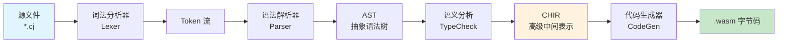

CJWasm 是一个用 Rust 编写的**仓颉语言（Cangjie）到 WebAssembly 的编译器前端**。本指南将帮助您在几分钟内完成环境配置并编译运行第一个仓颉程序。

## 环境准备

### 系统要求

| 组件 | 版本要求 | 用途 |
|------|---------|------|
| Rust | 1.70+ | 编译 CJWasm 本身 |
| wasmtime | 最新版 | 运行生成的 .wasm 文件 |
| git | 任意版本 | 克隆源码 |

**安装 Rust 和 wasmtime：**

```bash
# 安装 Rust（如果没有）
curl --proto '=https' --tlsv1.2 -sSf https://sh.rustup.rs | sh

# 安装 wasmtime（用于运行 WASM）
curl https://wasmtime.dev/install.sh -sSL | bash
```

Sources: [Cargo.toml](Cargo.toml#L1-L3)

## 编译 CJWasm

### 克隆并构建

```bash
git clone https://gitcode.com/SeanXDO/CJWasm
cd CJWasm
cargo build --release
```

构建完成后，可执行文件位于 `target/release/cjwasm`（或 `target/debug/cjwasm` 如果使用 debug 模式）。

Sources: [README.md](README.md#L20-L25)

## 编译流程概览

CJWasm 采用经典的**多阶段编译架构**，将仓颉源代码逐步转换为 WebAssembly 字节码：



编译器核心位于 `src/` 目录下：
- **词法分析器** `src/lexer/mod.rs` — 将源码转换为 Token 流
- **语法解析器** `src/parser/` — 构建 AST 语法树
- **语义分析** `src/typeck/` — 类型检查与推断
- **CHIR 中间表示** `src/chir/` — 高级中间表示与优化
- **代码生成** `src/codegen/` — 生成 WebAssembly 字节码

Sources: [src/main.rs](src/main.rs#L1-L8), [src/pipeline.rs](src/pipeline.rs#L1-L15)

## 创建第一个项目

### 方式一：使用 cjpm 工程（推荐）

CJWasm 兼容仓颉包管理器 (cjpm) 的项目结构，可自动发现并编译 `src/` 目录下的所有源文件：

```bash
# 初始化新项目
cjwasm init myproject
cd myproject

# 查看生成的项目结构
myproject/
├── cjpm.toml          # 项目配置文件
└── src/
    └── main.cj        # 入口源文件
```

```toml
# cjpm.toml
[package]
name = "myproject"
version = "0.1.0"
description = "我的第一个 CJWasm 项目"
output-type = "executable"
```

Sources: [src/main.rs](src/main.rs#L48-L63), [tests/examples/project/cjpm.toml](tests/examples/project/cjpm.toml#L1-L6)

### 方式二：直接编译单文件

对于简单场景，可直接编译单个源文件：

```bash
# 编译单文件
cjwasm tests/examples/hello.cj

# 指定输出文件名
cjwasm tests/examples/hello.cj -o hello.wasm

# 多文件编译
cjwasm main.cj lib.cj utils.cj -o app.wasm
```

Sources: [src/main.rs](src/main.rs#L170-L175)

## 编译并运行

### 构建工程

```bash
# 编译工程（读取 cjpm.toml）
cjwasm build

# 指定输出文件
cjwasm build -o app.wasm

# 显示详细编译信息
cjwasm build -v
```

编译成功后会输出类似信息：
```
cjwasm build 成功: myproject (3 个源文件) -> target/wasm/myproject.wasm
  大小: 2048 字节
```

Sources: [src/main.rs](src/main.rs#L65-L97)

### 运行 WASM

使用 wasmtime 运行生成的 WebAssembly 文件：

```bash
# 运行编译结果（--invoke 指定入口函数）
wasmtime run --invoke main hello.wasm

# 带参数的运行示例
wasmtime run --invoke main target/wasm/myproject.wasm
```

Sources: [README.md](README.md#L25-L35)

## 编写第一个程序

一个完整的仓颉程序包含函数定义和 `main()` 入口：

```cangjie
// 简单的加法函数
func add(a: Int64, b: Int64): Int64 {
    return a + b
}

// 阶乘函数
func factorial(n: Int64): Int64 {
    if (n <= 1) {
        1
    } else {
        n * factorial(n - 1)
    }
}

main(): Int64 {
    let result = factorial(5)
    @Assert(result, 120)  // 编译器内置断言
    return result  // 返回值将作为程序退出码
}
```

Sources: [tests/examples/hello.cj](tests/examples/hello.cj#L1-L29)

### 预期输出注释

在源文件中添加 `// 预期输出: <value>` 注释，系统测试会自动验证运行结果：

```cangjie
func square(n: Int64): Int64 {
    return n * n
}

main(): Int64 {
    return square(7)  // 预期输出: 49
}
```

Sources: [tests/examples/project/src/main.cj](tests/examples/project/src/main.cj#L1-L33)

## 运行测试

CJWasm 提供完整的测试框架验证编译正确性：

### 测试命令

```bash
# 交互式测试菜单
./scripts/run_test.sh

# 或直接指定测试级别
./scripts/run_test.sh 1    # 单元测试 (cargo test)
./scripts/run_test.sh 2    # 系统测试 (编译运行 .cj 示例)
./scripts/run_test.sh 3    # 性能测试
./scripts/run_test.sh 4    # 单元 + 系统测试
./scripts/run_test.sh 5    # 全部测试
```

### 测试内容

| 测试类型 | 数量 | 验证内容 |
|---------|------|---------|
| 单元测试 | 672 | 词法分析、语法解析、类型检查 |
| 集成测试 | 631 | 多文件编译、import 依赖解析 |
| 示例测试 | 37 | 所有示例程序编译运行 |
| 标准库测试 | 14 | L1 标准库功能验证 |

Sources: [scripts/run_test.sh](scripts/run_test.sh#L1-L50)

### 单独运行各类测试

```bash
# 仅编译测试
cargo test

# 仅编译运行示例
./scripts/system_test.sh

# 测试覆盖率报告
./scripts/coverage.sh --html
```

Sources: [scripts/system_test.sh](scripts/system_test.sh#L1-L30)

## 命令行选项参考

### 全局命令

| 命令 | 说明 |
|-----|------|
| `cjwasm build` | 编译 cjpm 工程 |
| `cjwasm init <名称>` | 初始化新项目 |
| `cjwasm <源文件.cj>` | 直接编译单文件 |

### build 子命令选项

| 选项 | 说明 |
|-----|------|
| `-o, --output <文件>` | 指定输出文件名 |
| `-p, --path <目录>` | 指定项目目录 |
| `-v, --verbose` | 显示详细编译信息 |
| `--no-chir` | 使用旧版代码生成（不经 CHIR） |

### 直接编译选项

| 选项 | 说明 |
|-----|------|
| `-o <文件>` | 指定输出文件名 |
| `--use-chir` | 使用 CHIR 中间表示 |
| `--no-chir` | 不使用 CHIR |

Sources: [src/main.rs](src/main.rs#L5-L36)

## 下一步

掌握快速入门后，建议按以下路径深入学习：

| 阶段 | 内容 | 推荐阅读 |
|-----|------|---------|
| **入门** | 了解项目整体架构 | [项目概述](1-xiang-mu-gai-shu) |
| **进阶** | 掌握命令行高级用法 | [命令行工具](3-ming-ling-xing-gong-ju) |
| **深入** | 理解编译流程核心 | [编译流水线](8-bian-yi-liu-shui-xian) |
| **实践** | 学习更多语言特性 | [语言特性示例](18-yu-yan-te-xing-shi-li) |

更多完整示例请参考 [`tests/examples/`](tests/examples/) 目录，包含 37 个涵盖各类语言特性的示例文件。