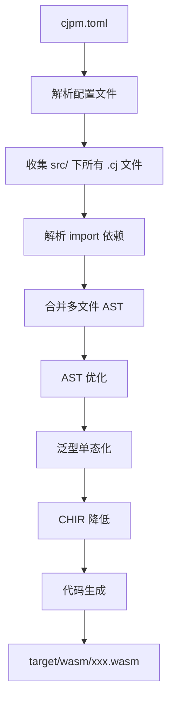
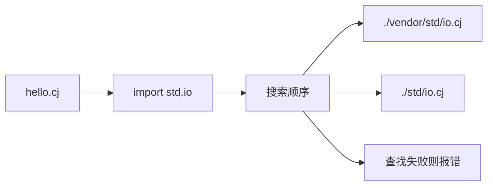

CJWasm 提供了一个统一的命令行工具 `cjwasm`，用于将仓颉（Cangjie）源代码编译为 WebAssembly 字节码。该工具支持三种核心使用模式：工程构建、单文件编译和项目初始化。本页将详细说明各命令的用法、选项含义以及典型应用场景。

Sources: [main.rs](src/main.rs#L33-L52)

## 核心命令概览

CJWasm 的命令行接口围绕三个主要功能设计：**项目构建**、**单文件编译**和**项目初始化**。下表列出了这些命令的基本语法和使用场景：

| 命令 | 语法 | 用途 |
|------|------|------|
| `build` | `cjwasm build [选项]` | 读取 cjpm.toml 构建完整项目 |
| `init` | `cjwasm init <名称>` | 创建新的仓颉 WASM 项目 |
| 直接编译 | `cjwasm <文件.cj> ... [选项]` | 将 .cj 文件直接编译为 WASM |

Sources: [main.rs](src/main.rs#L7-L31)

## 项目构建（build 命令）

当你的代码组织为完整的项目结构时，使用 `build` 命令可以自动发现源文件、解析依赖并生成优化的 WASM 输出。这是推荐的生产使用方法。

### 基本用法

```bash
cjwasm build                    # 编译当前目录的 cjpm 工程
cjwasm build -o app.wasm        # 指定输出文件名
cjwasm build -v                 # 显示详细编译过程
cjwasm build --use-chir         # 使用 CHIR 中间表示（默认）
```

Sources: [main.rs](src/main.rs#L56-L114)

### 选项详解

`-o, --output <文件>` 指定输出的 WASM 文件名。默认情况下，输出文件会写入 `target/wasm/<包名>.wasm`，使用此选项可以覆盖默认位置：

```bash
cjwasm build -o myoutput.wasm   # 输出到当前目录
```

`-p, --path <目录>` 指定项目根目录。当你需要在非当前目录下构建项目时使用：

```bash
cjwasm build -p /path/to/project
```

`-v, --verbose` 启用详细输出模式，显示包名、源文件路径、发现的文件数量等信息，便于调试编译问题：

```bash
cjwasm build -v
```

`--use-chir` 和 `--no-chir` 控制代码生成路径。默认使用 CHIR（高级中间表示）路径，可获得更好的优化效果；使用 `--no-chir` 可回退到旧的直接代码生成路径：

```bash
cjwasm build --no-chir          # 使用旧版代码生成
```

Sources: [main.rs](src/main.rs#L56-L114)

### 工作流程

`build` 命令会执行完整的编译流水线：



首先从 `cjpm.toml` 读取项目配置，然后递归收集 `src/` 目录下的所有源文件。接下来解析 import 语句以处理跨模块依赖，最后执行 AST 优化、泛型实例化和 CHIR 代码生成。

Sources: [cjpm.rs](src/cjpm.rs#L154-L294)

## 单文件编译

对于快速测试或简单脚本场景，CJWasm 支持直接编译单个或多个 .cj 文件，无需创建完整的项目结构。

### 基本语法

```bash
cjwasm hello.cj                     # 编译为 hello.wasm
cjwasm hello.cj -o hello.wasm       # 指定输出文件名
cjwasm hello.cj --use-chir          # 使用 CHIR 路径
cjwasm main.cj lib.cj -o app.wasm   # 编译多个文件
```

Sources: [main.rs](src/main.rs#L183-L223)

### 自动依赖解析

单文件编译模式会自动解析 `import` 语句，从三个位置搜索依赖文件：`源文件目录`、`当前工作目录` 和 `vendor 标准库目录`：



这种设计确保了与仓颉标准库的无缝集成，可以直接引用 `std.io`、`std.binary`、`std.console` 等模块。

Sources: [main.rs](src/main.rs#L250-L276)

### 编译选项

| 选项 | 说明 | 示例 |
|------|------|------|
| `-o <文件>` | 指定输出 WASM 文件名 | `cjwasm hello.cj -o out.wasm` |
| `--use-chir` | 使用 CHIR 路径（默认） | `cjwasm hello.cj --use-chir` |
| `--no-chir` | 使用旧版直接代码生成 | `cjwasm hello.cj --no-chir` |

Sources: [main.rs](src/main.rs#L186-L210)

## 项目初始化（init 命令）

使用 `init` 命令可以快速创建符合 CJWasm 规范的仓颉项目结构。

### 用法

```bash
cjwasm init myproject              # 创建 myproject/ 项目
```

初始化操作会创建以下文件结构：

```
myproject/
├── cjpm.toml              # 项目配置文件
└── src/
    └── main.cj            # 入口源文件
```

生成的 `cjpm.toml` 包含基础配置：

```toml
[package]
name = "myproject"
version = "0.1.0"
description = ""
output-type = "executable"
src-dir = ""
target-dir = ""
```

生成的 `src/main.cj` 包含一个简单的示例函数：

```cangjie
package myproject

func main(): Int64 {
    println("Hello, myproject!")
    return 0
}
```

Sources: [cjpm.rs](src/cjpm.rs#L308-L350)

## 编译后端选择

CJWasm 提供了两种代码生成路径，通过 CHIR 中间表示连接前端和后端。理解这两种路径有助于根据场景选择合适的编译策略。

### CHIR 路径（默认）

CHIR（高级中间表示）是新的代码生成路径，具有以下优势：

- **优化能力**：支持函数内联、死代码消除、常量传播等优化
- **模块化设计**：清晰的分层架构便于维护和扩展
- **类型系统**：CHIR 层保留类型信息，支持更精确的优化


要使用 CHIR 路径（默认行为），无需额外参数。如需明确指定：

```bash
cjwasm build --use-chir
```

Sources: [main.rs](src/main.rs#L289-L306)

### 旧版路径（--no-chir）

如果 CHIR 路径遇到问题，可以使用 `--no-chir` 选项回退到旧的直接代码生成路径：

```bash
cjwasm build --no-chir
```

当环境变量 `NO_CHIR=1` 被设置时，也会自动使用旧版路径。这种兼容性设计确保了在 CHIR 路径出现问题时仍能完成编译。

Sources: [main.rs](src/main.rs#L116-L119)

## 环境变量

CJWasm 识别以下环境变量来控制编译行为：

| 变量 | 说明 | 示例 |
|------|------|------|
| `NO_CHIR=1` | 强制使用旧版代码生成路径 | `NO_CHIR=1 cjwasm build` |
| `NO_CHIR_OPT=1` | 禁用 CHIR 优化 pass | `NO_CHIR_OPT=1 cjwasm build` |

设置 `NO_CHIR=1` 等价于在命令行传入 `--no-chir` 选项。`NO_CHIR_OPT=1` 在调试优化问题时特别有用，可以单独验证代码生成的正确性而不受优化影响。

Sources: [main.rs](src/main.rs#L116-L119), [main.rs](src/main.rs#L292-L294)

## 输出示例

成功的编译会显示详细的结果信息：

```text
cjwasm build 成功: myproject (3 个源文件) -> target/wasm/myproject.wasm
  大小: 4096 字节
```

对于直接编译：

```text
编译成功: hello.cj -> hello.wasm
  大小: 2048 字节
```

如果使用了 CHIR 路径，输出会显示 `[CHIR]` 标记：

```text
编译成功 [CHIR]: main.cj -> main.wasm
  大小: 3072 字节
```

Sources: [main.rs](src/main.rs#L127-L141), [main.rs](src/main.rs#L308-L323)

## 错误处理

编译过程中可能遇到以下错误情况：

| 错误 | 说明 | 解决方案 |
|------|------|----------|
| `未找到 cjpm.toml` | 使用 build 命令时配置文件缺失 | 确保目录包含 cjpm.toml 或使用单文件编译 |
| `未找到输入文件` | 未指定源文件 | 提供至少一个 .cj 文件 |
| `源目录不存在` | cjpm.toml 配置的 src-dir 路径无效 | 检查 cjpm.toml 中的 src-dir 设置 |
| `CHIR 转换失败` | CHIR 降低过程出错 | 使用 `--no-chir` 回退或查看详细错误信息 |

Sources: [cjpm.rs](src/cjpm.rs#L54-L69), [main.rs](src/main.rs#L298-L302)

## 典型工作流

### 快速原型开发

对于单文件脚本或快速测试，直接编译是最便捷的方式：

```bash
# 1. 编写代码
echo 'func main(): Int64 { return 42 }' > test.cj

# 2. 编译并运行
cjwasm test.cj -o test.wasm
wasmtime run --invoke main test.wasm
```

### 完整项目开发

对于需要多文件协同的完整项目，推荐使用项目结构：

```bash
# 1. 初始化项目
cjwasm init myapp

# 2. 进入项目目录
cd myapp

# 3. 编辑源码
# 编辑 src/main.cj 添加功能

# 4. 构建
cjwasm build -v

# 5. 运行
wasmtime run --invoke main target/wasm/myapp.wasm
```

### 调试编译问题

当编译出现问题时，使用详细模式可以帮助定位：

```bash
# 启用详细输出查看文件发现过程
cjwasm build -v

# 禁用 CHIR 优化单独验证代码生成
cjwasm build --no-chir

# 禁用所有优化
NO_CHIR_OPT=1 cjwasm build
```

Sources: [main.rs](src/main.rs#L56-L61), [cjpm.rs](src/cjpm.rs#L160-L182)

## 进阶用法

### 批量编译

编译 `tests/examples/` 目录下的所有文件：

```bash
for f in tests/examples/*.cj; do
    cjwasm "$f" -o "target/$(basename "$f" .cj).wasm"
done
```

### 性能基准测试

CJWasm 提供了 `scripts/benchmark.sh` 脚本用于性能对比测试：

```bash
# 完整性能测试（编译 + 运行时 + 输出大小）
./scripts/benchmark.sh

# 快速测试（3 次迭代）
./scripts/benchmark.sh --quick

# 仅编译速度对比
./scripts/benchmark.sh --compile

# 仅输出大小对比
./scripts/benchmark.sh --size
```

### 测试套件

使用 `scripts/run_test.sh` 可以运行不同级别的测试：

```bash
# 交互式菜单
./scripts/run_test.sh

# 直接运行单元测试
./scripts/run_test.sh 1

# 运行系统测试（含标准库）
./scripts/run_test.sh 2

# 运行性能测试
./scripts/run_test.sh 3

# 运行全部测试
./scripts/run_test.sh 5
```

Sources: [scripts/benchmark.sh](scripts/benchmark.sh#L1-L100), [scripts/run_test.sh](scripts/run_test.sh#L1-L150)

## 下一步

在掌握命令行工具的基本用法后，你可以继续了解：

- [项目工程管理](4-xiang-mu-gong-cheng-guan-li) — 深入了解 cjpm.toml 配置和工作区支持
- [编译流水线](8-bian-yi-liu-shui-xian) — 理解从源码到 WASM 的完整编译过程
- [快速开始](2-kuai-su-kai-shi) — 通过实际示例快速上手 CJWasm