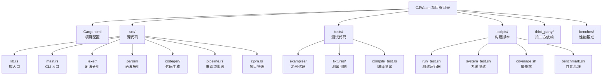
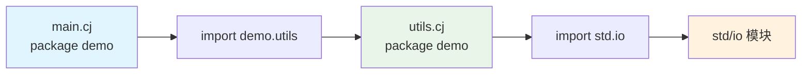
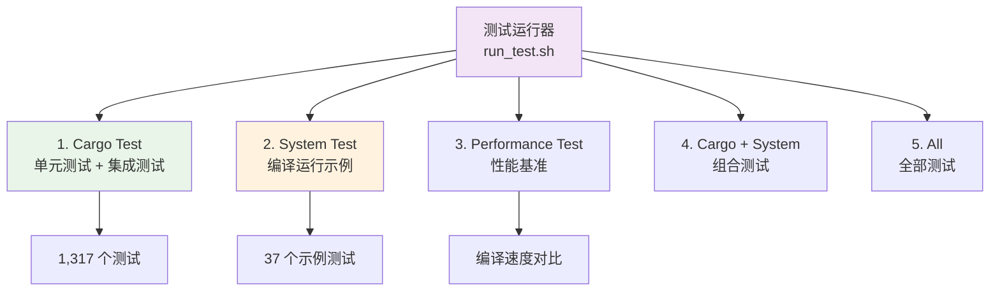
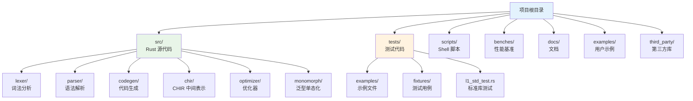

本文档面向初级开发者，介绍 CJWasm 项目的工程管理结构、配置体系以及日常开发中的常用操作方法。CJWasm 采用标准 Rust 项目结构，同时兼容仓颉包管理器（cjpm）的项目格式，为开发者提供流畅的编译体验。

## 项目结构总览

CJWasm 是一个使用 Rust 编写的仓颉语言到 WebAssembly 编译器前端。项目采用标准的 Rust 项目布局，核心源代码位于 `src/` 目录，测试代码位于 `tests/` 目录，辅助脚本位于 `scripts/` 目录。



Sources: [Cargo.toml](Cargo.toml#L1-L20), [src/lib.rs](src/lib.rs#L1-L16), [src/main.rs](src/main.rs#L1-L32)

## Cargo.toml 项目配置

`Cargo.toml` 是 Rust 项目的核心配置文件，定义了项目的元数据、依赖包和构建选项。CJWasm 的 Cargo.toml 配置简洁明了，便于理解和维护。

```toml
[package]
name = "cjwasm"
version = "0.1.0"
edition = "2021"

[dependencies]
logos = "0.14"           # 词法分析
wasm-encoder = "0.220"   # WASM 代码生成
thiserror = "2.0"        # 错误处理
ariadne = "0.4"          # 错误报告
toml = "0.8"             # cjpm.toml 解析
serde = { version = "1.0", features = ["derive"] }  # 序列化

[dev-dependencies]
criterion = { version = "0.5", features = ["html_reports"] }

[[bench]]
name = "compile_bench"
harness = false
```

Sources: [Cargo.toml](Cargo.toml#L1-L20)

### 依赖包说明

| 依赖包 | 版本 | 用途 |
|--------|------|------|
| logos | 0.14 | 高性能词法分析器生成 |
| wasm-encoder | 0.220 | WebAssembly 字节码编码器 |
| thiserror | 2.0 | 类型安全的错误处理 |
| ariadne | 0.4 | 友好的诊断信息输出 |
| toml | 0.8 | TOML 配置文件解析 |
| serde | 1.0 | 序列化/反序列化框架 |
| criterion | 0.5 | Rust 微基准测试框架 |

Sources: [Cargo.toml](Cargo.toml#L6-L18)

## cjpm.toml 工程配置

CJWasm 兼容仓颉包管理器（cjpm）的项目结构。通过 `cjpm.toml` 配置文件，开发者可以管理项目的元信息、源文件目录和输出设置。

```toml
[package]
name = "demo"
version = "0.1.0"
description = "CJWasm cjpm 工程示例"
output-type = "executable"
```

Sources: [tests/examples/project/cjpm.toml](tests/examples/project/cjpm.toml#L1-L6)

### 配置字段详解

| 字段 | 必填 | 默认值 | 说明 |
|------|------|--------|------|
| name | 是 | - | 项目名称 |
| version | 否 | "0.1.0" | 版本号 |
| description | 否 | "" | 项目描述 |
| output-type | 否 | "executable" | 输出类型（executable/lib） |
| src-dir | 否 | "src" | 源文件目录 |
| target-dir | 否 | "target" | 输出目录 |

Sources: [src/cjpm.rs](src/cjpm.rs#L24-L39)

### 初始化新项目

使用 `cjwasm init` 命令可以快速创建新的 cjpm 兼容项目：

```bash
cjwasm init myproject
cd myproject
```

该命令会生成标准的项目结构：

```
myproject/
├── cjpm.toml          # 项目配置
└── src/
    └── main.cj        # 入口文件
```

Sources: [src/cjpm.rs](src/cjpm.rs#L307-L350)

## 模块系统与导入机制

CJWasm 支持完整的多文件模块系统。源文件通过 `package` 声明包名，通过 `import` 语句导入其他模块。编译器会自动解析 import 依赖并合并 AST。



Sources: [src/pipeline.rs](src/pipeline.rs#L328-L347)

### 多文件编译示例

```cangjie
// module_main.cj
package examples.main

import examples.lib

func main(): Int64 {
    let a = add(10, 20)       // 30
    let b = multiply(3, 4)    // 12
    return a + b              // 预期输出: 42
}
```

```cangjie
// module_lib.cj
package examples.lib

func add(a: Int64, b: Int64): Int64 {
    return a + b
}

func multiply(a: Int64, b: Int64): Int64 {
    return a * b
}
```

编译命令：

```bash
cjwasm module_main.cj module_lib.cj -o module_test.wasm
```

Sources: [tests/examples/multifile/module_main.cj](tests/examples/multifile/module_main.cj#L1-L13), [tests/examples/multifile/module_lib.cj](tests/examples/multifile/module_lib.cj#L1-L15)

### 标准库模块（L1）

CJWasm 支持 11 个 L1 标准库模块，这些模块使用纯仓颉实现，从 vendor 目录优先解析：

| 模块 | 功能 |
|------|------|
| std.io | 输入输出流、字节缓冲 |
| std.binary | 二进制数据处理 |
| std.console | 控制台读写 |
| std.overflow | 溢出运算操作 |
| std.crypto | 加密与摘要 |
| std.deriving | 宏派生 |
| std.ast | 抽象语法树 |
| std.argopt | 命令行参数解析 |
| std.sort | 排序算法 |
| std.ref | 弱引用管理 |
| std.unicode | Unicode 支持 |

Sources: [src/pipeline.rs](src/pipeline.rs#L14-L18), [tests/l1_std_test.rs](tests/l1_std_test.rs#L1-L50)

## 构建命令与选项

CJWasm 提供两种构建模式：通过 cjpm.toml 构建工程，或直接编译源文件。

### 工程构建模式（推荐）

```bash
# 基本构建
cjwasm build

# 指定输出文件
cjwasm build -o app.wasm

# 显示详细日志
cjwasm build -v

# 指定项目目录
cjwasm build -p path/to/project

# 使用旧版代码生成（不经过 CHIR）
cjwasm build --no-chir
```

Sources: [src/main.rs](src/main.rs#L56-L142)

### 直接编译模式

```bash
# 编译单文件
cjwasm hello.cj

# 编译多文件
cjwasm main.cj lib.cj -o app.wasm

# 指定输出
cjwasm hello.cj -o hello.wasm
```

Sources: [src/main.rs](src/main.rs#L183-L276)

### 编译选项对照表

| 选项 | 说明 | 适用命令 |
|------|------|----------|
| `-o <file>` | 指定输出文件名 | build, 直接编译 |
| `-v` | 显示详细编译信息 | build |
| `-p <dir>` | 指定项目目录 | build |
| `--no-chir` | 使用旧版代码生成路径 | build, 直接编译 |
| `--use-chir` | 使用 CHIR 中间表示（默认） | build, 直接编译 |

Sources: [src/main.rs](src/main.rs#L56-L114)

## 测试框架

CJWasm 提供了完善的测试框架，包括单元测试、系统测试和性能测试三个层次。



Sources: [scripts/run_test.sh](scripts/run_test.sh#L1-L167)

### 测试命令详解

```bash
# 交互式菜单（推荐）
./scripts/run_test.sh

# 直接运行特定级别
./scripts/run_test.sh 1    # 单元测试
./scripts/run_test.sh 2    # 系统测试
./scripts/run_test.sh 3    # 性能测试
./scripts/run_test.sh 4    # 单元 + 系统测试
./scripts/run_test.sh 5    # 全部测试
```

Sources: [scripts/run_test.sh](scripts/run_test.sh#L127-L166)

### 系统测试选项

```bash
# 基本运行
./scripts/system_test.sh

# 显示详细输出
./scripts/system_test.sh --verbose

# 仅编译和验证，不运行
./scripts/system_test.sh --compile

# 跳过编译器构建
./scripts/system_test.sh --no-build

# 测试指定文件
./scripts/system_test.sh hello.cj math.cj
```

Sources: [scripts/system_test.sh](scripts/system_test.sh#L34-L75)

### 覆盖率检测

```bash
# 文本覆盖率报告
./scripts/coverage.sh

# HTML 可视化报告
./scripts/coverage.sh --html
# 输出: target/llvm-cov/html/index.html
```

Sources: [scripts/coverage.sh](scripts/coverage.sh#L1-L21)

## 项目目录结构规范

CJWasm 对各目录有明确的用途定义，便于开发者快速定位文件。



Sources: [get_dir_structure](get_dir_structure#L1), [src/lib.rs](src/lib.rs#L1-L16)

### 目录用途一览

| 目录 | 用途 | 关键文件 |
|------|------|----------|
| src/lexer/ | 词法分析器 | mod.rs |
| src/parser/ | 语法解析器 | expr.rs, stmt.rs, decl.rs |
| src/ast/ | AST 节点定义 | mod.rs, type_.rs |
| src/codegen/ | WebAssembly 代码生成 | mod.rs, expr.rs |
| src/chir/ | CHIR 中间表示 | mod.rs, lower.rs |
| src/optimizer/ | AST 优化器 | mod.rs |
| src/pipeline.rs | 编译流水线 | - |
| src/cjpm.rs | 项目管理 | - |
| tests/examples/ | 示例代码 | 37 个 .cj 文件 |
| tests/fixtures/ | 测试用例 | 小型测试文件 |
| scripts/ | 构建脚本 | run_test.sh 等 |
| benches/ | 性能基准 | compile_bench.rs |

Sources: [src/lib.rs](src/lib.rs#L1-L16), [get_dir_structure](get_dir_structure#L1)

## 环境变量配置

CJWasm 支持多个环境变量用于配置编译行为。

| 变量名 | 说明 | 默认值 |
|--------|------|--------|
| NO_CHIR | 禁用 CHIR 代码生成路径 | 未设置（使用 CHIR） |
| NO_CHIR_OPT | 禁用 CHIR 优化 | 未设置（启用优化） |
| CJWASM_STD_PATH | 标准库 vendor 目录路径 | 自动查找 |

Sources: [src/main.rs](src/main.rs#L116-L119), [src/pipeline.rs](src/pipeline.rs#L236-L252)

### 使用示例

```bash
# 使用旧版代码生成
NO_CHIR=1 cjwasm build

# 禁用 CHIR 优化
NO_CHIR_OPT=1 cjwasm build

# 指定标准库路径
CJWASM_STD_PATH=./third_party/cangjie_runtime/std/libs/std cjwasm build
```

## 下一步学习

完成本章节后，建议继续阅读以下内容：

- [快速开始](2-kuai-su-kai-shi) — 学习如何编译第一个仓颉程序
- [命令行工具](3-ming-ling-xing-gong-ju) — 深入了解 cjwasm 命令行接口
- [编译流水线](8-bian-yi-liu-shui-xian) — 理解编译器内部工作原理