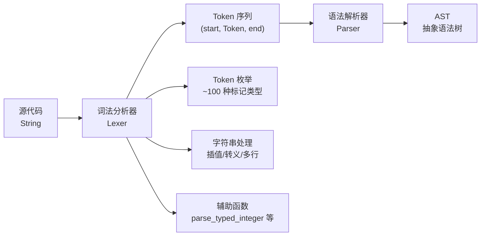
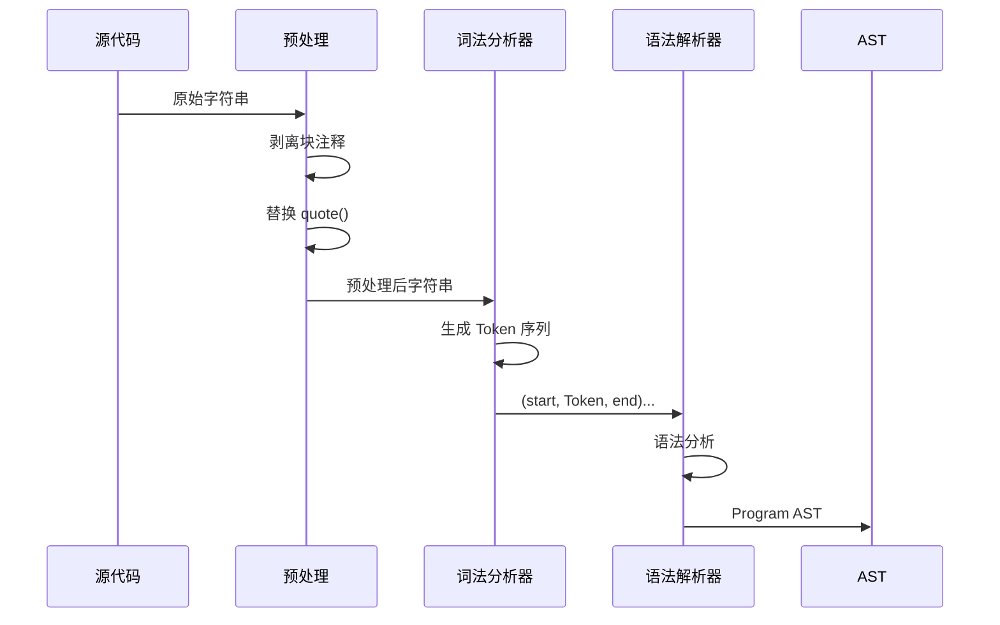

词法分析器是 CJWasm2 编译器流水线的第一个阶段，负责将源代码字符串转换为标记（Token）序列，为后续的语法解析阶段提供结构化的输入。本章节详细介绍词法分析器的架构设计、支持的标记类型、字符串处理机制以及与编译流水线的集成方式。

## 架构设计概述

CJWasm2 的词法分析器构建于 [Logos](https://logos-rs.github.io/Logos/) 词法分析器生成器之上，这是一个高性能的 Rust 词法分析库，通过过程宏自动生成高效的确定性有限状态机（DFA）。词法分析器位于 `src/lexer/mod.rs`，共约 1287 行代码，定义了完整的 Cangjie 语言词法规则。



词法分析器的核心是一个包装了 `logos::Lexer<Token>` 的 `Lexer` 结构体，并实现了 `Iterator` trait，以懒加载方式逐个产出 Token。这种设计使得词法分析与语法解析可以采用流式处理，避免一次性将所有 Token 加载到内存中。

Sources: [lexer/mod.rs](src/lexer/mod.rs#L862-L893)

## Token 枚举详解

`Token` 枚举定义了 Cangjie 语言的所有词法单元，采用 `#[derive(Logos)]` 过程宏自动实现 `Logos` trait。枚举成员超过 100 种，主要分为以下几类：

### 关键字标记

关键字标记使用 `#[token("...")]` 属性声明，Logos 在匹配时具有最高优先级。语言关键字涵盖了声明、控制流、类型系统、错误处理和模块系统等各个方面。

| 分类 | 关键字 | 说明 |
|------|--------|------|
| 函数与变量 | `func`, `let`, `var` | 函数声明和变量绑定 |
| 控制流 | `if`, `else`, `while`, `for`, `in`, `match`, `break`, `continue`, `loop` | 流程控制结构 |
| 类型系统 | `struct`, `enum`, `class`, `interface`, `abstract`, `sealed`, `open`, `extend`, `override` | 面向对象特性 |
| 访问控制 | `public`, `private`, `protected`, `internal` | 可见性修饰符 |
| 模块系统 | `package`, `import` | 包和导入机制 |
| 错误处理 | `try`, `catch`, `throw`, `finally` | 异常处理 |
| 其他 | `this`, `super`, `prop`, `mut`, `as`, `is`, `_` | 杂项关键字 |

Sources: [lexer/mod.rs](src/lexer/mod.rs#L384-L517)

### 字面量标记

字面量用于表示程序中的常量值，包括整数、浮点数、字符、字符串和布尔值。

**整数字面量** 支持多种进制表示法和类型后缀：

```cangjie
42           // 十进制
0xFF         // 十六进制（0x 前缀）
0o777        // 八进制（0o 前缀）
0b1010       // 二进制（0b 前缀）
100_i32      // 带类型后缀
0xFF_u8      // 带无符号类型后缀
1_000_000    // 数字分隔符（下划线）
```

`parse_typed_integer` 函数负责解析带类型后缀的整数，并验证数值范围是否在目标类型的表示范围内。例如，`300_i8` 会因超出 `i8` 类型范围（-128 到 127）而触发词法错误。

Sources: [lexer/mod.rs](src/lexer/mod.rs#L44-L88)

**浮点字面量** 根据后缀分为三种精度：

| 后缀 | 类型 | 存储 |
|------|------|------|
| 无后缀 | `Float64` | Rust `f64` |
| `f` 或 `f32` | `Float32` | Rust `f32` |
| `f64` | `Float64Suffix` | Rust `f64` |
| `f16` | `Float16` | Rust `f32`（前端统一按 f32 承载） |

**字符串字面量** 支持多种语法形式，将在下一节详细讨论。

**布尔字面量**：`true` 和 `false` 分别对应 `Token::True` 和 `Token::False`。

Sources: [lexer/mod.rs](src/lexer/mod.rs#L578-L707)

### 运算符标记

运算符标记采用 `#[token("...")]` 和 `#[regex(...)]` 属性声明，支持单字符和多字符运算符。以下是主要运算符的分类：

| 分类 | 运算符 |
|------|--------|
| 算术运算符 | `+`, `-`, `*`, `/`, `%`, `**`, `++`, `--` |
| 位运算符 | `&`, `\|`, `^`, `~`, `<<`, `>>` |
| 逻辑运算符 | `&&`, `\|\|`, `??` |
| 比较运算符 | `==`, `!=`, `<`, `>`, `<=`, `>=` |
| 赋值运算符 | `=`, `+=`, `-=`, `*=`, `/=`, `%=`, `**=`, `&&=`, `\|\|=`, `&=`, `\|=`, `^=`, `<<=`, `>>=` |
| 管道运算符 | `\|>`, `~>`（函数组合） |
| 箭头运算符 | `->`, `<-`, `=>` |
| 范围运算符 | `..`, `..=` |
| 类型运算符 | `<:`（子类型） |

注意：Logos 要求多字符运算符（如 `==`、`->`）必须在单字符运算符（如 `=`、`-`）之前声明，以确保正确的匹配优先级。

Sources: [lexer/mod.rs](src/lexer/mod.rs#L733-L835)

### 定界符标记

定界符包括括号、方括号、花括号以及标点符号：

```cangjie
( )     // 圆括号：函数调用、表达式分组
[ ]     // 方括号：数组字面量、索引访问
{ }     // 花括号：语句块、结构体字面量
: , ;   // 冒号（类型标注）、逗号（参数分隔）、分号（语句结束）
$ # @   // 特殊用途符号
```

Sources: [lexer/mod.rs](src/lexer/mod.rs#L839-L859)

## 字符串字面量处理

字符串处理是词法分析器中最复杂的部分，涉及转义序列、字符串插值和多行字符串等多种特性。

### 转义序列处理

`unescape_string` 函数负责将字符串字面量中的转义序列还原为实际字符：

```rust
pub fn unescape_string(s: &str) -> String {
    let mut out = String::with_capacity(s.len());
    let mut it = s.chars();
    while let Some(c) = it.next() {
        if c == '\\' {
            match it.next() {
                Some('n') => out.push('\n'),
                Some('t') => out.push('\t'),
                Some('"') => out.push('"'),
                Some('\\') => out.push('\\'),
                Some(other) => { out.push('\\'); out.push(other); }
                None => out.push('\\'),
            }
        } else {
            out.push(c);
        }
    }
    out
}
```

支持的转义序列包括：`\n`（换行）、`\t`（制表符）、`\"`（双引号）、`\\`（反斜杠）、`\$`（转义的美元符号，阻止字符串插值）。

Sources: [lexer/mod.rs](src/lexer/mod.rs#L19-L41)

### 字符串插值机制

CJWasm2 支持类似于现代编程语言的字符串插值语法，使用 `${expr}` 在字符串中嵌入表达式：

```cangjie
let name = "Alice"
let greeting = "Hello, ${name}!"  // "Hello, Alice!"
let calc = "2 + 2 = ${2 + 2}"     // "2 + 2 = 4"
```

字符串插值的解析由 `lex_string` 函数完成，其核心逻辑如下：

1. **词法分析阶段**：将字符串分割为 `StringPart` 枚举的变体
   - `StringPart::Literal(String)` — 字面量文本
   - `StringPart::Interpolation(String)` — 插值表达式（原始文本）

2. **嵌套大括号处理**：插值表达式内部可能包含嵌套的大括号（如 `if` 表达式或 lambda），使用括号深度计数器正确匹配：

```rust
let mut brace_depth = 1;
let expr_start = pos;
while pos < bytes.len() && brace_depth > 0 {
    match bytes[pos] {
        b'{' => brace_depth += 1,
        b'}' => brace_depth -= 1,
        b'"' => { /* 跳过内嵌字符串 */ }
        _ => {}
    }
    if brace_depth > 0 {
        pos += 1;
    }
}
```

3. **内嵌字符串跳过**：当解析嵌套表达式时，需要跳过其中的字符串字面量，避免将字符串内部的 `}` 误认为插值结束。

Sources: [lexer/mod.rs](src/lexer/mod.rs#L142-L230)

### 多行字符串处理

多行字符串使用 `"""..."""` 语法，支持自动去除公共缩进：

```cangjie
let poem = """
    春眠不觉晓，
    处处闻啼鸟，
    夜来风雨声，
    花落知多少。
    """
```

`process_multiline_string` 函数负责处理缩进去除：

1. 移除开头的空行（紧跟 `"""` 后的换行）
2. 移除结尾的空行（`"""` 前的缩进空白）
3. 计算所有非空行的公共最小缩进
4. 移除公共缩进并拼接各行

```rust
pub fn process_multiline_string(s: &str) -> String {
    let mut lines: Vec<&str> = s.lines().collect();
    // 移除首尾空行
    if !lines.is_empty() && lines[0].trim().is_empty() {
        lines.remove(0);
    }
    if !lines.is_empty() && lines.last().map(|l| l.trim().is_empty()).unwrap_or(false) {
        lines.pop();
    }
    // 计算公共缩进
    let min_indent = lines
        .iter()
        .filter(|l| !l.trim().is_empty())
        .map(|l| l.len() - l.trim_start().len())
        .min()
        .unwrap_or(0);
    // 移除公共缩进并拼接
    lines.iter()
        .map(|l| if l.len() >= min_indent { &l[min_indent..] } else { l.trim_start() })
        .collect::<Vec<_>>()
        .join("\n")
}
```

Sources: [lexer/mod.rs](src/lexer/mod.rs#L90-L140)

### 其他字符串类型

| 语法 | 类型 | 说明 |
|------|------|------|
| `"..."` | 普通/插值字符串 | 支持转义和 `${expr}` 插值 |
| `"""..."""` | 多行字符串 | 自动去除公共缩进 |
| `` `...` `` | 反引号字符串 | 与 Cangjie vendor 兼容，支持插值 |
| `r"..."` | 原始字符串 | 不处理转义序列 |
| `#"...`#`, `##"...`##` | 定界符原始字符串 | 可包含 `#` 字符 |

Sources: [lexer/mod.rs](src/lexer/mod.rs#710-726)

## 词法分析迭代器

`Lexer` 结构体是词法分析的主要接口，包装了 `logos::Lexer<'a, Token>` 并实现 `Iterator` trait：

```rust
pub struct Lexer<'a> {
    inner: logos::Lexer<'a, Token>,
}

impl<'a> Iterator for Lexer<'a> {
    type Item = Result<(usize, Token, usize), String>;

    fn next(&mut self) -> Option<Self::Item> {
        loop {
            let token = self.inner.next()?;
            let span = self.inner.span();
            match token {
                Ok(Token::BlockComment) => continue, // 跳过块注释
                Ok(tok) => return Some(Ok((span.start, tok, span.end))),
                Err(_) => {
                    return Some(Err(format!(
                        "未知字符: '{}'",
                        &self.inner.source()[span.start..span.end]
                    )))
                }
            }
        }
    }
}
```

**设计要点**：

- **返回类型**：`Result<(usize, Token, usize), String>` — 三元组包含 Token 的开始位置、Token 类型和结束位置，便于语法解析器生成精确的错误定位
- **块注释跳过**：`BlockComment` Token 在迭代过程中被自动过滤，不传递给上层
- **错误传播**：未知字符（如 `@` 或 `$`）产生 `Err` 变体，携带友好的错误消息
- **跳过空白**：通过 `#[logos(skip r"[ \t\r\n]+")]` 和 `#[logos(skip r"//[^\n]*")]` 属性自动跳过空格、制表符、换行和单行注释

Sources: [lexer/mod.rs](src/lexer/mod.rs#L862-L893)

## 编译流水线集成

词法分析器通过 `pipeline.rs` 中的 `parse_source` 函数与编译流水线其他阶段集成：

```rust
pub fn parse_source(source: &str) -> Result<Program, String> {
    // 1. 预处理：移除块注释
    let source = strip_block_comments(source);
    
    // 2. 预处理：处理 quote 宏
    let source = strip_quote_contents(&source);
    
    // 3. 词法分析
    let lexer = Lexer::new(&source);
    let tokens: Result<Vec<_>, _> = lexer.collect();
    let tokens = tokens.map_err(|e| format!("词法错误: {}", e))?;

    // 4. 语法解析
    let mut parser = Parser::new(tokens).with_source(&source);
    let program = parser
        .parse_program()
        .map_err(|e| format!("语法错误: {}", e))?;

    Ok(program)
}
```

**预处理阶段**包括两个步骤：

1. **块注释剥离**：`strip_block_comments` 函数使用引号计数算法正确处理注释内含 `*/` 的字符串（如 `/* e.g. "/*xx*/" */`）
2. **Quote 内容替换**：`strip_quote_contents` 将 `quote(...)` 宏调用替换为空外壳 `quote()`，避免词法错误



Sources: [pipeline.rs](src/pipeline.rs#L168-L182)

## 错误处理策略

词法分析器的错误处理遵循"早失败"原则，在发现词法错误时立即返回：

**类型范围验证**：`parse_typed_integer` 函数在解析带类型后缀的整数时，会验证数值是否在目标类型的有效范围内。超出范围时返回 `None`，Logos 自动将其转换为词法错误。

```rust
// 验证范围示例
if !valid {
    return None; // 触发 "value exceeds type's range" 错误
}
```

**未闭合字符串检测**：`lex_string` 和 `lex_multiline_string` 函数在无法找到结束引号时返回 `None`，生成"未找到结束引号"的错误信息。

**未知字符处理**：Logos 在无法匹配任何正则表达式或 token 时返回 `Err`，`Lexer` 的 `next()` 方法将其转换为格式化的错误消息。

Sources: [lexer/mod.rs](src/lexer/mod.rs#L44-L88), [lexer/mod.rs](src/lexer/mod.rs#L130-L140)

## 测试覆盖

词法分析器包含完整的单元测试，覆盖所有标记类型和边界情况：

```rust
#[cfg(test)]
mod tests {
    // 基础 Token 测试
    test_basic_tokens, test_comments_skipped, test_struct_tokens
    
    // 字面量测试
    test_float_literal, test_bool_literal, test_lexer_hex_literal
    test_lexer_float32_literal, test_lexer_float16_literal
    test_lexer_char_literal, test_uint64_large_literal
    
    // 字符串测试
    test_string_literal, test_string_escape, test_multiline_string
    test_multiline_string_inline, test_string_interpolation
    test_string_interpolation_escape, test_hash_raw_string
    test_rune_literal, test_unescape_*
    
    // 插值嵌套测试
    test_string_interpolation_with_nested_braces
    test_string_interpolation_with_embedded_string
    
    // 运算符测试
    test_comparison_ops, test_range_operators, test_lexer_operator_tokens
    
    // 关键字测试
    test_match_tokens, test_lexer_keyword_tokens, test_lexer_type_tokens
    test_lexer_error_handling_tokens, test_array_tokens
}
```

使用 `cargo test` 可执行所有测试用例，验证词法分析器的正确性。

Sources: [lexer/mod.rs](src/lexer/mod.rs#L895-L1287)

## 下一步

词法分析器输出的 Token 序列将进入 [语法解析器](6-yu-fa-jie-xi-qi) 进行进一步处理，生成抽象语法树（AST）。如需了解 Token 如何被组织为层次化的语法结构，请继续阅读语法解析器章节。

如需深入了解 Token 序列如何被转换为 AST，请参考 [抽象语法树](7-chou-xiang-yu-fa-shu) 章节。