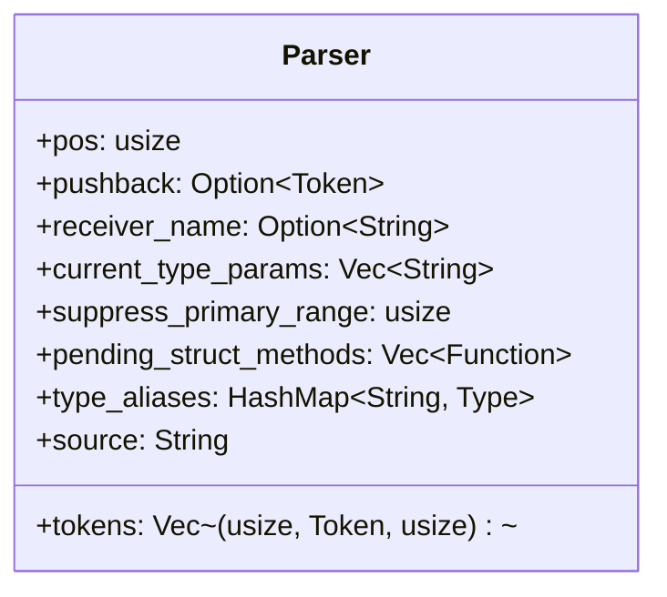
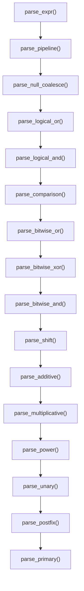
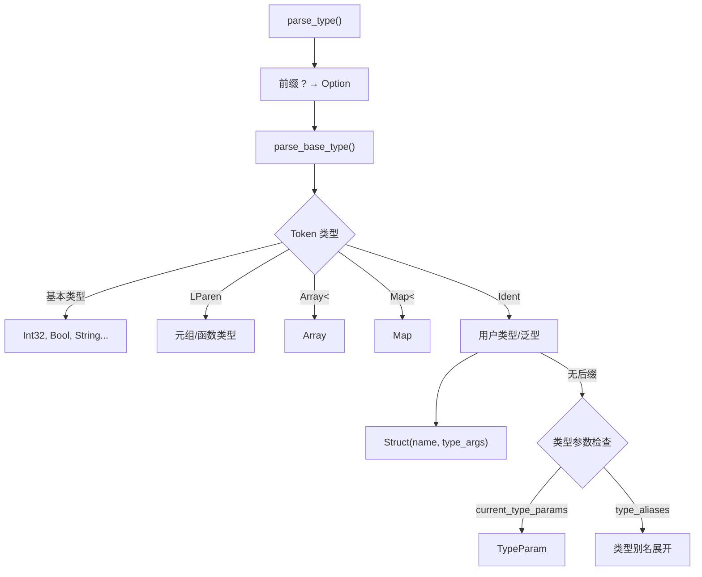
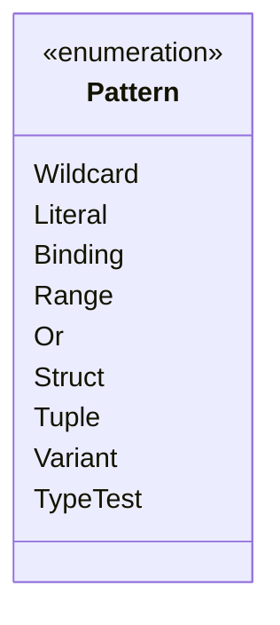

Cangjie 编译器采用**递归下降解析器**架构，将词法分析器产生的 Token 流转换为抽象语法树（AST）。解析器位于 `src/parser/` 目录，由 8 个模块组成，总计约 10,400 行 Rust 代码。解析器采用手写的递归下降算法，而非使用 parser generator，这与 cjc 编译器保持一致的工程选择。

## 解析器核心架构

### Parser 状态管理

`Parser` 结构体维护解析过程的全部状态，包括当前位置追踪、上下文信息和语言特性开关。核心字段定义于 `src/parser/mod.rs`：



**关键字段说明**：

| 字段 | 类型 | 用途 |
|------|------|------|
| `tokens` | `Vec<(usize, Token, usize)>` | Token 流，每个元素包含起始偏移、Token、结束偏移 |
| `pos` | `usize` | 当前解析位置（消费指针） |
| `pushback` | `Option<Token>` | 单 token 回退机制，用于处理 `>>` 在泛型上下文中的歧义 |
| `receiver_name` | `Option<String>` | 方法体内的 receiver 参数名（解析 `this` 关键字时使用） |
| `current_type_params` | `Vec<String>` | 当前泛型作用域的类型参数名列表 |
| `suppress_primary_range` | `usize` | 禁用 primary 表达式层整数范围解析的嵌套深度计数器 |

Sources: [mod.rs](src/parser/mod.rs#L17-L30)

### Token 消费机制

解析器提供三级 Token 操作原语，构成所有解析逻辑的基础：

**`advance()`** — 消费并返回当前 Token，支持 pushback 回退：

```rust
fn advance(&mut self) -> Option<Token> {
    if let Some(t) = self.pushback.take() {
        return Some(t);
    }
    if self.pos < self.tokens.len() {
        let tok = self.tokens[self.pos].1.clone();
        self.pos += 1;
        Some(tok)
    } else {
        None
    }
}
```

Sources: [mod.rs](src/parser/mod.rs#L295-L307)

**`expect(token)`** — 期望特定 Token，失败时产生精确错误。在类型上下文中，`>>` 自动拆分为 `>` + `>` 以正确解析 `Array<UInt32>>` 这样的嵌套泛型：

```rust
fn expect(&mut self, expected: Token) -> Result<(), ParseErrorAt> {
    if std::mem::discriminant(&expected) == std::mem::discriminant(&Token::Gt)
        && self.peek() == Some(&Token::Shr) {
        self.advance();
        self.pushback = Some(Token::Gt);
        return Ok(());
    }
    // ... 标准匹配逻辑
}
```

Sources: [mod.rs](src/parser/mod.rs#L309-L323)

**`peek()` / `peek_next()`** — 前瞻 Token 而不消费，用于决策。

### 错误处理模型

解析错误分为两类定义于 `src/parser/error.rs`：

```rust
#[derive(Error, Debug)]
pub enum ParseError {
    #[error("意外的 token: {0:?}, 期望: {1}")]
    UnexpectedToken(Token, String),
    #[error("意外的输入结束")]
    UnexpectedEof,
    #[error("未知类型: {0}")]
    UnknownType(String),
}

#[derive(Debug)]
pub struct ParseErrorAt {
    pub error: ParseError,
    pub byte_start: usize,
    pub byte_end: usize,
}
```

Sources: [error.rs](src/parser/error.rs#L1-L28)

`bail()` 和 `bail_at()` 方法将 `ParseError` 转换为 `Result<T, ParseErrorAt>` 并附加字节偏移，便于后续转换为行号报告。

## 表达式解析

### 运算符优先级解析

表达式解析采用**经典递归下降**模式，每个优先级对应一个解析函数，遵循以下调用链：



每个二元运算符采用**左结合循环**实现：

```rust
pub(crate) fn parse_additive(&mut self) -> Result<Expr, ParseErrorAt> {
    let mut left = self.parse_multiplicative()?;
    while let Some(op) = match self.peek() {
        Some(Token::Plus) => Some(BinOp::Add),
        Some(Token::Minus) => Some(BinOp::Sub),
        _ => None,
    } {
        self.advance();
        let right = self.parse_multiplicative()?;
        left = Expr::Binary { op, left: Box::new(left), right: Box::new(right) };
    }
    Ok(left)
}
```

Sources: [expr.rs](src/parser/expr.rs#L179-L197)

**幂运算 `**` 是右结合**的特例：

```rust
pub(crate) fn parse_power(&mut self) -> Result<Expr, ParseErrorAt> {
    let mut left = self.parse_unary()?;
    if matches!(self.peek(), Some(Token::StarStar)) {
        self.advance();
        let right = self.parse_power()?;  // 递归而非循环，实现右结合
        left = Expr::Binary { op: BinOp::Pow, left: Box::new(left), right: Box::new(right) };
    }
    Ok(left)
}
```

Sources: [expr.rs](src/parser/expr.rs#L171-L183)

### 后缀表达式解析

`parse_postfix_from_expr()` 负责处理 `.field`、`[index]`、`?.field` 等后缀操作，采用**循环+模式匹配**架构：

```mermaid
flowchart LR
    A["parse_primary()"] --> B["parse_postfix_from_expr()"]
    B --> C{"当前 Token"}
    C -->|"Token::LBracket"| D["数组访问/切片"]
    C -->|"Token::Dot"| E["字段访问/方法调用"]
    C -->|"Token::Question"| F["可选链 ?."]
    C -->|"Token::As"| G["类型转换 as"]
    C -->|"Token::Incr/Decr"| H["后缀自增/自减"]
    C -->|"Token::Question"| I["? 运算符"]
    C -->|"Token::LBrace"| J["尾随闭包"]
    C -->|"其他"| K["返回"]
    D --> B
    E --> B
    F --> B
    G --> B
    H --> B
    I --> B
```



Sources: [expr.rs](src/parser/expr.rs#L302-L550)

**关键设计：跨行边界检测**。方法调用时需要判断 `(` 是否与前一个 Token 之间存在换行（避免 `Int8.Max\n(a, b)` 被误解析为方法调用）：

```rust
fn newline_before_current(&self) -> bool {
    if self.source.is_empty() { return false; }
    let prev_end = self.tokens[self.pos - 1].2;
    let cur_start = self.tokens.get(self.pos).map(|t| t.0).unwrap_or(prev_end);
    self.source[prev_end..cur_start].contains('\n')
}
```

Sources: [mod.rs](src/parser/mod.rs#L53-L65)

### 主表达式解析

`parse_primary()` 处理原子表达式和特殊构造，涵盖 Cangjie 语言的核心语法：

| Token 类型 | 解析结果 |
|-----------|---------|
| 整数字面量 | `Expr::Integer`（含后缀验证） |
| 浮点/字符/布尔字面量 | `Expr::Float` / `Expr::Rune` / `Expr::Bool` |
| 字符串字面量 | `Expr::String` / `Expr::Interpolate` |
| `this` | 转换为 `Expr::Var(receiver_name)` |
| `super` | `Expr::SuperCall` 或 `Expr::SuperFieldAccess` |
| `Some(e)` / `None` / `Ok(e)` / `Err(e)` | `Expr::Some` 等 |
| 类型构造器 `T(e)` | `Expr::Call` |
| `try { } catch { } finally { }` | `Expr::TryBlock` |
| `match { ... }` | `Expr::Match` |
| `{ x => expr }` | `Expr::Lambda` |

Sources: [expr.rs](src/parser/expr.rs#L704-L1099)

**范围表达式解析**在 `parse_primary()` 中处理，支持 `1..10`、`0..=n`、`1..-1:step` 等形式：

```rust
if self.suppress_primary_range == 0
    && (self.check(&Token::DotDot) || self.check(&Token::DotDotEq)) {
    let inclusive = self.check(&Token::DotDotEq);
    self.advance();
    let end = if /* 开放式范围 */ {
        Box::new(Expr::Integer(i64::MAX))
    } else {
        Box::new(self.parse_unary()?)
    };
    let step = if self.check(&Token::Colon) {
        Some(Box::new(self.parse_unary()?))
    } else { None };
    return Ok(Expr::Range { start: Box::new(Expr::Integer(value)), end, inclusive, step });
}
```

Sources: [expr.rs](src/parser/expr.rs#L718-L743)

## 语句解析

### 语句分类

语句解析入口 `parse_stmt()` 根据首个 Token 分派到各子解析器：

| 语句类型 | 关键字 | AST 节点 |
|---------|-------|---------|
| 不可变绑定 | `let` | `Stmt::Let` |
| 可变绑定 | `var` | `Stmt::Var` |
| 赋值 | — | `Stmt::Assign` |
| 返回 | `return` | `Stmt::Return` |
| 条件循环 | `while` | `Stmt::While` / `Stmt::WhileLet` |
| 迭代循环 | `for` | `Stmt::For` |
| 无限循环 | `loop` | `Stmt::Loop` |
| do-while | `do` | `Stmt::DoWhile` |
| 控制转移 | `break` / `continue` | `Stmt::Break` / `Stmt::Continue` |
| 表达式语句 | 其他 | `Stmt::Expr` |

Sources: [stmt.rs](src/parser/stmt.rs#L59-L698)

### `for` 循环的特殊处理

`for` 循环支持多种形式，包括元组解构和 `where` 子句过滤：

```rust
Some(Token::For) => {
    // 支持 for (x, y) in iterable { ... }
    let (var, tuple_vars) = if self.check(&Token::LParen) {
        // 解析元组变量列表
        ("__for_tuple_destr".to_string(), names)
    } else {
        (v, Vec::new())
    };
    
    let iterable = self.parse_for_iterable()?;
    
    // cjc: 支持 where 过滤子句
    if self.check(&Token::Where) {
        self.advance();
        self.parse_expr()?;  // 解析并丢弃 where 条件
    }
    
    // 元组解构转换为多条 let 语句
    if !tuple_vars.is_empty() {
        let mut prefix = Vec::new();
        for (i, name) in tuple_vars.into_iter().enumerate() {
            if name != "_" {
                prefix.push(Stmt::Let {
                    pattern: Pattern::Binding(name),
                    value: Expr::TupleIndex { object: Box::new(Expr::Var(var.clone())), index: i as u32 },
                    ..
                });
            }
        }
        body = prefix;
    }
}
```

Sources: [stmt.rs](src/parser/stmt.rs#L258-L325)

## 声明解析

### 程序入口

`parse_program()` 负责解析顶层结构，按顺序处理：

1. **Package 声明**：`package prefix.path`（支持 `protected package`）
2. **Import 语句**：支持 `import path.Item`、`import path.{A, B}`、`import path.*`
3. **顶层声明**：可见性修饰符 + 声明类型

Sources: [decl.rs](src/parser/decl.rs#L12-L299)

### 结构体解析

结构体支持泛型参数、where 约束和内部方法。解析完成后，方法存入 `pending_struct_methods` 在程序结束时合并：

```rust
pub(crate) fn parse_struct_with_visibility(&mut self, visibility: Visibility) -> Result<StructDef, ParseErrorAt> {
    self.expect(Token::Struct)?;
    let name = self.advance_ident().ok_or(...)?
    
    // 解析泛型参数 <T: Bound1 & Bound2>
    let (type_params, constraints) = self.parse_type_params_with_constraints()?;
    let where_constraints = self.parse_where_clause()?;
    let mut merged = self.current_type_params.clone();
    merged.extend(type_params.clone());
    let prev_params = std::mem::replace(&mut self.current_type_params, merged);
    
    // 解析字段和方法体
    // ...
    
    // 内部方法暂存，完成后合并
    self.pending_struct_methods.extend(methods);
    Ok(StructDef { visibility, name, type_params, fields, .. })
}
```

Sources: [decl.rs](src/parser/decl.rs#L930-L1050)

### 枚举解析

枚举支持变体关联类型和内部方法。变体可为无值形式或带关联值形式（如 `Result.Ok(Int64)`）：

```rust
while !self.check(&Token::RBrace) {
    // 跳过可见性修饰符
    while matches!(self.peek(), Some(Token::Public | Token::Private | ...)) {
        self.advance();
    }
    
    // 解析变体或方法
    match self.peek() {
        Some(Token::Func) | Some(Token::Unsafe) => {
            methods.push(self.parse_enum_method()?);
        }
        _ => {
            // 解析变体名及关联值
            let variant_name = self.advance_ident()?;
            let payload = if self.check(&Token::LParen) {
                self.advance();
                Some(self.parse_type()?)
            } else { None };
            variants.push(EnumVariant { name: variant_name, payload });
        }
    }
}
```

Sources: [decl.rs](src/parser/decl.rs#L1077-L1170)

## 类型解析

### 类型语法层次

类型解析采用专门的优先级层次，与表达式解析互补：



Sources: [type_.rs](src/parser/type_.rs#L162-L399)

### 泛型与类型参数上下文

`current_type_params` 字段在解析泛型函数/类型定义时填充，使标识符解析能够区分类型参数与普通类型：

```rust
// 解析函数泛型参数
let (type_params, constraints) = self.parse_type_params_with_constraints()?;
let prev_params = std::mem::replace(&mut self.current_type_params, type_params.clone());

// 在函数体解析期间，parse_base_type() 检查：
if self.current_type_params.contains(&name) {
    return Ok(Type::TypeParam(name));
}
```

Sources: [type_.rs](src/parser/type_.rs#L67-L90)

## 模式解析

模式解析支持 Cangjie 的丰富模式匹配语法，包括解构、范围和类型测试模式：



| 模式类型 | 语法示例 | 解析位置 |
|---------|---------|---------|
| 通配符 | `_` | `parse_primary_pattern()` |
| 字面量 | `1`, `"hello"`, `true` | `parse_primary_pattern()` |
| 绑定 | `x` | `parse_primary_pattern()` |
| 范围 | `1..10` | `parse_primary_pattern()` |
| 或模式 | `1 \| 2 \| 3` | `parse_or_pattern()` |
| 结构解构 | `Point { x, y }` | `parse_pattern_fields()` |
| 元组解构 | `(a, b, c)` | `parse_primary_pattern()` |
| 枚举变体 | `Option.Some(v)` | `parse_primary_pattern()` |
| 类型测试 | `x: Type` | `parse_primary_pattern()` |

Sources: [pattern.rs](src/parser/pattern.rs#L26-L200)

## 关键设计决策

### 1. Pushback 机制处理 `>>` 歧义

C++11 引入了嵌套模板参数中 `>>` 的歧义问题，Cangjie 采用相同解决方案：

```rust
// 类型上下文中的 >> 视为两个 >
fn expect(&mut self, expected: Token) -> Result<(), ParseErrorAt> {
    if std::mem::discriminant(&expected) == std::mem::discriminant(&Token::Gt)
        && self.peek() == Some(&Token::Shr) {
        self.advance();
        self.pushback = Some(Token::Gt);  // 将多出的 > 推回缓冲区
        return Ok(());
    }
    // ...
}
```

Sources: [mod.rs](src/parser/mod.rs#L309-L323)

### 2. 关键字作为标识符

Cangjie 允许某些关键字在特定上下文中作为标识符使用（如 `main`、`type`、`where`），通过 `advance_ident()` 方法实现：

```rust
fn advance_ident(&mut self) -> Option<String> {
    match self.peek() {
        Some(Token::Main) => { self.advance(); Some("main".to_string()) }
        Some(Token::Where) => { self.advance(); Some("where".to_string()) }
        Some(Token::TypeAlias) => { self.advance(); Some("type".to_string()) }
        // ...
        _ => None  // 降级给标准标识符处理
    }
}
```

Sources: [mod.rs](src/parser/mod.rs#L227-L272)

### 3. 属性注解条件编译

属性注解 `@When[os == "Windows"]` 用于条件编译，解析器在遇到不适用条件时返回 `should_skip_next = true`：

```rust
fn skip_optional_attributes(&mut self) -> Result<bool, ParseErrorAt> {
    while self.check(&Token::At) {
        self.advance();
        let attr_name = self.advance_ident()?;
        if self.check(&Token::LBracket) {
            self.advance();
            // 收集条件表达式并评估
            // ...
            if attr_name == "When" && !condition_matches_target() {
                return Ok(true);  // 应跳过下一个声明
            }
        }
    }
    Ok(false)
}
```

Sources: [mod.rs](src/parser/mod.rs#L356-L399)

## 性能优化特性

解析器实现了多项性能优化：

1. **Token 索引优化**：每个 Token 存储 `(start, Token, end)` 三元组，避免重复计算位置
2. **Pushback 栈深度为 1**：最小化回退开销
3. **Early Return 模式**：在 `parse_*` 函数中尽早检查边界条件
4. **类型上下文感知**：通过 `is_type_start()` 预判避免误解析表达式为泛型实参

Sources: [type_.rs](src/parser/type_.rs#L24-L55)

## 相关文档

- [词法分析器](5-ci-fa-fen-xi-qi) — 解析器的上游模块
- [抽象语法树](7-chou-xiang-yu-fa-shu) — 解析器的输出数据结构
- [编译流水线](8-bian-yi-liu-shui-xian) — 解析器在完整编译流程中的位置