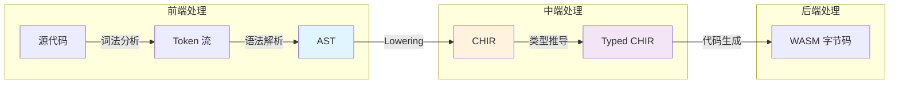
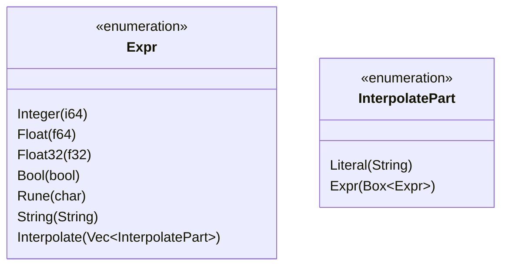
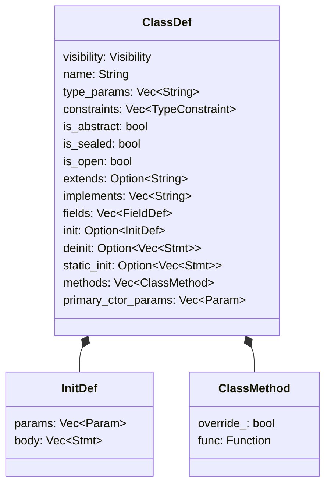
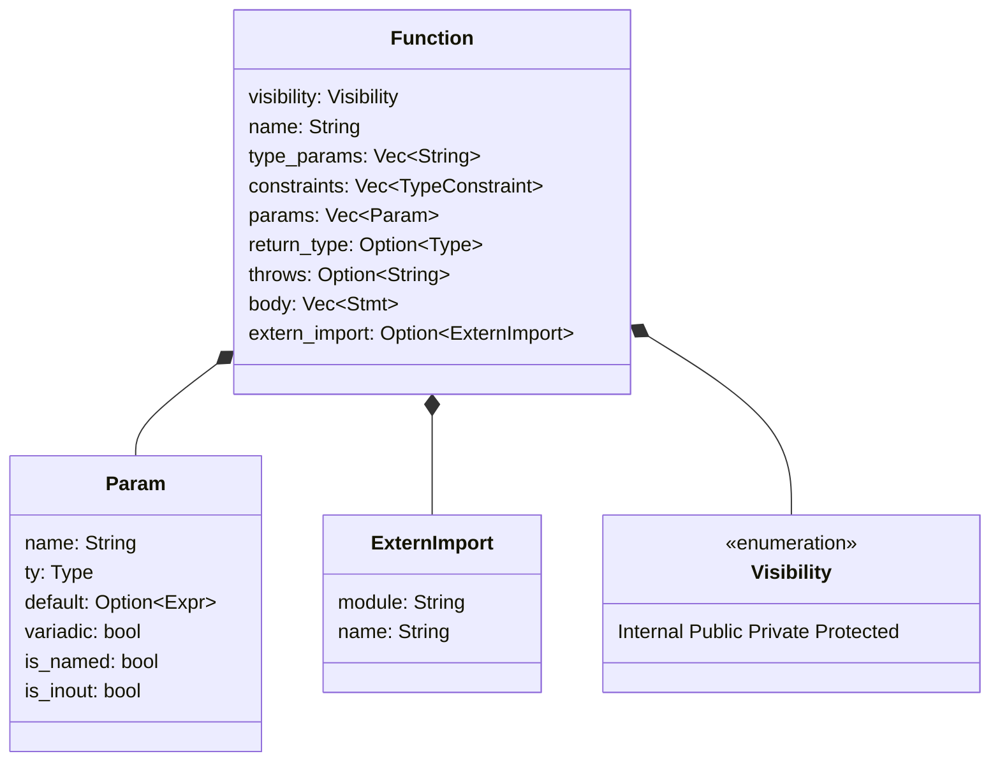
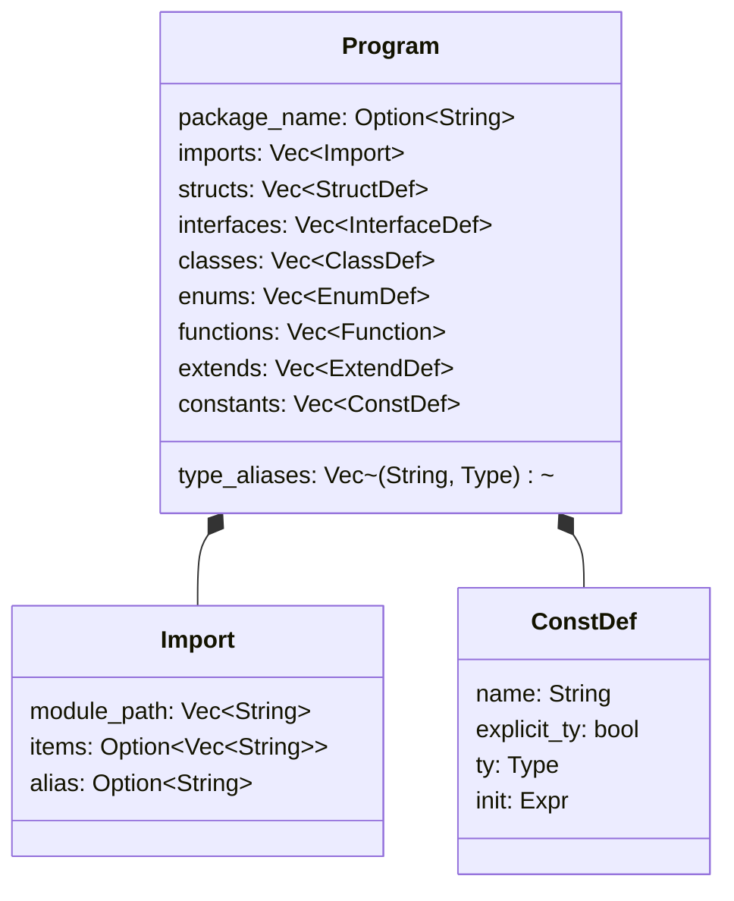
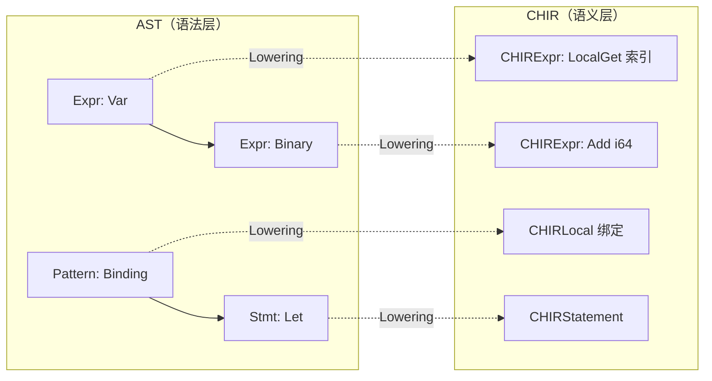

抽象语法树（Abstract Syntax Tree，简称 AST）是 CJWasm2 编译器在前端处理阶段的核心数据结构。它作为[词法分析器](5-ci-fa-fen-xi-qi)与[语法解析器](6-yu-fa-jie-xi-qi)的输出，以及后续编译阶段的主要输入，在编译流程中扮演着承上启下的关键角色。

## 概述：AST 在编译流程中的位置

CJWasm2 采用经典的编译器分层架构：源代码经过词法分析生成 Token 流，由语法解析器构建 AST，再经过 Lowering 过程转换为带有完整类型信息的 CHIR（ Cangjie High-level IR），最终由代码生成器输出 WebAssembly 字节码。AST 作为这一链条的中间产物，忠实反映了源代码的语法结构，同时保持语言无关的树形表示形式。



这一设计的关键优势在于：AST 层专注于语法结构的完整表示，而类型解析、符号解析等语义分析工作在下沉的 CHIR 层完成。这种职责分离使得编译器的各个阶段更加模块化，便于维护和扩展。 [src/pipeline.rs#L169-L181](src/pipeline.rs#L169-L181)

## 表达式层：Expr 枚举

表达式是 AST 中最丰富的组成部分，CJWasm2 的 `Expr` 枚举包含超过 40 种变体，覆盖了仓颉语言的所有表达式类型。这些变体按语义可分为几个主要类别：

### 字面量与基础类型

字面量表达式直接对应源代码中的字面常量。CJWasm2 区分了多种数值类型以支持 WebAssembly 的精确类型映射。

| 变体 | 源代码示例 | 说明 |
|------|-----------|------|
| `Integer(i64)` | `42`, `0xFF` | 整数字面量 |
| `Float(f64)` | `3.14` | 64 位浮点 |
| `Float32(f32)` | `3.14f` | 32 位浮点（后缀 f） |
| `Bool(bool)` | `true`, `false` | 布尔值 |
| `Rune(char)` | `'A'`, `'\n'` | Unicode 码点 |
| `String(String)` | `"hello"` | 字符串字面量 |



字符串插值 `"Hello, ${name}!"` 被解析为 `Interpolate` 变体，其中包含字面量部分和表达式部分的交替序列。这种设计使得插值表达式的每个组成部分都可以独立处理，便于后续的代码生成阶段生成正确的字符串拼接调用。

[src/ast/mod.rs#L52-L68](src/ast/mod.rs#L52-L68)

### 运算符表达式

一元和二元运算符表达式采用标准的运算符枚举表示。`UnaryOp` 定义了三种一元运算：`Not`（逻辑非 `!`）、`Neg`（算术负 `-`）和 `BitNot`（按位取反 `~`）。`BinOp` 则覆盖了仓颉语言的全部二元运算符，包括算术运算、比较运算、逻辑运算、位运算以及语言特有的幂运算 `**` 和管道操作 `|>`。

```mermaid
classDiagram
    class Expr {
        <<enumeration>>
        Unary {op, expr}
        Binary {op, left, right}
        Call {name, type_args, args, named_args}
        MethodCall {object, method, args, type_args}
    }
    
    class UnaryOp {
        <<enumeration>>
        Not
        Neg
        BitNot
    }
    
    class BinOp {
        <<enumeration>>
        Add Sub Mul Div Mod
        Eq NotEq Lt Gt LtEq GtEq
        LogicalAnd LogicalOr
        BitAnd BitOr BitXor
        Shl Shr Pow
        NotIn Pipeline
    }
    
    Expr o-- UnaryOp
    Expr o-- BinOp
```

值得注意的是，`BinOp::Pipeline` 表示管道运算符 `|>`，其语义为 `left |> right` 等价于 `right(left)`。在代码生成阶段，这需要特殊处理以生成正确的函数调用序列。

[src/ast/mod.rs#L8-L39](src/ast/mod.rs#L8-L39)

### 调用与访问

函数调用和方法调用是表达式的重要组成部分。CJWasm2 区分了三种调用形式：

**函数调用** `Call` 表示对顶级函数的调用，支持显式类型实参（如 `identity<Int64>(42)`）和命名参数（P2.9 特性）。**方法调用** `MethodCall` 表示通过对象调用的方法，其结构包含接收者对象、方法名和类型参数。**构造调用** `ConstructorCall` 是构造函数的特殊形式，在代码生成阶段会被转换为 `StructInit`。

字段访问 `Field` 和元组索引访问 `TupleIndex` 遵循类似的 Box 封装模式，将子表达式包裹在 `Box<Expr>` 中以控制递归深度和内存布局。

[src/ast/mod.rs#L78-L144](src/ast/mod.rs#L78-L144)

### 控制流表达式

控制流表达式包括条件表达式、循环表达式和模式匹配表达式。`If` 表达式采用标准的条件-分支结构，支持可选的 else 分支。`IfLet` 是仓颉语言的重要特性，允许在条件表达式中同时进行模式绑定。

```mermaid
classDiagram
    class Expr {
        <<enumeration>>
        If {cond, then_branch, else_branch}
        IfLet {pattern, expr, then_branch, else_branch}
        Match {expr, arms}
        Lambda {params, return_type, body}
        TryBlock {resources, body, catch_*, finally_*}
    }
    
    class MatchArm {
        pattern: Pattern
        guard: Option~Box~Expr~
        body: Box~Expr~
    }
    
    Expr *-- MatchArm
```

`Match` 表达式由一个待匹配对象和一系列匹配分支组成。每个 `MatchArm` 包含要匹配的模式、可选的守卫条件（`if` 子句）和匹配成功时的执行体。Lambda 表达式则直接内联了参数列表、返回类型和函数体。

[src/ast/mod.rs#L105-L200](src/ast/mod.rs#L105-L200)

## 模式层：Pattern 枚举

模式用于 `let` 绑定、`match` 分支和 `for-in` 循环中的解构匹配。CJWasm2 的 `Pattern` 枚举定义了仓颉语言支持的完整模式种类：

| 模式类型 | 源代码示例 | 用途 |
|---------|-----------|------|
| `Wildcard` | `_` | 忽略任意值 |
| `Literal` | `42`, `"ok"`, `true` | 匹配字面量 |
| `Binding` | `x` | 绑定变量 |
| `Range` | `1..10`, `'a'..='z'` | 范围匹配 |
| `Or` | `1 \| 2 \| 3` | 多选一匹配 |
| `Struct` | `Point { x, y }` | 结构体解构 |
| `Tuple` | `(a, b, c)` | 元组解构 |
| `Variant` | `Result.Ok(v)` | 枚举变体匹配 |
| `TypeTest` | `x: Type` | 类型测试模式（P3.5） |
| `Field` | `obj.field` | 字段模式匹配 |
| `Guard` | `expr` | 表达式守卫 |

`Literal` 枚举进一步定义了模式中可用的字面量类型：`Integer(i64)`、`Float(f64)`、`Bool(bool)`、`String(String)` 和 `Rune(char)`。

[src/ast/mod.rs#L241-L296](src/ast/mod.rs#L241-L296)

## 语句层：Stmt 枚举

语句代表可执行的程序指令。CJWasm2 将多种语法结构统一表示为 `Stmt` 枚举的变体：

```mermaid
classDiagram
    class Stmt {
        <<enumeration>>
        Let {pattern, ty, value}
        Var {pattern, ty, value}
        Assign {target, value}
        Expr(Expr)
        Return(Option~Expr~)
        While {cond, body}
        WhileLet {pattern, expr, body}
        DoWhile {body, cond}
        For {var, iterable, body}
        Loop {body}
        Break
        Continue
        Assert {left, right, line}
        Expect {left, right, line}
        Const {name, ty, value}
        UnsafeBlock {body}
        LocalFunc(Function)
    }
    
    class AssignTarget {
        <<enumeration>>
        Var(String)
        Index {array, index}
        Field {object, field}
        FieldPath {base, fields}
        IndexPath {base, fields, index}
        ExprIndex {expr, index}
        Tuple(Vec~AssignTarget~)
        SuperField {field}
    }
    
    Stmt *-- AssignTarget
```

**变量绑定**，`Let` 表示不可变绑定，`Var` 表示可变绑定，两者都接受模式作为绑定目标，支持解构赋值。`Assign` 语句则处理赋值操作，其目标可以是简单变量、数组元素、结构体字段或更复杂的链式访问路径。

**循环结构**包括 `While`（条件循环）、`DoWhile`（先执行后判断的循环）、`For`（for-in 循环，支持 `step` 表达式）和 `Loop`（无限循环）。`WhileLet` 允许在循环条件中同时进行模式绑定。

**控制流**，`Break` 和 `Continue` 用于退出或继续循环。`Return` 语句携带可选的返回值表达式。

[src/ast/mod.rs#L299-L362](src/ast/mod.rs#L299-L362)

## 声明层：类型与函数定义

### 类型系统：Type 枚举

`Type` 枚举完整定义了仓颉语言的类型系统，支持从原始类型到复杂泛型类型的完整谱系：

```mermaid
classDiagram
    class Type {
        <<enumeration>>
        Int8 Int16 Int32 Int64 IntNative
        UInt8 UInt16 UInt32 UInt64 UIntNative
        Float16 Float32 Float64
        Rune Bool
        Nothing Unit
        String Array~Type~
        Struct~String, Vec~Type~~ Tuple~Vec~Type~~
        Range
        Function {params, ret}
        Option~Type~
        Result~Type, Type~
        Slice~Type~
        Map~Type, Type~
        TypeParam~String~
        This
        Qualified~Vec~String~~
    }
```

**原始类型**覆盖了有符号/无符号整数（8/16/32/64 位及原生宽度）、IEEE 754 浮点数（Rune 为 Unicode 码点）、布尔类型以及特殊类型 `Nothing`（无返回值函数）和 `Unit`（无意义值）。

**复合类型**包括固定长度的数组 `Array<T>`、结构体类型 `Struct(name, type_args)`、元组 `Tuple(types)` 和范围类型 `Range`。函数类型 `Function` 明确记录参数类型列表和可选的返回类型。

**泛型系统**，`TypeParam<T>` 表示泛型定义体内的类型参数（如 `func identity<T>(x: T)` 中的 `T`），需要通过[泛型单态化](11-fan-xing-dan-tai-hua)替换为具体类型。`This` 类型（P2 特性）专用于类方法中表示当前类类型。

**限定类型**，`Qualified` 用于表示模块化类型引用（如 `pkg.Module.Type`），通过路径段向量表示。

每个 `Type` 变体都实现了 `to_wasm()` 方法返回对应的 WebAssembly 值类型，以及 `size()` 方法计算类型在内存中的字节大小。对于无法直接映射到 WASM 原生的复合类型，统一返回 `I32`（表示堆上的指针）。

[src/ast/type_.rs#L1-L133](src/ast/type_.rs#L1-L133)

### 结构体与类定义

**`StructDef`** 表示仓颉的结构体类型，支持泛型参数和类型约束：

```rust
pub struct StructDef {
    pub visibility: Visibility,
    pub name: String,
    pub type_params: Vec<String>,      // 泛型参数，如 ["T", "U"]
    pub constraints: Vec<TypeConstraint>, // 类型约束
    pub fields: Vec<FieldDef>,          // 字段定义
}
```

每个字段由 `FieldDef` 表示，包含字段名、类型和可选的默认值。

**`ClassDef`** 表示类类型，功能更为丰富，支持继承、接口实现、构造函数等：



类的继承通过 `extends` 字段表示，`implements` 字段列出所实现的接口。`is_abstract`、`is_sealed` 和 `is_open` 标记控制类的继承行为——仓颉语言默认类不可继承，需要显式标记 `open` 才允许被继承。

[src/ast/mod.rs#L415-L596](src/ast/mod.rs#L415-L596)

### 接口与枚举定义

**`InterfaceDef`** 定义了接口类型，包含方法签名列表和可选的关联类型定义。接口支持默认实现和静态方法。

**`EnumDef`** 表示枚举类型，其变体可以是简单的判别式或携带关联值：

```rust
pub struct EnumVariant {
    pub name: String,
    pub payload: Option<Type>,  // 关联值类型，如 Ok(Int64) 的 Int64
}

pub struct EnumDef {
    pub visibility: Visibility,
    pub name: String,
    pub type_params: Vec<String>,
    pub constraints: Vec<TypeConstraint>,
    pub variants: Vec<EnumVariant>,
}
```

枚举变体的 payload 类型决定了该变体的内存布局：无 payload 变体使用 i32 判别式，有 payload 变体则使用堆分配的指针。

[src/ast/mod.rs#L497-L657](src/ast/mod.rs#L497-L657)

### 函数定义

**`Function`** 结构记录了仓颉函数的完整签名和函数体：



`Param` 结构支持可选默认值、可变参数（`args: Int64...`）、命名参数（`name!: Type = default`）和引用参数（`inout`）。`ExternImport` 用于声明从 WebAssembly 宿主导入的外部函数，指定模块名和导入名。

[src/ast/mod.rs#L455-L493](src/ast/mod.rs#L455-L493)

### 扩展与约束

**`ExtendDef`** 表示扩展定义，用于为已有类型追加方法或实现接口：

```rust
pub struct ExtendDef {
    pub target_type: String,          // 被扩展的类型
    pub interface: Option<String>,     // 实现的接口
    pub assoc_type_bindings: Vec<(String, Type)>,  // 关联类型绑定
    pub methods: Vec<Function>,       // 扩展的方法
}
```

**`TypeConstraint`** 定义了泛型类型参数上的约束边界：

```rust
pub struct TypeConstraint {
    pub param: String,           // 类型参数名，如 "T"
    pub bounds: Vec<String>,     // 约束的接口名，如 ["Comparable", "Hashable"]
}
```

[src/ast/mod.rs#L540-L614](src/ast/mod.rs#L540-L614)

## 程序结构：Program

`Program` 是 AST 的根节点，封装了完整的编译单元信息：



`Import` 结构记录了模块导入的完整信息，包括模块路径、导入的具体项和别名。`type_aliases` 存储类型别名定义（如 `type MyInt = Int64`）。

编译流水线通过 `parse_source()` 函数将源代码字符串解析为 `Program`：

```rust
pub fn parse_source(source: &str) -> Result<Program, String> {
    let source = strip_block_comments(source);
    let source = strip_quote_contents(&source);
    let lexer = Lexer::new(&source);
    let tokens: Result<Vec<_>, _> = lexer.collect();
    let tokens = tokens.map_err(|e| format!("词法错误: {}", e))?;

    let mut parser = Parser::new(tokens).with_source(&source);
    let program = parser
        .parse_program()
        .map_err(|e| format!("语法错误: {}", e))?;

    Ok(program)
}
```

多文件编译时，`merge_programs()` 函数将多个 `Program` 合并为单一的编译单元：

[src/ast/mod.rs#L699-L729](src/ast/mod.rs#L699-L729)
[src/pipeline.rs#L169-L223](src/pipeline.rs#L169-L223)

## AST 到 CHIR 的转换

AST 本身仅包含语法结构和部分类型信息（显式注解的类型），符号引用（如变量名、函数名）尚未解析。**Lowering** 过程将 AST 转换为 CHIR（ Cangjie High-level IR），在此过程中完成符号解析、类型推断和作用域分析。



CHIR 层的主要增强包括：

- **完整的类型信息**：每个表达式都标注了 `Type` 和对应的 WASM `ValType`
- **符号解析**：变量名替换为局部变量索引，函数名替换为函数表索引
- **作用域管理**：显式的嵌套作用域和变量生命周期

Lowering 过程在 `src/chir/lower.rs` 中实现，包含继承合法性检查、顶层命名唯一性验证等语义校验：

[src/chir/lower.rs#L1-L47](src/chir/lower.rs#L1-L47)

## 设计特点与扩展考量

CJWasm2 的 AST 设计体现了几个重要原则：

**节点可见性管理**：类字段的可见性通过 `thread_local` 的 `FIELD_VISIBILITY_REGISTRY` 动态记录，而非硬编码在 AST 结构中。这种设计在保持 AST 结构简洁的同时，支持了仓颉语言的完整可见性系统。

**与 cjc 编译器对齐**：AST 变体的设计参考了 cjc release/1.0 的实现，例如移除了无符号右移 `>>>` 运算符以保持一致性。

**渐进式特性支持**：许多变体带有 P2、P3、P5 等阶段标记，表明该特性是在仓颉语言演进的不同阶段引入的。这使得 AST 能够准确反映源代码的语义，同时为未来的语言扩展预留了空间。

## 小结与后续阅读

抽象语法树作为编译器前端的核心产物，完整地记录了源代码的语法结构。从 AST 到 CHIR 的 Lowering 过程是编译流程中的关键转换，将语法表示转化为带有完整语义信息的中间表示。

若您希望深入了解 Lowering 过程的实现细节，建议阅读 [CHIR 中间表示](9-chir-zhong-jian-biao-shi) 章节。若对表达式到 WASM 指令的转换感兴趣，可继续阅读 [表达式代码生成](14-biao-da-shi-dai-ma-sheng-cheng)。对于类型系统更全面的讨论，请参阅 [类型检查与类型推断](13-lei-xing-jian-cha-yu-lei-xing-tui-duan)。