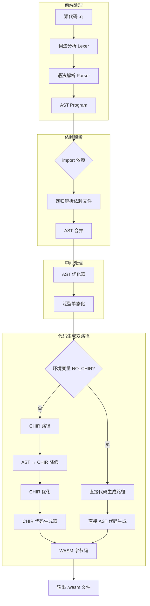
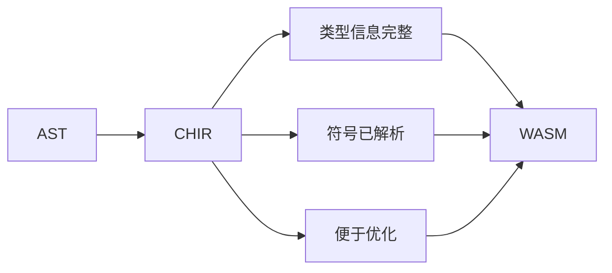

CJWasm2 的编译流水线是将仓颉（Cangjie）源代码转换为 WebAssembly 字节码的完整处理过程。该流水线采用多阶段架构，支持两种并行的代码生成路径：传统的直接 AST → WASM 路径，以及引入了 CHIR（仓颉高级中间表示）的新路径。本文档详细解析各阶段的职责、数据转换与关键设计决策。

## 流水线整体架构

CJWasm2 的编译流水线由以下核心阶段组成：



### 关键设计决策

| 特性 | CHIR 路径 | 直接路径 |
|------|----------|---------|
| 环境变量控制 | `NO_CHIR=1` 启用 | 默认 |
| 中间表示 | CHIR（带完整类型信息） | 无 |
| 优化能力 | CHIR 级别优化 | AST 级别优化 |
| 稳定性 | 实验性 | 生产可用 |
| 回退机制 | 失败时自动回退 | — |

Sources: [pipeline.rs](src/pipeline.rs#L349-L369), [main.rs](src/main.rs#L116-L119)

## 阶段一：词法分析与语法解析

### 词法分析器 (Lexer)

词法分析器使用 `logos` 库实现，将源代码字符串转换为 Token 流。其核心职责包括：

**Token 化处理**

```rust
pub struct Lexer<'a> {
    // logos 生成的词法分析器
}

impl<'a> Iterator for Lexer<'a> {
    type Item = Token;
}
```

词法分析器处理的 Token 类型涵盖关键字、标识符、字面量、运算符、界符等。关键特性包括带类型后缀的整数解析（如 `42_i64`）、字符串插值（`"Hello, ${name}!"`）以及多行字符串处理。

Sources: [lexer/mod.rs](src/lexer/mod.rs#L1-L140)

### 语法解析器 (Parser)

解析器采用递归下降算法，将 Token 流转换为抽象语法树（AST）。解析入口为 `parse_program()`，返回一个包含所有程序元素的 `Program` 结构。

**Program 结构定义**

```rust
pub struct Program {
    pub package_name: Option<String>,      // 包名
    pub imports: Vec<Import>,             // 导入列表
    pub structs: Vec<StructDef>,          // 结构体定义
    pub interfaces: Vec<InterfaceDef>,    // 接口定义
    pub classes: Vec<ClassDef>,           // 类定义
    pub enums: Vec<EnumDef>,              // 枚举定义
    pub functions: Vec<Function>,        // 函数定义
    pub extends: Vec<ExtendDef>,          // 扩展定义
    pub type_aliases: Vec<(String, Type)>,// 类型别名
    pub constants: Vec<ConstDef>,         // 常量定义
}
```

Sources: [ast/mod.rs](src/ast/mod.rs#L710-L729)

### 预处理：注释与宏处理

在正式解析之前，pipeline 模块执行两项预处理操作：

**1. 块注释移除**

`strip_block_comments()` 函数递归处理 `/* ... */` 块注释，需要正确处理注释内含 `*/` 的字符串字面量（如 `/* e.g. "/*xx*/" */`）：

```rust
fn find_comment_close(bytes: &[u8], start: usize) -> usize {
    // 通过引号计数判断 */ 是否在字符串内
    let q = count_unmatched_quotes(bytes, start, i);
    if q % 2 == 0 {
        // 偶数个引号：不在字符串内，关闭注释
        return i + 2;
    }
    // 奇数个引号：可能在字符串内，进一步判断
}
```

**2. quote() 宏内容提取**

`strip_quote_contents()` 函数将 `quote(...)` 宏调用替换为 `quote()` 空壳，保留宏调用的语法结构但不处理其内容。这使得编译器能够解析标准库中的宏使用场景。

Sources: [pipeline.rs](src/pipeline.rs#L110-L166), [pipeline.rs](src/pipeline.rs#L25-L91)

## 阶段二：依赖解析与 AST 合并

### import 依赖递归解析

编译多文件项目时，需要解析 `import` 语句并递归加载依赖模块。`collect_import_files()` 函数实现了这一逻辑：

```rust
pub fn collect_import_files(
    program: &Program,
    base_dirs: &[&Path],
    visited: &mut HashSet<PathBuf>,
    vendor_std_dir: Option<&Path>,
) -> Vec<PathBuf>
```

**搜索路径策略**

| 策略 | 路径格式 | 说明 |
|------|---------|------|
| 目录路径 | `module/sub.cj` | 按点分路径搜索目录 |
| 下划线路径 | `module_sub.cj` | 将点替换为下划线 |
| src 目录 | `src/module/sub.cj` | 在 src 子目录下搜索 |

**L1 标准库优先解析**

对于标准库模块（`std.io`、`std.crypto` 等），编译器优先从 vendor 目录加载实现：

```rust
const L1_STD_TOP: &[&str] = &[
    "io", "binary", "console", "overflow", "crypto", 
    "deriving", "ast", "argopt", "sort", "ref", "unicode",
];

pub fn resolve_import_to_files(
    module_path: &[String],
    base_dirs: &[&Path],
    vendor_std_dir: Option<&Path>,
) -> Vec<PathBuf> {
    // L1 Vendor 优先：std.io / std.crypto.digest 等
    if let Some(vendor) = vendor_std_dir {
        if is_l1_std_module(module_path) && module_path.len() >= 2 {
            let dir = vendor.join(rel);
            if dir.exists() && dir.is_dir() {
                // 返回目录下所有 .cj 文件
                return files;
            }
        }
    }
}
```

Sources: [pipeline.rs](src/pipeline.rs#L225-L347)

### AST 合并

多文件编译的最后阶段是将独立的 Program AST 合并为单一程序：

```rust
pub fn merge_programs(programs: Vec<Program>) -> Program {
    let mut merged = Program {
        package_name: None,
        imports: vec![],
        structs: vec![],
        interfaces: vec![],
        classes: vec![],
        enums: vec![],
        functions: vec![],
        extends: vec![],
        type_aliases: vec![],
        constants: vec![],
    };

    for prog in programs {
        // 保留第一个非 None 的 package_name
        if merged.package_name.is_none() && prog.package_name.is_some() {
            merged.package_name = prog.package_name;
        }
        // 合并所有程序元素
        merged.imports.extend(prog.imports);
        merged.structs.extend(prog.structs);
        // ... 其他类型同理
    }
    merged
}
```

Sources: [pipeline.rs](src/pipeline.rs#L192-L223)

## 阶段三：AST 级别优化

在代码生成之前，AST 优化器执行三项关键优化：

### 常量折叠

将编译时可确定的常量表达式直接求值：

```rust
fn fold_expr(expr: Expr) -> Expr {
    match expr {
        Binary { op, left, right } => {
            let left = fold_expr(*left);
            let right = fold_expr(*right);
            match (&left, &right) {
                (Integer(a), Integer(b)) => fold_binary_int(*a, *b, &op)?,
                (Float(x), Float(y)) => fold_binary_float(*x, *y, &op)?,
                _ => Binary { op, left, right },
            }
        }
        // ...
    }
}
```

Sources: [optimizer/mod.rs](src/optimizer/mod.rs#L180-L200)

### 死代码消除

移除 `return`、`break`、`continue` 语句之后不可达的代码：

```rust
fn eliminate_dead_code(stmts: &mut Vec<Stmt>) {
    let mut terminator_pos = None;
    for (i, stmt) in stmts.iter().enumerate() {
        match stmt {
            Stmt::Return(_) | Stmt::Break | Stmt::Continue => {
                terminator_pos = Some(i);
                break;
            }
            _ => {}
        }
    }
    if let Some(pos) = terminator_pos {
        stmts.truncate(pos + 1);
    }
}
```

Sources: [optimizer/mod.rs](src/optimizer/mod.rs#L44-L73)

### 尾递归优化

将符合条件的尾递归调用转换为循环结构：

```rust
// 原始：func factorial(n: Int64): Int64 { ... return factorial(new_args) }
// 转换后：loop { ... param = new_args; continue } return result
```

Sources: [optimizer/mod.rs](src/optimizer/mod.rs#L75-L144)

## 阶段四：泛型单态化

仓颉支持泛型编程，单态化阶段将泛型代码按具体类型参数生成特化版本：

```rust
pub fn mangle_name(name: &str, type_args: &[Type]) -> String {
    if type_args.is_empty() {
        format!("{}$_", name)
    } else {
        format!(
            "{}${}",
            name,
            type_args.iter()
                .map(type_mangle_suffix)
                .collect::<Vec<_>>()
                .join("$")
        )
    }
}
```

**类型修饰规则示例**

| 泛型类型 | 实例化类型 | 修饰后缀 |
|---------|----------|---------|
| `Array<T>` | `Array<Int64>` | `Array_Int64` |
| `Option<T>` | `Option<String>` | `Option_String` |
| `Map<K,V>` | `Map<String,Int64>` | `Map_String_Int64` |

Sources: [monomorph/mod.rs](src/monomorph/mod.rs#L84-L99)

## 阶段五：代码生成

CJWasm2 支持两条并行的代码生成路径。

### 路径 A：CHIR 中间表示（实验性）

CHIR（仓颉高级中间表示）是 2025 年新引入的架构，提供了 AST 和 WASM 之间的类型化中间层：

**CHIR 架构优势**



**降低流程**

```rust
pub fn compile_source_to_wasm(source: &str) -> Result<Vec<u8>, String> {
    let mut program = parse_source(source)?;
    crate::optimizer::optimize_program(&mut program);
    crate::monomorph::monomorphize_program(&mut program);

    if std::env::var("NO_CHIR").is_err() {
        // 新路径: AST → CHIR → WASM
        let mut chir_program = crate::chir::lower_program(&program)?;
        crate::chir::optimize::optimize_chir(&mut chir_program);
        let mut codegen = crate::codegen::chir_codegen::CHIRCodeGen::new();
        Ok(codegen.generate(&chir_program))
    } else {
        // 旧路径: AST → WASM
        let mut codegen = CodeGen::new();
        Ok(codegen.compile(&program))
    }
}
```

Sources: [pipeline.rs](src/pipeline.rs#L349-L369)

**CHIR 模块结构**

```rust
pub mod chir {
    pub mod builder;      // CHIR 构建器
    pub mod lower;        // AST → CHIR 降低
    pub mod lower_expr;   // 表达式降低
    pub mod lower_stmt;   // 语句降低
    pub mod optimize;     // CHIR 优化
    pub mod type_inference; // 类型推断上下文
    pub mod types;        // CHIR 类型系统
}
```

Sources: [chir/mod.rs](src/chir/mod.rs#L1-L25)

### 路径 B：直接代码生成（生产可用）

传统路径将优化后的 AST 直接转换为 WASM：

```rust
pub struct CodeGen {
    func_types: HashMap<String, u32>,      // 函数类型索引
    func_indices: HashMap<String, u32>,    // 函数索引
    structs: HashMap<String, StructDef>,   // 结构体定义
    enums: HashMap<String, EnumDef>,       // 枚举定义
    classes: HashMap<String, ClassInfo>,   // 类信息（含 vtable）
    string_pool: Vec<(String, u32)>,        // 字符串常量池
    // ...
}
```

**WASM 内存布局**

| 区域 | 地址范围 | 用途 |
|-----|---------|------|
| I/O 缓冲区 | 0-127 | println 等 I/O 操作 |
| WASI Scratch | 80-127 | WASI 系统调用临时区 |
| iovec 结构 | 64-71 | WASI fd_write 参数 |
| nwritten | 72-79 | 写入字节数输出 |
| 堆 | 1024+ | 运行时堆分配 |

Sources: [codegen/mod.rs](src/codegen/mod.rs#L24-L83)

## cjpm 构建流程集成

当使用 `cjwasm build` 命令时，cjpm 模块提供完整的项目管理集成：

```rust
pub fn build(opts: &BuildOptions) -> Result<BuildResult, String> {
    // 1. 加载 cjpm.toml 配置
    let config = load_config(&opts.project_dir)?;
    
    // 2. 递归收集 src/ 下所有 .cj 文件
    let cj_files = collect_cj_files(&src_dir);
    
    // 3. 解析所有源文件
    let programs = parse_all_sources(&cj_files)?;
    
    // 4. 解析 import 依赖
    let import_queue = collect_imports(&programs)?;
    
    // 5. AST 合并
    let program = merge_programs(programs);
    
    // 6. 优化 + 单态化
    crate::optimizer::optimize_program(&mut program);
    crate::monomorph::monomorphize_program(&mut program);
    
    // 7. 代码生成
    let wasm = codegen::generate(&program)?;
    
    // 8. 写入输出文件
    fs::write(&output_path, &wasm)?;
    
    Ok(BuildResult { ... })
}
```

Sources: [cjpm.rs](src/cjpm.rs#L153-L294)

## 命令行使用

```bash
# 单文件编译
cjwasm hello.cj -o hello.wasm

# 项目编译
cjwasm build -o app.wasm

# 强制使用旧版路径
cjwasm build --no-chir

# 强制使用 CHIR 路径（实验性）
cjwasm hello.cj --use-chir
```

Sources: [main.rs](src/main.rs#L1-L52)

## 下一步

完成编译流水线的学习后，建议深入以下专题：

- **[CHIR 中间表示](9-chir-zhong-jian-biao-shi)** — 深入理解 CHIR 的类型系统、符号解析与优化机制
- **[WebAssembly 代码生成器](12-webassembly-dai-ma-sheng-cheng-qi)** — 了解 WASM 指令生成与内存布局细节
- **[泛型单态化](11-fan-xing-dan-tai-hua)** — 掌握泛型特化与类型修饰的实现原理
- **[词法分析器](5-ci-fa-fen-xi-qi)** — 了解 Token 化与字符串处理的底层实现
- **[语法解析器](6-yu-fa-jie-xi-qi)** — 深入 AST 构建过程