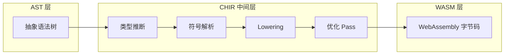
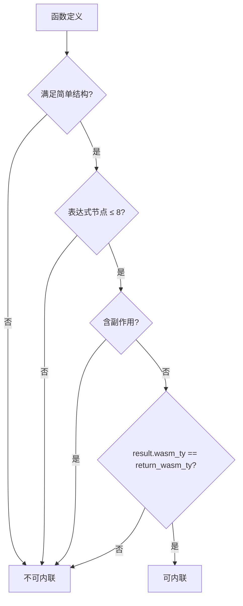

CHIR（Cangjie High-level IR）是 CJWasm 编译器架构中连接抽象语法树与 WebAssembly 代码生成的核心中间层。它在 AST 与 WASM 之间建立了一道完整的类型桥接层，使得每个表达式都携带双层类型信息（AST 原始类型与 WASM 值类型），同时完成所有符号的解析（函数索引、局部变量索引、字段偏移）。

Sources: [mod.rs](src/chir/mod.rs#L1-L25)

## 架构定位

CHIR 在编译流水线中的位置可概括为三阶段架构：**AST → CHIR → WASM**。



相比直接生成 WASM，CHIR 提供了三项关键能力：完整的类型信息（AST 类型加上对应的 WASM 类型）使得类型转换显式可见；所有符号在降低阶段已经解析完毕，无需在代码生成时重新查找；优化的引入使得函数内联和冗余局部变量消除成为可能。

Sources: [mod.rs](src/chir/mod.rs#L1-L11)

## 核心数据结构

CHIR 的类型系统由五个核心结构组成，形成从表达式到程序的完整抽象层次。

### CHIRExpr 与 CHIRExprKind

表达式是 CHIR 中最基本的工作单元。每个 `CHIRExpr` 携带四个字段：`kind` 描述表达式的语义类别，`ty` 保存完整的 AST 类型（单态化后），`wasm_ty` 保存对应的 WASM 值类型，`span` 记录源码位置用于错误报告。

`CHIRExprKind` 是一个庞大的枚举，涵盖了仓颉语言的所有表达式形式。按功能可划分为七个类别：

| 类别 | 变体 | 说明 |
|------|------|------|
| **字面量** | `Integer`, `Float`, `Float32`, `Bool`, `String`, `Rune` | 编译期常量值 |
| **变量与引用** | `Local(u32)`, `Global(String)` | 局部变量索引或全局变量名 |
| **运算** | `Binary`, `Unary` | 二元与一元运算符 |
| **函数调用** | `Call`, `MethodCall`, `CallIndirect` | 普通调用、方法调用、间接函数调用（Lambda） |
| **内存访问** | `Load`, `Store` | 带偏移和对齐的内存读写 |
| **控制流** | `If`, `Match`, `Block` | 条件分支、模式匹配、块表达式 |
| **类型转换** | `Cast` | 显式 WASM 类型转换 |

```mermaid
classDiagram
    class CHIRExpr {
        +CHIRExprKind kind
        +Type ty
        +ValType wasm_ty
        +Option~Span~ span
        +new(kind, ty, wasm_ty)
        +int_const(value, ty)
        +bool_const(value)
    }
    
    class CHIRExprKind {
        <<enumeration>>
        Integer(i64)
        Float(f64)
        Local(u32)
        Binary{op, left, right}
        Call{func_idx, args}
        MethodCall{...}
        Load{ptr, offset, align}
        Cast{expr, from_ty, to_ty}
        If{cond, then, else}
        Print{arg, newline, fd}
    }
    
    CHIRExpr *-- CHIRExprKind
```

CHIRExprKind 还包含数组/元组操作（`ArrayNew`, `ArrayGet`, `TupleGet`）、结构体/类操作（`StructNew`, `FieldGet`, `FieldSet`）、内置方法调用（`BuiltinAbs`, `BuiltinCompareTo`）、以及 I/O 输出（`Print`）和数学运算（`MathUnary`, `MathBinary`）等扩展类别。

Sources: [types.rs](src/chir/types.rs#L13-L179)

### CHIRStmt 语句结构

CHIR 中的语句变体相对简洁，体现了 WASM 的扁flat 控制流模型：

```rust
pub enum CHIRStmt {
    Let { local_idx: u32, value: CHIRExpr },
    Assign { target: CHIRLValue, value: CHIRExpr },
    Expr(CHIRExpr),
    Return(Option<CHIRExpr>),
    Break,
    Continue,
    While { cond: CHIRExpr, body: CHIRBlock },
    Loop { body: CHIRBlock },
}
```

值得注意的是，CHIR 消解了 AST 中的 `if` 语句与 `if` 表达式之分——两者都统一为 `CHIRExprKind::If`，语句形式只是没有返回值的表达式形式。WASM 缺乏复杂控制流原语，所有控制结构最终都被拆解为基础的 `block`/`loop`/`if` 结构。

Sources: [types.rs](src/chir/types.rs#L181-L192)

### CHIRBlock 基本块

CHIR 使用基本块作为控制流的基本容器：

```rust
pub struct CHIRBlock {
    pub stmts: Vec<CHIRStmt>,
    pub result: Option<Box<CHIRExpr>>, // 块表达式的结果
}
```

块结构将语句序列与最终表达式值分离，这与 WASM 的 `block...end` 语义一致。空块用于 `if`/`while`/`loop` 的主体，有结果表达式的块用于计算上下文。

Sources: [types.rs](src/chir/types.rs#L208-L213)

### CHIRPattern 模式匹配

CHIR 的模式匹配系统专门为枚举和结构体设计：

```rust
pub enum CHIRPattern {
    Wildcard,
    Binding(u32),                    // 绑定到局部变量
    Literal(CHIRLiteral),            // 常量字面量
    Variant {                         // 枚举变体
        discriminant: i32,
        payload_binding: Option<u32>,
        enum_has_payload: bool,
    },
    Range { start: i64, end: i64, inclusive: bool },
    Struct { fields: Vec<StructPatternField> },
}
```

结构体模式字段支持字面量检查、常量绑定、以及嵌套结构体解构（先解引用指针再访问内层字段），这为代码生成提供了完整的模式信息。

Sources: [types.rs](src/chir/types.rs#L223-L274)

### CHIRFunction 与 CHIRProgram

函数定义包含了完整的签名与实现信息：

```rust
pub struct CHIRFunction {
    pub name: String,
    pub params: Vec<CHIRParam>,
    pub return_ty: Type,
    pub return_wasm_ty: ValType,
    pub locals: Vec<CHIRLocal>,
    pub body: CHIRBlock,
    pub local_wasm_types: HashMap<u32, ValType>,
}
```

局部变量 WASM 类型映射（`local_wasm_types`）是降低阶段的关键产物——它记录了每个局部变量声明时的 WASM 类型，使得后续赋值时能够自动插入类型强制转换，避免 `local.set` 类型不匹配的错误。

Sources: [types.rs](src/chir/types.rs#L284-L295)

程序级结构则聚合了所有编译单元：

```rust
pub struct CHIRProgram {
    pub functions: Vec<CHIRFunction>,
    pub structs: Vec<StructDef>,
    pub classes: Vec<ClassDef>,
    pub enums: Vec<EnumDef>,
    pub globals: Vec<CHIRGlobal>,
}
```

Sources: [types.rs](src/chir/types.rs#L315-L323)

## Lowering 过程

AST 到 CHIR 的转换（Lowering）是编译器前端的最后一步，也是连接语义分析与代码生成的关键桥梁。降低过程不仅做形式转换，还承担语义验证和符号解析的职责。

### 语义验证

`lower.rs` 在开始转换前执行一系列合法性检查：

**循环继承检测** — 避免类继承链中出现 `A <: B <: ... <: A` 的情况，直接自继承会触发专用错误 "declaration 'X' cannot inherit itself"。

**顶层命名唯一性** — 顶层常量（let/var/const）、函数、类型（class/struct/interface/enum/type alias）之间不可重名。函数重载（同名不同参数）保持允许，这与大多数静态类型语言一致。

**扩展声明校验** — extension 中访问目标类型的私有成员会触发编译期错误。

Sources: [lower.rs](src/chir/lower.rs#L9-L47)

### LoweringContext 上下文

降低上下文封装了所有降低过程中需要的符号信息：

```rust
pub struct LoweringContext<'a> {
    pub type_ctx: &'a TypeInferenceContext,
    local_map: HashMap<String, u32>,          // 变量名 → 局部变量索引
    pub local_wasm_tys: HashMap<u32, ValType>, // 索引 → WASM 类型
    func_indices: &'a HashMap<String, u32>,   // 函数名 → 函数索引
    pub class_field_info: HashMap<String, HashMap<String, (u32, Type)>>,
    pub current_class: Option<(String, u32)>, // 当前类上下文
    pub func_return_types: HashMap<String, Type>,
    pub enum_defs: Vec<EnumDef>,
    // ... try-catch 错误处理、Lambda 计数等
}
```

上下文在构造时从类型推断上下文继承符号表，使得降低过程能够将 AST 中的符号名称解析为 WASM 的索引值。

Sources: [lower_expr.rs](src/chir/lower_expr.rs#L20-L75)

### 表达式降低策略

表达式降低遵循一个统一的模式：首先推断类型，然后在 `LoweringContext::lower_expr` 中根据表达式种类分发处理逻辑。

**类型推断优先级** — 对于变量表达式，`LoweringContext` 会优先使用降低阶段的局部变量类型（而非类型推断上下文的类型），这解决了 For 循环计数器等场景下的类型覆盖问题：

```rust
if let Expr::Var(name) = expr {
    if let Some(local_ty) = self.local_map.get(name)
        .and_then(|&idx| self.get_local_ty(idx))
    {
        if local_ty != inferred_wasm && matches!(ty, Type::Int32) {
            local_ty  // 以 lowering 阶段类型为准
        }
    }
}
```

**内置函数识别** — `println`/`print`/`eprintln`/`eprint` 等 I/O 函数在降低阶段被识别为 `CHIRExprKind::Print` 节点，由后续的代码生成器发射 WASI `fd_write` 调用。类型转换构造函数（`Float32`、`Int64` 等）被识别并包装为 `Cast` 节点。

**二元运算类型提升** — 算数运算的操作数类型如果宽于类型推断结果，会自动提升结果类型：

```rust
let effective_wasm_ty = if !is_comparison {
    if left_chir.wasm_ty == ValType::F64 || right_chir.wasm_ty == ValType::F64 {
        ValType::F64
    } else if left_chir.wasm_ty == ValType::I64 || right_chir.wasm_ty == ValType::I64 {
        ValType::I64
    } else {
        wasm_ty
    }
};
```

Sources: [lower_expr.rs](src/chir/lower_expr.rs#L161-L466)

### 语句降低与类型强制转换

语句降低中的关键职责是为 `let`/`var` 声明的局部变量记录 WASM 类型，并在后续赋值时自动插入 `Cast`：

```rust
pub fn alloc_local_typed(&mut self, name: String, wasm_ty: ValType) -> u32 {
    let idx = self.alloc_local(name);
    self.local_wasm_tys.insert(idx, wasm_ty);
    idx
}

fn insert_cast_if_needed(&mut self, expr: CHIRExpr, expected_ty: ValType) -> CHIRExpr {
    if expr.wasm_ty == expected_ty {
        return expr;
    }
    CHIRExpr::new(
        CHIRExprKind::Cast { expr: Box::new(expr), from_ty: expr.wasm_ty, to_ty: expected_ty },
        expr.ty, expected_ty
    )
}
```

这一机制解决了将 `Int32` 值赋给 `Int64` 局部变量时的类型桥接问题，否则 `local.set` 会因为类型不匹配而拒绝。

Sources: [lower_stmt.rs](src/chir/lower_stmt.rs#L43-L56) [lower_stmt.rs](src/chir/lower_stmt.rs#L144-L186)

## 类型推断上下文

`TypeInferenceContext` 是降低过程的另一核心组件，它在 AST 遍历期间收集类型信息，供降低过程查询。

### 符号表结构

上下文维护了仓颉语言类型系统的完整视图：

| 表结构 | 内容 |
|--------|------|
| `locals: HashMap<String, Type>` | 局部变量类型 |
| `local_mutability: HashMap<String, bool>` | 局部变量可变性（var/inout 为 true） |
| `functions: HashMap<String, FunctionSignature>` | 函数签名（单态化后） |
| `struct_fields: HashMap<String, HashMap<String, Type>>` | 结构体字段类型 |
| `class_fields: HashMap<String, HashMap<String, Type>>` | 类字段类型 |
| `class_method_returns: HashMap<String, HashMap<String, Type>>` | 类方法返回类型 |
| `nominal_supertypes: HashMap<String, Vec<String>>` | 名义类型继承关系 |
| `globals: HashMap<String, Type>` | 全局变量类型 |

Sources: [type_inference.rs](src/chir/type_inference.rs#L114-L149)

### 内置超类型注册

上下文预注册了标准库中名义类型的继承关系，形成类型层次结构：

```rust
fn builtin_nominal_supertypes() -> &'static [(&'static str, &'static [&'static str])] {
    &[
        ("IOException", &["Exception", "Error", "Object"]),
        ("Exception", &["Error", "Object"]),
        ("File", &["InputStream", "OutputStream"]),
        // ...
    ]
}
```

这些继承信息对于接口实现检查和方法分派至关重要——当调用 `InputStream.readFrom` 时，降低器需要知道 `File` 实现了该接口。

Sources: [type_inference.rs](src/chir/type_inference.rs#L152-L180)

### 返回类型推断

对于没有显式返回类型注解的函数，降低器从函数体中推断返回类型——搜索第一个带值的 `return` 语句并推断其表达式类型。这对于仓颉的隐式类型推断函数至关重要：

```rust
pub fn resolve_function_return_type(func: &Function, base_ctx: &TypeInferenceContext) -> Type {
    if let Some(ret_ty) = &func.return_type {
        return ret_ty.clone();
    }
    let mut fn_ctx = base_ctx.clone();
    fn_ctx.collect_locals_from_function(func);
    infer_return_type_from_body(&func.body, &fn_ctx).unwrap_or(Type::Unit)
}
```

Sources: [type_inference.rs](src/chir/type_inference.rs#L96-L103)

## CHIRBuilder 构建器

CHIRBuilder 提供了一套辅助方法用于简化 CHIR 结构的构造：

```rust
pub struct CHIRBuilder {
    next_local: u32,
}

impl CHIRBuilder {
    pub fn new() -> Self { CHIRBuilder { next_local: 0 } }
    pub fn alloc_local(&mut self) -> u32 { ... }
    
    // 表达式构建
    pub fn int_const(&self, value: i64, ty: Type) -> CHIRExpr { ... }
    pub fn binary(&self, op: BinOp, left: CHIRExpr, right: CHIRExpr, result_ty: Type) -> CHIRExpr { ... }
    pub fn call(&self, func_idx: u32, args: Vec<CHIRExpr>, return_ty: Type) -> CHIRExpr { ... }
    pub fn cast(&self, expr: CHIRExpr, to_ty: Type) -> CHIRExpr { ... }
    pub fn if_expr(&self, cond: CHIRExpr, then: CHIRBlock, else_: Option<CHIRBlock>, result_ty: Type) -> CHIRExpr { ... }
    
    // 语句构建
    pub fn let_stmt(&mut self, value: CHIRExpr) -> (u32, CHIRStmt) { ... }
    pub fn return_stmt(&self, value: Option<CHIRExpr>) -> CHIRStmt { ... }
    
    // 块与函数构建
    pub fn block_from_stmts(&self, stmts: Vec<CHIRStmt>) -> CHIRBlock { ... }
    pub fn function(&mut self, name: String, params: Vec<CHIRParam>, return_ty: Type, body: CHIRBlock) -> CHIRFunction { ... }
}
```

构建器自动管理局部变量索引的分配，确保类型信息的一致性。它是 CHIR 优化器和代码生成器的主要辅助工具。

Sources: [builder.rs](src/chir/builder.rs#L1-L200)

## 优化 Pass

CHIR 层实现了两个轻量级优化 Pass，在降低完成后、代码生成前执行。

### Pass 1: 小函数内联

内联优化识别符合以下条件的函数：

1. **简单结构**：`stmts=[]` 且 `result=Some(expr)`，或 `stmts=[Return(expr)]`
2. **表达式规模**：`count_expr_nodes(result) <= 8`
3. **无副作用**：不含函数调用、`Print`、`Store`、`FieldSet` 等副作用
4. **类型一致**：结果的 WASM 类型与函数返回类型一致



内联时，参数引用被替换为实参表达式，非参数的局部变量索引被重映射到调用者的命名空间：

```rust
fn substitute_and_remap(expr: CHIRExpr, params: &[CHIRParam], args: &[CHIRExpr], caller_next_local: u32) -> CHIRExpr {
    // Local(idx):
    //   - 如果是参数 → 替换为对应实参
    //   - 如果是非参数 local → 偏移到 caller 的命名空间
}
```

Sources: [optimize.rs](src/chir/optimize.rs#L105-L277)

### Pass 2: 冗余局部变量消除

该 Pass 识别和消除只被立即读取一次的 `Let` 声明。在链式赋值 `let a = 1; b = a;` 模式下，如果 `a` 的值只在 `b = a` 中被读取，则可以消除中间变量直接将值传递给目标。

优化统计通过 `eprintln!` 输出，显示内联前后函数调用数的变化和 `let` 语句数的变化：

```
[optimize] inline: calls 42 -> 38 (eliminated 4)
[optimize] locals: lets 120 -> 115 (eliminated 5)
```

Sources: [optimize.rs](src/chir/optimize.rs#L12-L34)

## 与前后阶段的集成

### AST → CHIR 接口

`src/chir/mod.rs` 暴露了两个主要入口：

```rust
pub use lower::{lower_function, lower_program};
pub use type_inference::TypeInferenceContext;
```

`lower_program` 接收 AST `Program`，返回完整类型推断和语义验证后的 `CHIRProgram`。`lower_function` 则用于单独降低某个函数（泛型单态化后的实例）。

### CHIR → WASM 接口

`src/codegen/chir_codegen.rs` 实现了 `CHIR → WASM` 的代码生成。它以 `CHIRProgram` 为输入，遍历函数、生成 WASM 函数签名和函数体、使用 `wasm_encoder` 库构建二进制模块。

CHIR 的设计使得代码生成器无需重新实现符号解析或类型推断——所有信息已在 CHIR 中准备好：

```rust
// chir_codegen.rs 中的类型定义直接使用 CHIR
use crate::chir::{
    CHIRBlock, CHIRExpr, CHIRExprKind, CHIRFunction, CHIRLValue, CHIRProgram, CHIRStmt,
};
```

Sources: [chir_codegen.rs](src/codegen/chir_codegen.rs#L1-L12)

## 总结

CHIR 作为 CJWasm 的中间表示层，承担了类型桥接与符号解析的双重职责。它的设计哲学是将复杂的语义分析结果（类型系统、继承关系、字段偏移）凝固到数据结构中，使得下游的代码生成阶段能够以统一、简洁的逻辑处理所有语言特性。

CHIR 的核心价值在于三个维度：**类型双轨制**（AST 类型与 WASM 类型并行携带）使得类型转换显式可见；**符号提前解析**（函数索引、局部变量索引、字段偏移在降低时确定）简化了代码生成的复杂度和运行时开销；**优化层的存在**（函数内联、冗余局部变量消除）使得编译器能够在 IR 层进行架构感知的代码改进。

Sources: [types.rs](src/chir/types.rs#L1-L518) [optimize.rs](src/chir/optimize.rs#L1-L1742)

---

**后续阅读**：

- [AST 优化器](10-ast-you-hua-qi) — 了解 CHIR 优化 Pass 的具体实现细节
- [WebAssembly 代码生成器](12-webassembly-dai-ma-sheng-cheng-qi) — 了解 CHIR 如何被转换为 WASM 字节码
- [编译流水线](8-bian-yi-liu-shui-xian) — 了解 CHIR 在完整编译流程中的位置